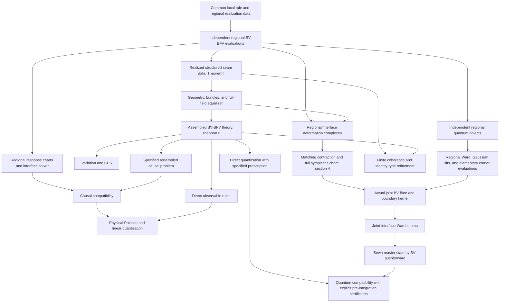

# Regional BV–BFV Theories by Descent

## Local Evaluation, Structured Sewing, and Compatibility of Derived Constructions

**Version: 2026-09-26.** This is a standalone reorganization of the uploaded `REGIONAL_BV_BFV_FORMALISM.md`, incorporating the geometric results of `STRUCTURED_INTERFACE_SEWABILITY.md`. The original files are unchanged. The source manifest and the separate migration document identify the exact input versions. The geometric companion was written against an earlier chapter ordering; all chapter references below refer to this document.

A local theory rule is evaluated on independently specified regions. Compatible structured interface data then assemble their geometry, full fields, action, and BV–BFV structure. The governing direction is

$$\begin{align}
\boxed{ \mathfrak T\longrightarrow\{T(R_a)\},\qquad \bigl(\{T(R_a)\},\{D_{ab}\}\bigr)\longmapsto T_D.
}
\end{align}$$

No independently computed global theory, global solution space, global propagator, or global quantum state occurs in the definition of sewing. The assembled theory is the output. An independently supplied target is considered only in §16.

The scope is finite regular cuts along two-sided timelike interfaces, fixed regional bundle data and any explicitly declared assembled-sector selector, regular exact BV–BFV presentations, and formal perturbative quantum realizations under specified prescriptions. Full fields, ghosts, antifields, nonminimal fields when present, and finite gauge data are retained. The word “regular” is a substantive restriction on geometry and field/boundary domains, not a consequence of writing a fibre product. With a dynamical metric, the timelike requirement belongs to the admissible history domain; the geometric species are specified without first choosing metric boundary values.

Three kinds of statement are distinguished throughout. A **construction** defines an object from the regional inputs. An **internal compatibility result** compares two independently specified routes to a derived structure of the assembled theory. An **optional comparison** additionally uses an independently supplied target. Definitions such as a critical locus or a transported product are not advertised as reconstruction theorems.

The five structural statements organize the document:

| Structural statement | Location | Content and strength |
|---|---|---|
| Theorem I — Structured sewability | §3.1 | A necessary and sufficient realized seam criterion; not ordinary one-sided-germ equivalence |
| Theorem II — Regional descent and closure | §3.3 | Construction of a regular exact BV–BFV theory under explicit coefficient, domain, pairing, and boundary-descent tests |
| Theorem III — Automorphisms and sectors | §3.5 | A cut-marked groupoid equivalence; an orbit set alone forgets automorphisms |
| Theorem IV — Finite composition | §13.1 | Canonical equivalence of admissible finite assembly orders with the same coherent diagram |
| Theorem V — Derived-structure compatibility | §14 | A typed family of conditional commuting-construction statements, not a theorem that every theory is quantizable |

Numbered propositions and realization theorems supply the technical certificates for these statements. In particular, §4 constructs residual models independently of causal Green operators; §§5–7 supply physical variations, response, and observables; §§8–11 define quantum algebras, states, insertions, and actual corner operations; §12 constructs quantum sewing and then proves its conditional compatibility with quantizing the assembled theory. The finite-refinement statement is §13.3.

The two quantum routes will be denoted schematically by

$$\begin{align}
\mathsf{Quant}_{\mathfrak q_D}(T_D) \quad\hbox{and}\quad \mathsf{Sew}^{\mathrm q}_D
\bigl(\mathsf{Quant}_{\mathfrak q_L}(T_L), \mathsf{Quant}_{\mathfrak q_R}(T_R)\bigr).
\end{align}$$

The first route evaluates the quantum prescription on the classically assembled theory. The second constructs a joint polarized BV fibre, pairs the regional boundary variables, and pushes forward only its acyclic factors. These routes are not identified by definition. Their equality or homotopy comparison uses the explicit kernel, line, Ward, graph-extension, representative, and cycle certificates in §§8 and 12. A common local prescription does not select a unique state, polarization, Green realization, or integration cycle.

Notation retains the conventions of the input. The field-space differential is $\delta$; $d$ denotes the spacetime differential or a typed cochain differential as stated locally. The bulk $\omega^{\rm BV}$, boundary $\omega^{\rm BFV}$, and physical $\Omega_\Sigma$ have different degrees and domains. The BV vector field is $Q$, whereas $\mathsf{Quant}$ denotes quantization. $D_\Gamma$ is a structured interface transport, $D_0$ a free quantum observable differential, and $\mathcal D_R$ a quantum master operator. A subscript $D$ refers to the assembled object; $\#$ refers to a construction expressed in regional variables. These are two presentations or two construction routes, not two independently assumed global theories. For quantum states, $Z_D^{\rm dir}$ explicitly denotes direct quantization of the already constructed $T_D$.

## 1. The Common Local Rule and Regional Evaluation

### 1.1 Theory-Level Inputs and Realization Data

A common local theory rule $\mathfrak T$ specifies the following data, together with their covariance under the permitted structural maps:

$$\begin{align}
\mathfrak T= (\mathfrak S,\mathfrak E,L_{\rm BV},Q_{\rm loc}, \omega_{\rm loc}^{\rm BV},\mathfrak B_{\rm var}, \mathfrak F_{\rm func},\mathfrak G_{\rm fin}; \mathfrak R,\mathfrak W\text{ when a quantum realization is used}).
\end{align}$$

Here $\mathfrak S$ is the full field-species and ghost-degree signature, including the chosen resolution and nonminimal species. $\mathfrak E$ lists natural bundle constructions and every genuinely independent structural bundle or map. The actual finite-order local BV density, local degree-one evolutionary vector field, and local odd pairing are given, not inferred from the name of a theory. The rule $\mathfrak B_{\rm var}$ specifies the action representatives, boundary terms, integration-by-parts conventions, and preboundary construction, including the strata reached by the declared finite diagrams. The functional rule $\mathfrak F_{\rm func}$ specifies allowed functional classes and completions. The finite-data rule $\mathfrak G_{\rm fin}$ retains the finite gauge groupoids and the distinction between presentation equivalences, proper gauge transformations, and charged boundary symmetries.

When needed, $\mathfrak R$ is the local graph-extension/counterterm and finite-normalization prescription, and $\mathfrak W$ specifies the master, Ward, equation-of-motion, and contact normalizations. They are common rules, not already evaluated global products or states. Their existence and the validity of their boundary Ward realization are not deduced from the classical geometry.

An input region consists of a smooth Hausdorff second-countable manifold with the declared boundary strata, its actual primitive bundles and fixed backgrounds, exterior conditions, sector constraints, and admissible domains. Denote this realization data by $\mathfrak d_R$. Evaluation is the local construction

$$\begin{align}
T(R)=\operatorname{Eval}_R(\mathfrak T;\mathfrak d_R).
\end{align}$$

It is performed only on the declared class where its operations and regular boundary presentation exist. No assertion is made that every region and every domain admits such an evaluation. A sector with no admissible histories is not turned into a nonempty regular field manifold by notation.

| Common rule | Region-dependent specification or construction |
|---|---|
| Gauge groups, representations, full graded species, natural bundle functors | Actual principal/tangential/independent bundles and their fixed topological sectors |
| Covariant local $L_{\rm BV},Q_{\rm loc},\omega_{\rm loc}$ and their compatibility identities | Fixed background profiles, regional fields, action, vector field, and pairing |
| Boundary variation and representative rule | Physical and artificial faces, boundary-law labels, source domains, resulting preboundary/BFV objects |
| Functional and completion rules | Actual admissible support, trace, test, and joint domains; continuity/regularity certificates |
| Local ordering, renormalization, and Ward prescriptions, when used | Two-point data, Green realizations, residual representatives, polarizations, line trivializations, cycles, and resulting quantum states |
| Finite gauge and equivalence policy | Allowed regional automorphisms and their simultaneous boundary restriction images |

The objects in the right column are not all freely independent: once the listed regional choices are made, the displayed constructions determine their outputs. Conversely, a common rule alone does not supply a propagator or an integration cycle. “Using the same rule” always means independent evaluation, not restriction of an already computed answer.

Let $R$ be one such region, of dimension $n\ge2$, with Lorentzian signature $(-,+,\ldots,+)$ in the fixed-background case. Its boundary is decomposed into caps, physical faces, and any artificial interface occurrences,

$$\begin{align}
\partial R=\Sigma_{R,i}\cup\Sigma_{R,f}\cup B_R\cup\Gamma_R.
\end{align}$$

The boundary and joint conditions, and any regulator for noncompact or asymptotic domains, are actual regional input. They are not inherited from a preexisting target spacetime. For metric gravity, the tensor species is specified first; nondegeneracy, time orientation, and causal character are conditions on its field domain. Fixed backgrounds, by contrast, are included in the structured seam tests of §3.1.

Write $\boldsymbol\phi$ for the full graded field. Define

$$\begin{align}
\mathcal F_R^o= \{\boldsymbol\phi\text{ smooth on the regional bundles, satisfying the declared essential exterior and regional sector conditions}\}.
\end{align}$$

This is off shell. Its definition does not require extension to any other region or to a global solution. Smoothness of odd fields is understood coefficientwise in finite Grassmann test families, compatible with changes of the auxiliary Grassmann algebra. A formal completion is used only in its specified topology or filtration.

In a cotangent presentation, a coordinate $z^A$ of ghost degree $g_A$ has an antifield of degree $-1-g_A$, valued in the density dual of its variation bundle. Reducible symmetries require the complete ghost tower. A general BV presentation must supply its actual graded bundles and pairing; a principal gauge bundle does not determine every possible resolution.

For the generic identities in §§1.2–1.4, write $\mathcal F_R=\mathcal F_R^o$ and $S_R=S_R^o$ unless a closed realization is explicitly indicated.

Evaluation gives

$$\begin{align}
S_R^o=\int_R L_{{\rm BV},R}+S_{{\rm phys},R},\qquad Q_R=Q_{{\rm loc},R},\qquad \omega_R^{\rm BV}=\int_R\omega_{{\rm loc},R}^{\rm BV} +\omega_{{\rm boundary},R}^{\rm BV}.
\end{align}$$

Only boundary contributions actually specified by the theory are present. The action is also written $S_R=\int_R L_R+\int_{B_R}\ell_R+\text{declared cap/joint terms}$. The rule and its realization must satisfy the relative identities below, including $Q_R^2=0$, on their actual domains. The pairing has ghost degree $-1$ and is weakly nondegenerate in the stated regular class. On noncompact regions, compact tests or the declared regulated action define the variational identities. The classical action sets ghosts, antifields, and nonminimal coordinates to their classical zero values; merely selecting total ghost degree zero is not the same operation.

### 1.2 Boundary Data and the Compatibility Identity

Let $\displaystyle{d}$ denote the spacetime exterior derivative and $\displaystyle{\delta}$ the field-space differential. Introduce a boundary projection

$$\begin{align}
\pi_R:\mathcal F_R&\longrightarrow\mathcal F_{\partial R}.
\end{align}$$

It is induced by the boundary jets actually appearing in the variation and is a surjective submersion onto the declared boundary domain. In an exact regular BV–BFV presentation, the boundary data are

$$\begin{align}
(\mathcal F_{\partial R},\alpha_{\partial R}, \omega_{\partial R}^{\mathrm{BFV}},Q_{\partial R},S_{\partial R}),\qquad \omega_{\partial R}^{\mathrm{BFV}}&=\delta\alpha_{\partial R}.
\end{align}$$

Here $\displaystyle{\alpha_{\partial R},\omega_{\partial R}^{\mathrm{BFV}}}$ have ghost degree zero, and $\displaystyle{Q_{\partial R},S_{\partial R}}$ have ghost degree one. We use the convention

$$\begin{align}
\iota_{Q_R}\omega_R^{\mathrm{BV}} &=\delta S_R+\pi_R^*\alpha_{\partial R},\\
T\pi_R\circ Q_R&=Q_{\partial R}\circ\pi_R,\\
Q_{\partial R}^2&=0,& \iota_{Q_{\partial R}}\omega_{\partial R}^{\mathrm{BFV}} &=\delta S_{\partial R}.
\end{align}$$

This is the exact convention of [Cattaneo–Mnev–Reshetikhin, Definition 2.3](https://arxiv.org/html/1507.01221v2#S2.SS1). The boundary primitive records the failure of the unrestricted regional action to generate the bulk vector field without a boundary correction.

The corresponding modified classical master identity is

$$\begin{align}
\frac12\,\iota_{Q_R}\iota_{Q_R}\omega_R^{\mathrm{BV}} &=\pi_R^*S_{\partial R}.
\end{align}$$

Thus the boundary charge is part of the regional master structure. When the boundary contributions cancel in a closed assembled problem, this reduces to the ordinary bulk master identity. A remaining physical boundary retains its regional relative identity.

The sign of this primitive must be distinguished from the sign of boundary work in an ordinary first variation. If the bulk Euler one-form is represented by $\displaystyle{\iota_Q\omega^{\mathrm{BV}}}$, then the displayed convention gives

$$\begin{align}
\delta S&=(\text{bulk Euler one-form})+\beta_{\partial},& \beta_{\partial}&=-\pi^*\alpha_{\partial}.
\end{align}$$

In particular, writing a physical boundary term as $\displaystyle{+\int\Pi\,\delta q}$ does not simultaneously identify it with $\displaystyle{+\alpha_{\partial}}$ in this convention. All polarization changes and incidence signs below use this distinction.

The boundary equations are statements about the complete boundary object. When an individual face has a boundary, tangential integration by parts leaves corner terms. Such a face is treated with those relative terms or the corresponding next-stratum data; an isolated face is not assigned the closed-face identities after dropping its endpoints. The exact formulas above apply to the total compatible boundary structure, or to a closed face, or to tests supported away from its ends.

### 1.3 Constructing the Boundary Structure

Start with the space $\displaystyle{\widetilde{\mathcal F}_{\partial R}}$ of boundary jets that occur before removing redundant trace coordinates. Integration by parts in the bulk identity produces a one-form $\displaystyle{\widetilde\alpha_{\partial R}}$. Set

$$\begin{align}
\widetilde\omega_{\partial R}&=\delta\widetilde\alpha_{\partial R}.
\end{align}$$

Assume its kernel has a regular leaf space, the primitive descends in the chosen exact presentation, and the bulk vector field projects through this construction. Then

$$\begin{align}
p:\widetilde{\mathcal F}_{\partial R} &\longrightarrow \mathcal F_{\partial R} =\widetilde{\mathcal F}_{\partial R}/\ker\widetilde\omega_{\partial R},& p^*\alpha_{\partial R}&=\widetilde\alpha_{\partial R}
\end{align}$$

defines the boundary BFV data. The projection $\displaystyle{\pi_R}$ is boundary restriction followed by $\displaystyle{p}$. This removes redundant coordinates of the boundary trace description. The full bulk fields, their gauge directions and their finite gauge maps remain in $\displaystyle{\mathcal F_R}$.

If the regularity or descent condition is unavailable, the preboundary data can still be retained, but that presentation does not supply the exact regular BFV space used in the statements below. No quotient of bulk gauge orbits is required for those statements.

Finite bundle automorphisms, disconnected gauge transformations, stabilizers and the declared distinction between proper gauge transformations and charged boundary symmetries are also part of the regional evaluation. The vector field $\displaystyle{Q_R}$ encodes the infinitesimal resolution; it is used together with these finite data.

### 1.4 Relative Faces and Corner Incidence

A face with ends has its own variational boundary. To specify a regular extension to the strata needed by a cut, let $\displaystyle{X}$ have codimension $\displaystyle{k}$ in the bulk. Assign graded fields, a cohomological vector field and relative Hamiltonian data with degrees

$$\begin{align}
\operatorname{gh}(\omega_X) &=\operatorname{gh}(\alpha_X)=k-1,& \operatorname{gh}(S_X)&=k,& \operatorname{gh}(Q_X)&=1.
\end{align}$$

When the stratum pairing is exact, write $\displaystyle{\omega_X=\delta\alpha_X}$. Bulk exactness is needed only if this extended exact presentation is used; the sewing identities of §§2–3 require the stated bulk symplectic form and exact boundary data. For each incident next stratum $\displaystyle{Y}$ supply a trace map $\displaystyle{\pi_{XY}}$. Fix the primitive and action signs at each degree so that the relative identity takes the form

$$\begin{align}
\iota_{Q_X}\omega_X &=\delta S_X+ \sum_{Y\subset\partial X}\epsilon(X,Y)\pi_{XY}^*\alpha_Y,\\
T\pi_{XY}\circ Q_X&=Q_Y\circ\pi_{XY},& Q_X^2&=0.
\end{align}$$

Here $\displaystyle{\epsilon(X,Y)}$ includes the chosen incidence orientation. For $\displaystyle{k=0}$ this is §1.2. For a boundary face, the additional term is the corner contribution; the closed-face Hamiltonian identity is recovered only when this term is absent or cancels in the complete boundary. The degree assignments and recursive structure are the regular higher-stratum extension of classical BV–BFV; see [Cattaneo–Mnev–Reshetikhin, §3.6](https://arxiv.org/html/1201.0290v3#S3.SS6).

Boundary restriction along two incident paths must identify the same corner data. The corresponding signs obey

$$\begin{align}
\sum_{Y:\,Z\subset\partial Y,\ Y\subset\partial X}
\epsilon(X,Y)\epsilon(Y,Z)&=0.
\end{align}$$

The gluing transports commute with these restrictions. This supplies both the geometric boundary-of-boundary cancellation and the field-space identification needed to add corner work. An external corner action or additional corner degree of freedom is included with its own occurrence; it is not canceled merely because two faces meet there.

For a finite compatible boundary diagram, define the total boundary domain by the stated corner matching conditions. Pull back each face primitive to that domain, sum it with its incidence, and include the specified joint contributions. Internal occurrences cancel only after their actual transports and relative variations have been included. Applying $\displaystyle{\delta}$ gives the corresponding cancellation of two-forms. Projectability of the vector fields gives the total boundary differential. Whenever the resulting preboundary pairing has the regular descent of §1.3, this constructs the complete boundary BFV object used in §1.2.

This construction can stop at the lowest stratum reached by the given cuts, with its specified terminal boundary data. A theory for which a regular next-stratum projection is unavailable may instead be used through an explicitly supplied relative boundary object with all its joint terms. In that case no independent symplectic structure on the missing stratum is asserted. Quantum sewing uses the resulting complete boundary Ward identities, as described in §12.1.

## 2. Independently Defined Regional Theories

### 2.1 Opened Regional Data

Give independently defined regions $R_a$ with their actual bundles, fixed backgrounds, and labelled boundary occurrences. For two regions write

$$\begin{align}
\partial R_a=\Sigma_{a,i}\cup\Sigma_{a,f}\cup B_a\cup\Gamma_a.
\end{align}$$

There is not yet an assembled manifold. The faces $B_a$ carry the supplied physical boundary problem; $\Gamma_L$ and $\Gamma_R$ are separate artificial occurrences. Compatible product collars will be part of the structured sewing realization. Regional bundle sectors and any eventual joint selectors are stated separately.

On each region, define $\displaystyle{\mathcal F_a^o}$ as all smooth graded fields satisfying the declared essential physical conditions and regional sector conditions. A condition involving both regions is imposed later on a joint configuration. Membership in $\displaystyle{\mathcal F_a^o}$ does not require extension to a global solution.

Evaluate the common local rule independently on the regional fields:

$$\begin{align}
S_a^o&=\int_{R_a}L_{\mathrm{BV},a}+S_{\mathrm{phys},a},& \omega_a^{\mathrm{BV}}&=\int_{R_a}\omega_{\mathrm{BV},a}^{\mathrm{loc}},& Q_a&=Q_{\mathrm{loc},a}.
\end{align}$$

Any specified boundary contribution to the BV pairing is included as well. Compute the complete regional variation and its induced preboundary/BFV data by §1.3. This defines the opened regional object

$$\begin{align}
\mathbb T_a^o &=(\mathcal F_a^o,\omega_a^{\mathrm{BV}},S_a^o,Q_a; \pi_a,\mathcal F_{\partial R_a},\alpha_{\partial R_a}, \omega_{\partial R_a}^{\mathrm{BFV}},Q_{\partial R_a},S_{\partial R_a}).
\end{align}$$

Each object is constructed from regional fields and local rules without using an assembled or externally supplied global object.

The opened classical solution space is defined independently as well. Set the nonclassical coordinates to zero, and test $\displaystyle{\delta S_{a,\mathrm{cl}}^o}$ against allowed variations vanishing near the artificial faces and equation-test caps. This imposes the regional bulk equations and the declared physical equations reached by the tests. It leaves the artificial trace and response free. Joint equations excluded by these tests are restored in the complete sewing variation.

### 2.2 Closed Boundary Realizations

A realization label $\displaystyle{b=(\rho,j)}$ consists of a boundary-law type $\displaystyle{\rho}$ and an admissible source history $\displaystyle{j}$. In an exact BFV chart, a useful class of realizations is specified by a degree-zero boundary functional $\displaystyle{\lambda_b}$ and a boundary submanifold $\displaystyle{\mathcal L_b}$:

$$\begin{align}
S_a^{c,b}&=S_a^o+\pi_{\Gamma_a}^*\lambda_b,\\
\alpha_{\Gamma_a}^{\,b}&=\alpha_{\Gamma_a}-\delta\lambda_b,\\
\mathcal F_a^{c,b}&=\pi_{\Gamma_a}^{-1}(\mathcal L_b).
\end{align}$$

The boundary differential is tangent to $\displaystyle{\mathcal L_b}$, and the complete adjusted artificial primitive vanishes on its allowed tangent directions:

$$\begin{align}
\left.\alpha_{\Gamma_a}^{\,b}\right|_{T\mathcal L_b}&=0.
\end{align}$$

For a maximal regular polarization, $\displaystyle{\mathcal L_b}$ is an adapted Lagrangian submanifold. More general boundary realizations must specify their full variational and BFV data explicitly. A polarization alone does not define a source solver.

These formulas preserve the bulk compatibility identity because

$$\begin{align}
\delta S_a^{c,b}+\pi_{\Gamma_a}^*\alpha_{\Gamma_a}^{\,b} &=\delta S_a^o+\pi_{\Gamma_a}^*\alpha_{\Gamma_a}.
\end{align}$$

The unchanged exterior contributions are understood. If $\displaystyle{\lambda_b}$ contains tangential derivatives, its variation is decomposed into face work and cap/joint terms before making this comparison. Its source derivatives are retained on the full family; they vanish only on a fixed-source fibre.

The admissible labels specify regularity, incoming data, physical conditions, ghost/antifield boundary domains and compatibility at corners. Whenever a response solver is used, its existence and mapping properties refer to this actual input domain.

Define the classical closed solution space by stationarity of $\displaystyle{S_{a,\mathrm{cl}}^{c,b}}$ with its allowed fixed-source variations. The complete regional theory consists of $\displaystyle{\mathbb T_a^o}$ and the declared family of these closed realizations.

### 2.3 Opening and Regional Coverage

Opening releases $\displaystyle{\mathcal L_b}$ and the artificial source fixing, removes $\displaystyle{\lambda_b}$, and restores the opened field and equation-test domains. It also restores the associated face work and corner potentials. The opened domain was already defined in §2.1; it is not reconstructed by varying the label of one selected closed solution.

For the regional family itself, fix a realization chart and a source-extraction map on its declared opened-solution coverage domain:

$$\begin{align}
\tau_{\rho_a}:\mathscr U_a^o&\longrightarrow\mathcal J_{a,\rho_a},& \phi_a&\in \mathscr S_a^{c,(\rho_a,\tau_{\rho_a}(\phi_a))} \quad(\phi_a\in\mathscr U_a^o).
\end{align}$$

The boundary law defines $\displaystyle{\tau_{\rho_a}}$; coverage and input compatibility are properties of that regional family. After a theory has been assembled, restriction of one of its smooth solutions gives such an opened regional solution and, within the coverage domain, a member of the labelled closed family. This is an application of coverage, not its definition.

Boundary realization and BV gauge fixing serve different purposes. The former specifies allowed artificial boundary data. The latter selects an auxiliary realization for perturbative response or integration. Opening releases an artificial boundary condition without imposing a gauge quotient or setting the interface ghosts to zero.

## 3. Structured Interfaces and Regional BV–BFV Descent

### 3.1 Structured Sewability and the Constructed Geometry

#### Regional Geometry and Three Interface Objects

Each artificial face $\Gamma_a\subset\partial R_a$ is closed embedded, possibly noncompact, with declared cap, physical-boundary, and corner labels. Its collar is $c_a:[0,\epsilon_a)\times\Gamma_a\to R_a$; a positive width depending on the tangential point is allowed. At intersecting faces use compatible product collars. A finite regular diagram must admit an atlas of incident orthants which assemble to ordinary manifold or boundary-corner charts, with a Hausdorff second-countable quotient and no local branching. In the closed-face finite gluing situation these separation properties follow from the closed identifications and the collar atlas. They must not be replaced by the combinatorial equation $\partial^2=0$: identifying three full half-spaces along one boundary branches.

The base map $d:\Gamma_R\to\Gamma_L$ is a variable to be found and checked. It preserves the declared labels and strata and reverses the outward-normal-first boundary orientation when bulk orientations are fixed. Its stabilized tangent map sends $n_{\rm out,R}$ to $-n_{\rm out,L}$. Inward coordinates $\rho_a\ge0$ determine the common signed coordinate

$$\begin{align}
x=-\rho_L\quad\hbox{on }R_L,\qquad x=\rho_R\quad\hbox{on }R_R.
\end{align}$$

Thus a scalar obeys

$$\begin{align}
\partial_{\rho_L}^k\partial_y^\alpha\phi_L|_0 =(-1)^k\partial_{\rho_R}^k\partial_y^\alpha\phi_R|_0.
\end{align}$$

If $r_L\le0$ and $r_R\ge0$ already denote the common signed coordinate, their derivatives are equal without another factor $(-1)^k$. Bundle and nonlinear field transitions require their full chain rule in addition to this sign.

The primitive structural diagram $\mathfrak B_a$ contains the actual gauge and tangential bundles, their specified lifts/reductions and structural maps, and every independent graded or boundary/corner bundle. Spin data, for example, are lifts of the oriented stable tangent classifying data, or Spin covers of the orthonormal frame bundle in a specified metric presentation, not just an unrelated abstract Spin bundle. An auxiliary reference metric used for this description is not a prior choice of a dynamical metric history. The species rule specifies the associated tensor, affine connection, and graded bundles built from this diagram. Fixed sections and structural profiles are denoted $b_a$; dynamical fields are not among their preassigned values.

There are three distinct boundary objects.

| Object | Information retained |
|---|---|
| Face object $\mathfrak I_a^0$ | The face, labels, stable tangent and normal data, primitive bundles restricted to the face, and their structure maps |
| Actual one-sided germ $\mathfrak I_a^{\rm germ}$ | Those structures and fixed backgrounds on an actual inward collar, up to shrinking |
| Completed seam object $\widehat{\mathfrak I}_a$ | The face object and all transverse Taylor coefficients of primitive structure maps and fixed backgrounds, with tangential smoothness and compatible corner restrictions |

Locally the completion uses

$$\begin{align}
\widehat{\mathcal O}_{\Gamma_a} =\varprojlim_k C^\infty(c_a)/\mathcal I_{\Gamma_a}^{k+1},
\end{align}$$

where $\mathcal I_{\Gamma_a}$ is the vanishing ideal. It forgets flat-to-all-orders differences. This is a completion of seam data, not a replacement of regional histories by Taylor series and not a quantum completion.

A **realized structured seam datum**

$$\begin{align}
D\in\mathscr D^{\rm geom} =\operatorname{Iso}^{\rm sew}_{\rm str} (\widehat{\mathfrak I}_R,\widehat{\mathfrak I}_L)
\end{align}$$

consists of a permissible base map, compatible primitive bundle/structure lifts, and full seam-transition jets realized by actual smooth collar and bundle charts. In those charts every fixed background and nonautomatic structural profile has matching signed transverse jets. Restrictions agree along all incident corner paths. An arbitrary formal automorphism without such a realization is not an admissible datum. Two realizations with the same completed transitions represent the same datum. Their assembled objects are identified by the piecewise identity, as proved below.

An ordinary isomorphism of actual inward germs is neither the definition nor a replacement for this condition. For example $b_L(x)=0$ on $x\le0$ and $b_R(x)=e^{-1/x^2}$ on $x>0$, with $b_R(0)=0$, sew smoothly although no background-preserving one-sided-germ isomorphism exists. Conversely two identical inward profiles $b_a(\rho_a)=\rho_a$ give $|x|$ under the seam identification and are not smoothly sewable with that matching. The signed seam test rejects the latter and accepts the former. These are the distinctions established in [SIS, §§1–2].

If a metric is fixed, its full background jets and the timelike condition are part of these tests. If the metric is dynamical, only its tensor species and tangential structure are transported at this stage. Timelike character and the matching of its actual values and jets are conditions on the subsequently chosen histories.

#### Primitive and Induced Data

| Datum                                                                              | Status                                        | Construction or independent test                                                  |
| ---------------------------------------------------------------------------------- | --------------------------------------------- | --------------------------------------------------------------------------------- |
| Regional cells, labelled faces, orientation, compatible product-corner atlas       | Primitive geometry                            | Independently supplied; regular local links and separation must be checked        |
| Actual base identification $d$                                                     | Primitive sewing choice                       | Find a label-, stratum-, and orientation-compatible diffeomorphism                |
| Principal-bundle lifts and independent structural-diagram lifts                    | Primitive sewing choices                      | Solve the Čech equations and the simultaneous diagram equations                   |
| Fixed background profiles and couplings                                            | Independent regional data                     | Test their full signed seam jets; do not interpolate them to force agreement      |
| Collar charts and bundle product presentations                                     | Realization choices                           | They produce actual smooth transitions; rigid profiles can obstruct compatibility |
| Natural associated, tensor, adjoint, density, and connection-affine transports     | Derived                                       | Apply the declared bundle functors and the base derivative                        |
| Canonical cotangent antifield transport                                            | Derived under the stated cotangent hypotheses | Inverse graded density dual; Liouville/evaluation preservation fixes it           |
| Higher jet transports                                                              | Derived after realization                     | Jet prolongation and the full chain rule                                          |
| Independent ghost resolutions, boundary species, general noncotangent pairing maps | Not automatically derived                     | Supply and test them as parts of the actual presentation                          |
| Concrete $g,A,\phi,c,\phi^+$ values and jets                                       | History data                                  | Impose matching on the complete opened field space                                |
| Response matching                                                                  | Variationally derived                         | The common variation in §3.2, on the actual extendable trace domain               |
| Local action, vector-field, and pairing compatibility; regular domains             | Theory-admissibility tests                    | §3.3; not consequences of topological bundle isomorphism                          |
| $M_D,P_D,E_D$, full field domain, and $S_D,Q_D,\omega_D$                           | Outputs                                       | Quotient and atlas construction, then full-field descent                          |
| A prescribed assembled topological sector or nonlocal joint selector               | Additional declared selection, when used      | Apply to the constructed bundles/domain; not a preexisting full global theory     |

For natural associated fields the transport is $[p,v]\mapsto[\Phi(p),v]$. Equivariance makes it well defined, and it respects inverses and composition. For a connection, the natural affine bundle is $C(P)=J^1P/G$. With $z_L=h z_R$ and covariant derivative $d+A$, the local matching law is

$$\begin{align}
d^*A_L=hA_Rh^{-1}-dh\,h^{-1}.
\end{align}$$

It includes normal components and derivatives of the realized $h$. Matching only the tangential pullback of a connection does not give a smooth connection across the seam. YM ghosts use the induced adjoint map; a higher ghost tower is induced only if the whole tower and its maps were specified as natural constructions. An extra contractible pair on just one side already prevents a strict full-species isomorphism.

For a degree-preserving pointwise field isomorphism $z_L=F(x,z_R)$ over $x_L=f(x_R)$, its derivative $T=\partial F/\partial z$ determines the cotangent lift. In ungraded component notation and absolute densities, on corresponding coordinate patches $U$ and $f(U)$,

$$\begin{align}
(z_L^+)_A(f(x)) =|\det Df(x)|^{-1}(z_R^+)_B(x)(T^{-1})^B{}_A(x,z_R), \qquad \int_{f(U)}\langle z_L^+,\delta z_L\rangle =\int_U\langle z_R^+,\delta z_R\rangle.
\end{align}$$

Use the inverse graded dual and the stated Koszul convention for graded fields, and the signed determinant for oriented top forms. This lift is unique among zero-section-preserving fibre-linear lifts preserving the canonical evaluation/Liouville form. Preservation of the odd two-form alone is not a uniqueness theorem: allowed cotangent shifts can also be canonical. General noncotangent presentations and derivative-dependent field redefinitions require their own explicit maps and boundary corrections.

The jet transport is the usual prolongation of the actual maps. For instance, in common base coordinates,

$$\begin{align}
D_\mu F=F_{,\mu}+F_{,A}z^A_\mu, \quad D_\nu D_\mu F=F_{,\mu\nu}+F_{,\mu A}z^A_\nu +F_{,\nu A}z^A_\mu+F_{,AB}z^B_\nu z^A_\mu +F_{,A}z^A_{\mu\nu}.
\end{align}$$

Nontrivial base maps and graded variables retain the full additional Jacobian derivatives and signs. Naturality and the chain rule prove compatibility with composition and truncation. A face value alone does not determine this map: $h=1$ and $h=e^{\rho X(y)}$ agree on the face and transport normal jets differently. These observations are the induced-transport lemma of [SIS, Theorem B], with its hypotheses retained.

#### Existence Criterion and a Constructive Certificate

Fix $d$ and a finite-dimensional Lie group $G$, including its disconnected components. On the smooth numerable bundle class used here,

$$\begin{aligned}
&\operatorname{Iso}_G(P_R|_{\Gamma_R},d^*P_L|_{\Gamma_L})\ne\varnothing\\
&\quad\Longleftrightarrow [P_R|_{\Gamma_R}]=[d^*P_L|_{\Gamma_L}]\ \text{in }[\Gamma_R,BG]\\
&\quad\Longleftrightarrow \exists\{h_i:U_i\to G\}:\quad d^*g^L_{ij}=h_i g^R_{ij}h_j^{-1}.
\end{aligned}$$

The middle equivalence is the standard classifying-space theorem, not an assertion that a list of characteristic classes is complete. For the last equivalence choose local right-principal sections $s_j^a=s_i^ag^a_{ij}$ and write $\Phi(s_i^R)=s_i^Lh_i$. Evaluating $\Phi(s_j^R)$ in both frames gives the equation. Conversely it makes $s_i^Rg\mapsto s_i^Lh_ig$ independent of the chart and constructs the lift. A passive frame change gives

$$\begin{align}
g^a_{ij}\mapsto(k_i^a)^{-1}g^a_{ij}k_j^a, \qquad h_i\mapsto(d^*k_i^L)^{-1}h_ik_i^R;
\end{align}$$

it changes no actual gluing map.

For several structural bundles the lifts must also satisfy $\Phi_C f_R=f_L\Phi_B$ for every prescribed structure arrow $f_a:B_a\to C_a$. Individual isomorphism tests do not replace this simultaneous diagram problem. For oriented Spin structures, existence of some lift requires $w_2=0$, but two chosen structures differ by an $H^1(\Gamma;\mathbb Z_2)$-torsor class that must vanish under the specified tangent map. Lifts between fixed such structures, when they exist, differ by $H^0(\Gamma;\mathbb Z_2)$. In the stable Euclidean convention the Pin obstructions are $w_2$ for Pin$^+$ and $w_2+w_1^2$ for Pin$^-$; a Lorentzian Pin convention must instead use its actual central extension. Spin$^c$ has obstruction $\beta w_2$ and an $H^2(\Gamma;\mathbb Z)$-torsor of structures. Twisting by a line changes the determinant class by twice its first Chern class, so determinant equality need not identify structures in the presence of 2-torsion. General reductions are the corresponding classifying-map lift or section problem, with its actual local coefficient systems and lower-stage choices. Prescribed framing or soldering profiles must match as structural maps, not merely as abstract reduced bundles. These are the specific structural tests of [SIS, §3].

**Theorem I — Structured sewability.** In the finite regular smooth category above, geometric structured sewing, retaining the given regional structures, is possible if and only if

$$\begin{align}
\boxed{\operatorname{Iso}^{\rm sew}_{\rm str}
(\widehat{\mathfrak I}_R,\widehat{\mathfrak I}_L)\ne\varnothing.}
\end{align}$$

Explicitly the witnesses are: a permissible base map; compatible lifts of all primitive structural diagrams; an actual coherent collar/bundle realization; and equality of all fixed-structure seam jets in that realization. For ordinary productizable bundle diagrams with no extra rigid transverse profiles, the last conditions reduce to the compatible product-collar realization and corner restrictions, so the face-level lift equations are sufficient. No independent obstruction is added by transports genuinely induced by the specified functors.

**Proof.** For ordinary bundles choose compatible base collars and auxiliary connections to identify each collar bundle with the pullback of its face restriction by parallel transport. The auxiliary connection selects charts, not a dynamical connection history. Extend a face lift constantly in these product presentations and use the common signed coordinate. A lift diagram must productize as a diagram; a prescribed tangent framing or differential profile that cannot do so is an additional profile test, not an automatic case. At corners use the coherent product realizations required in the hypotheses.

Construct the base as the quotient of the disjoint regional manifolds by the face maps, and construct each principal bundle by its equivariant face identifications. Away from the seam retain the regional charts. Near it, rewrite the right frame by $h_i$; the two half-collars then give charts $( -\epsilon,\epsilon)\times U_i$ and $( -\epsilon,\epsilon)\times U_i\times G$. The Čech equations and coherent realization make their transitions smooth. The regional right actions descend and in these charts are the standard free transitive fibre actions. The regular atlas and closed identifications supply the stated separation and corner properties. Thus

$$\begin{align}
\boxed{M_D=(R_L\sqcup R_R)/d,\qquad P_D=(P_L\sqcup P_R)/\Phi}
\end{align}$$

are actually constructed; no collars of positive thickness are identified as physical overlapping regions. Associated bundles commute with this quotient, and commuting primitive structure arrows assemble in the same charts.

For general fixed structures, equality of all one-sided coefficient derivatives implies smoothness of the piecewise coefficient: equality of first derivatives and the fundamental theorem of calculus establish $C^1$, and induction establishes every higher derivative. The same proof applies to mixed corner derivatives in a product atlas. It assembles the given backgrounds and structure maps without modifying them on either side. Pointwise identities, and finite-order differential identities on those smooth fields, consequently continue across the seam. This proves sufficiency.

Conversely, a smooth structured assembly supplies actual seam charts; their restrictions give the stated lifts, realizations, and matching jets. This necessity argument does not define the output: the preceding sufficiency argument already constructs it. The same derivative lemma shows that realizations with identical completed transitions have a smooth piecewise-identity comparison and smooth inverse. ∎

This theorem constructs bundles and fixed structures, not a solution or a nonempty constrained history domain. Nor does it, by itself, establish the action or regular BFV descent in §3.3.

A practical witness-producing workflow is to find the base map, refine a cover trivializing the primitive bundles, solve the Čech lift equations, solve the structural-diagram lift equations, realize the collar charts, test fixed-profile jets and corner paths, and then induce the field/antifield/jet maps. Finally apply the local-theory tests in §3.3 and the automorphism quotient in §3.5. For arbitrary smooth inputs this is not a proven terminating universal decision algorithm.

For $U(1)$, the lift step is explicit. Write $g^a_{ij}=e^{2\pi i a^a_{ij}}$ and $n^a_{ijk}=a^a_{ij}+a^a_{jk}-a^a_{ik}\in\mathbb Z$, after pulling back the left data. Equality of integral $c_1$ gives an integral cochain $m$ with $n^L-n^R=\check\delta m$. Then $b_{ij}=a^L_{ij}-a^R_{ij}-m_{ij}$ is a smooth real Čech cocycle. A subordinate partition $\{\chi_k\}$ gives $f_i=\sum_k\chi_k b_{ik}$, so $f_i-f_j=b_{ij}$. The functions $h_i=e^{2\pi i f_i}$ solve the required equation. Here $\check\delta$ is the Čech coboundary, not the field-space variation. For a non-Abelian group use the actual isomorphism-bundle section problem with its skeleton obstructions, followed by relative smoothing; characteristic-class tests alone are not a replacement.

### 3.2 Common Variation and BFV Matching

On the classical fields, let $\displaystyle{q_a}$ be the configuration traces selected by the first variation, and $\displaystyle{\Pi_a}$ their response densities. Define the weak configuration matching by

$$\begin{align}
q_L&=D_\Gamma q_R.
\end{align}$$

The complete weak action is the sum of opened regional actions, including any interface term required by the specified higher-derivative weak extension. On the smooth matching domain its value is the action constructed in §3.3, provided the stated weak extension has no additional uncanceled internal term there.

After imposing the regional equations, the artificial part of its variation is

$$\begin{align}
\beta_{\Gamma,\#} &=\int_{\Gamma_L} \left\langle\Pi_L+D_\Gamma^\vee\Pi_R,\delta q\right\rangle +\beta_{\#,\mathrm{joint}}.
\end{align}$$

The dual transport is defined by preservation of the integrated variation pairing. In particular, for nonlinear trace transport,

$$\begin{align}
\int_{\Gamma_L}\langle D_\Gamma^\vee\Pi_R,\delta q_L\rangle &=\int_{\Gamma_R}\langle\Pi_R,\delta q_R\rangle,& \delta q_L&=T_{q_R}D_\Gamma\,\delta q_R.
\end{align}$$

Outward signs are already contained in the response densities. If the common trace can be varied freely, stationarity gives

$$\begin{align}
\boxed{q_L=D_\Gamma q_R,\qquad \Pi_L+D_\Gamma^\vee\Pi_R=0.}
\end{align}$$

If only a subspace of trace variations extends to allowed regional variations, the response sum is required to annihilate that subspace. The joint equations follow from the remaining joint variation.

The graded BV variation performs the same calculation for every boundary canonical pair, with its prescribed Koszul signs. Assume the chosen trace polarization exhausts the actual preboundary work. Its resulting matching defines a boundary relation

$$\begin{align}
\mathcal L_\Gamma &\subset\mathcal F_{\Gamma_L}\times\mathcal F_{\Gamma_R}.
\end{align}$$

In regular charts where this relation is the graph of a map $\displaystyle{I_\Gamma:\mathcal F_{\Gamma_R}\to\mathcal F_{\Gamma_L}}$, transparent matching has

$$\begin{align}
I_\Gamma^*\alpha_{\Gamma_L}&=-\alpha_{\Gamma_R},& I_\Gamma^*\omega_{\Gamma_L}^{\mathrm{BFV}}&=-\omega_{\Gamma_R}^{\mathrm{BFV}},\\
TI_\Gamma\circ Q_{\Gamma_R}&=Q_{\Gamma_L}\circ I_\Gamma,& I_\Gamma^*S_{\Gamma_L}&=-S_{\Gamma_R}.
\end{align}$$

The map includes the outward-response sign in addition to the geometric transport. Its graph is Lagrangian in the product boundary symplectic space. The last charge identity follows from the Hamiltonian identity and equivariance: the field-space derivative of the sum vanishes, and a constant of ghost degree one is zero in the chosen ordinary coefficient ring.

These equations apply with the full corner incidence understood. In a different exact polarization, first transform the primitives and boundary actions together. Their restriction to the matching relation then has vanishing total internal primitive. Configuration matching is specified before the common variation; the response part of this relation is derived from that variation.

### 3.3 Full-Field Equalizer and Regional Descent

The structured interface object is not itself a space of field values. Let $\mathcal J^\infty_\Gamma(E)$ denote the complete smooth formal normal-jet trace space, with tangential holonomicity and the declared corner conditions. Use actual trace images when the domain does not cover that space; no surjectivity or continuous splitting of an infinite-jet trace map is assumed. For the full opened fields define

$$\begin{align}
\mathcal F_D^{\rm sm}= \left\{(\boldsymbol\phi_L,\boldsymbol\phi_R)\in \mathcal F_L^o\times\mathcal F_R^o: j^\infty_{\Gamma_L}\boldsymbol\phi_L =D_\Gamma^{(\infty)}j^\infty_{\Gamma_R}\boldsymbol\phi_R, \ \mathcal C_{\rm joint}\right\}.
\end{align}$$

All ghosts, antifields, nonminimal coordinates, and specified independent boundary/corner fields remain. Independent stratum fields obey their own transported matching and incidence equations; they are not silently replaced by bulk traces. The symbol $\mathcal C_{\rm joint}$ records explicit exterior, joint, and sector conditions. An additional nonlocal constraint is included here only when supplied; it is not recoverable from individual regional restriction images in general. A fixed assembled bundle class can be selected after Theorem I constructs $P_D$. If the base varies, the comparison of such classes must also be specified.

**Smooth section lemma.** Piecewise evaluation defines a bijection

$$\begin{align}
A=\operatorname{Asm}_D:\mathcal F_D^{\rm sm} \xrightarrow{\sim}\Gamma^\infty_{\rm adm}(M_D,E_D),
\end{align}$$

where $E_D$ and the primitive diagrams are those constructed in §3.1, and admissibility on the right is evaluated from the stated local and joint conditions. Independent stratum fields have the corresponding simultaneous section equalizer.

**Proof.** In common seam charts the full jet condition makes each piecewise coefficient smooth by the derivative induction used in Theorem I. The primitive bundle cocycles make the local sections agree on chart overlaps. Restriction is a two-sided inverse. Compatible local boundary conditions are checked in their own charts, and the explicit joint conditions are imposed on either presentation. The proof works coefficientwise for graded fields and in the declared formal completion. For unrestricted vector-bundle sections, compact-open smooth seminorms in one presentation are controlled by finitely many such seminorms in the other; hence assembly is a continuous linear isomorphism. Pointwise nonlinear field charts give the corresponding smooth maps in the specified regular section category. For constrained subsets this proves a correspondence and its induced topology, not that the subsets are smooth manifolds or that a trace map is a submersion. Those are separate domain hypotheses. ∎

For the later two-presentation formulas, set $\mathcal F_\#^{\rm sm}:=\mathcal F_D^{\rm sm}$ on the regional equalizer and $\mathcal F_D:=\Gamma^\infty_{\rm adm}(M_D,E_D)$ on the assembled section presentation. The map $A$ identifies these two constructed spaces; the subscript $D$ does not designate an independently supplied target.

The lemma uses no equations of motion. A finite BFV trace relation cannot replace this off-shell equalizer without an explicit comparison resolving the omitted matching data, as in §4.1.

#### Closure Hypotheses

The following conditions define **theory-admissibility** of a geometric datum. Write $\mathscr D^{\rm th}\subseteq\mathscr D^{\rm geom}$ for the candidates satisfying them. They are tests on actual regional formulas, the constructed equalizer, and its exterior preboundary data; they do not posit an already completed global BV–BFV theory.

**C1 — Full species and domains.** The smooth section lemma applies to all fields and stratum species. The admissible field category, allowed variations, explicit joint selector, and their tangency under the regional vector fields are specified for the additional domain conditions. Preservation of the seam equalities themselves is proved below, not assumed here. Formal series and integrals exist in their declared domains. Any nonempty or regular-domain assertion needed in a model is an additional verified realization condition, not a consequence of bundle existence.

**C2 — Off-shell local-rule compatibility.** In the realized seam charts, $L_{\rm BV}$, the odd-pairing density, $Q_{\rm loc}$, and their finite-order structure maps have matching full transverse coefficient jets as smooth functions of the field-jet variables. This is an off-shell identity, including its vertical derivatives; agreement on a chosen solution is insufficient. Naturality of the same local rule with compatible fixed backgrounds and the same full presentation proves this test when applicable. Otherwise the actual coefficient identities must be checked. The field transport uses its full derivative when nonlinear.

**C3 — Representatives and incidence.** Artificial closing terms have been removed by opening. Actual bulk and physical action representatives, potential conventions, and lower-stratum terms are compatible. Each exterior contribution is counted once; internal occurrences carry opposite incidence. All face ends and independent stratum fields are included in the regional variation. Equality of Lagrangians modulo a total derivative is not enough unless the compensating face and corner actions have actually been supplied.

**C4 — Regular exact presentation.** On the candidate equalizer, the sum of bulk pairings is weakly nondegenerate in the stated category. Its closedness follows from the regional closedness and pullback and is not an additional independent assumption. The total surviving preboundary space, obtained from the regional first variations and complete incidence, has a regular kernel quotient with a basic primitive and projectable vector field; the resulting exterior trace projection is a surjective submersion onto its declared boundary domain. The corresponding identities hold on the actual relative strata needed by the finite diagram. These are the regularity and exactness conditions of §1, tested on explicitly constructed data, not a deduction from the separate regional quotients. Any additional boundary pairing has its own nondegeneracy test.

For the ordinary cotangent-density bulk pairing with arbitrary compact interior tests, weak nondegeneracy has a direct certificate. If a variation pairs to zero with every test, each coefficient is zero in every cell interior, hence on its boundary by smoothness. This does not prove nondegeneracy for all constrained domains or for extra independent boundary variables. Restricting a product symplectic form to an arbitrary matching subspace can make it degenerate.

**Theorem II — Regional descent and closure.** Let $T_L^o,T_R^o$ be independent evaluations of the local rule in the stated regular class. Let $D$ satisfy Theorem I and C1–C4. Define

$$\begin{aligned}
S_D&=(S_L^o+S_R^o)|_{\mathcal F_D^{\rm sm}},\\
\omega_D^{\rm BV} &=(\operatorname{pr}_L^*\omega_L^{\rm BV} +\operatorname{pr}_R^*\omega_R^{\rm BV})|_{\mathcal F_D^{\rm sm}},\\
Q_D&=(Q_L,Q_R)|_{\mathcal F_D^{\rm sm}}.
\end{aligned}$$

Via the section lemma these define the local theory on the newly constructed bundles over $M_D$. The vector field is tangent and squares to zero. The regional first variations construct the exterior boundary data and give

$$\begin{align}
\iota_{Q_D}\omega_D^{\rm BV} =\delta S_D+\pi_{\rm ext}^*\alpha_{\rm ext}, \qquad T\pi_{\rm ext}Q_D=Q_{\rm ext}\pi_{\rm ext}.
\end{align}$$

With C4, the output is a regular exact BV–BFV object of the declared class, denoted

$$\begin{align}
\boxed{T_L\#_D T_R=T_D.}
\end{align}$$

This notation includes opening the chosen artificial realizations before assembly. The closing sources are not frozen in the full sewn domain. The displayed sums give the operations in equalizer coordinates. Subsequently write $(S_\#,\omega_\#^{\rm BV},Q_\#)$ for those operations on $\mathcal F_\#^{\rm sm}$ and $(S_D,\omega_D^{\rm BV},Q_D)$ for the local coefficient evaluation on the assembled section presentation. The theorem identifies them by

$$\begin{align}
S_\#=A^*S_D,\qquad \omega_\#^{\rm BV}=A^*\omega_D^{\rm BV},\qquad TA\,Q_\#=Q_D A.
\end{align}$$

These are internal presentation identities proved by local coefficient descent below, not input comparisons with a previously existing theory.

**Proof.** Theorem I first constructs the base and bundle diagrams. The section lemma constructs their full field space. By C2 the coefficients of the finite-order density, pairing, and evolutionary vector field piece together smoothly on the assembled jet bundles; the input coefficients on each region are unchanged.

The derivative of the matching defect along the pair vector field is

$$\begin{align}
j^\infty Q_L-TD^{(\infty)}j^\infty Q_R.
\end{align}$$

It vanishes on the equalizer by the off-shell coefficient identity and jet prolongation. C1 supplies tangency to the other declared domain conditions. Thus $Q_D$ is well defined. Its square restricts to zero on every region; injectivity of restriction makes $Q_D^2=0$. This proof does not infer tangency from a finite trace match.

Bulk integration over the cells counts the assembled bulk once. C3 performs the same accounting for physical and joint contributions, giving the displayed action and pairing. Closedness of the pairing follows because $\delta$ commutes with the pullbacks and the regional forms are closed; its nondegeneracy is the separate C4 condition. Pull back and sum the regional relative BV identities. In the common signed collar every internal variational boundary term has the opposite outward incidence on the other side. C2–C3 identify its coefficients, all tangential integrations by parts, and all incident endpoint contributions. Hence the complete internal primitive vanishes on the smooth matching domain. The remaining primitive is exactly the computed exterior one. Taking $\delta$ gives the corresponding cancellation of boundary two-forms. Projectability gives the boundary vector field. C4 then performs the regular exact preboundary reduction of §1.3 and yields the stated boundary projection and BFV object. The boundary Hamiltonian and modified master identities follow from the same retained regional identities and incidence; in the ordinary coefficient ring their possible additive ghost-degree-one constant is zero. Individual faces with ends are treated within the complete relative diagram, not as closed faces. ∎

There is no comparison with a separately supplied global theory in this proof. Closure is a theorem because tangency, smooth local coefficient descent, and cancellation of the relative structure have to be checked. It is not a theorem that C4 always follows from two individually regular regions. Similarly, geometric sewability alone does not imply C2: two identical scalar bundles with different constant masses have an off-shell jump in $Q\phi^+$, for instance on $\phi=1$ near the seam. They define a different, nonsmooth-coefficient interface problem, not a counterexample to this conditional closure theorem.

### 3.4 From Finite Transmission to Smooth Solutions

The physical solution space is defined from the assembled action,

$$\begin{align}
\mathscr S_D:=\operatorname{Crit}_{\rm adm}(S_{D,\rm cl}).
\end{align}$$

In regional coordinates also define $\mathscr S_\#^{\rm sm}:=\operatorname{Crit}_{\rm adm}(S_{\#,\rm cl})$. The action and variation identification in Theorem II makes $A$ a bijection to $\mathscr S_D$. This is a presentation consequence of the constructed action, not an additional existence theorem.

This is a definition, not a theorem comparing it with a preexisting target. The classical restriction sets the nonclassical coordinates to their classical zero values. Critical points use the declared variations and external conditions. The full BV critical or cohomological object, when used, is a different graded object.

A genuinely additional statement compares this smooth critical problem with the composition of opened regional physical solutions using only finite variational traces. Such a statement needs a transmission certificate. The following is the finite normal-form certificate already available in the input formalism; it is not an off-shell theorem for independent ghost or antifield histories.

For a first-order classical density in a common collar, write

$$\begin{align}
L_{\mathrm{cl}}&=\mathcal L(r,y,u,u_r,u_i)\,dr\,d^{n-1}y,& p_A^r&=\frac{\partial\mathcal L}{\partial u_r^A}.
\end{align}$$

Assume the two solutions lie on a common branch where the normal Legendre map $\displaystyle{u_r\mapsto p^r}$ is injective with invertible derivative. Assume the complete physical equations, with any required gauge chart and propagated constraints, have the normal form

$$\begin{align}
u_{rr}^A &=\mathcal G^A(r,y,u,u_r,u_i,u_{ri},u_{ij};J),
\end{align}$$

where the coefficient and source jets $\displaystyle{J}$ agree across the interface.

**Realization proposition 3.2 — Finite transmission.** Under these hypotheses and their incident-joint versions, the action-derived matching of configuration traces and responses implies smooth assembly of the regional physical solutions.

**Proof.** Trace equality gives all tangential derivatives. Outward-response balance becomes equality of $\displaystyle{p^r}$ in the common signed coordinate, so injectivity gives equality of $\displaystyle{u_r}$ and its tangential derivatives. The normal equation gives equality of $\displaystyle{u_{rr}}$. Differentiating it $\displaystyle{k}$ times in $\displaystyle{r}$ expresses the next normal derivative using already matched lower derivatives and source jets. Induction gives all jets. Continuous one-sided limits extend the equalities to regular joints. $\square$

An appropriate transmission theorem may replace this normal-form certificate. For a gauge system the certificate must cover the constrained components as well. The proposition concerns physical solutions; independent off-shell ghost and antifield histories retain the matching domain of §3.3.

On the smooth field domain, stationarity is stationarity of the action defined in Theorem II. Compactly supported regional tests give the interior equations, while the full common variation gives the complete natural exterior and joint equations. In the converse direction, regional equations and cancellation of the full interface work imply stationarity against the smooth matching variations. The trace-extension and corner conditions in §3.2 specify which variations are actually available. There is no need to name a separate global critical locus in order to define this one.

Equality with the critical locus of a larger weak action is an extra realization statement: its complete weak interface coefficients must vanish on smooth matched solutions, and its admissible regional solutions must satisfy the transmission certificate. Under these conditions finite-trace regional composition and $\mathscr S_D$ agree. Without them the weak composition may be larger; Theorem II remains a full-jet off-shell construction and makes no unsupported PDE assertion.

### 3.5 Extendable Automorphisms and Cut-Marked Sectors

Fix a group $A_a$ of actual regional-presentation automorphisms preserving the declared structural data, local rule and representatives, exterior conditions, and allowed labels/domains. Specify whether sources and framings are fixed pointwise or transported. The subset $\mathscr D^{\rm th}$ and any sector selector must be invariant under these groups. Proper gauge transformations and charged symmetries are not identified by the infinitesimal BV differential alone.

Whole-region extension is different from collar extension. For a principal bundle $P\to R$, vertical automorphisms are smooth sections of $\operatorname{Ad}P=P\times_{\rm conj}G$. Given their values on a union $A$ of prescribed boundary faces, including physical faces fixed to the identity when required, extension is exactly this relative section problem. For a compatible finite-dimensional CW/cofibration pair its skeleton construction starts with component and low-dimensional compatibility; after a partial lift is fixed, the higher obstruction classes have the form

$$\begin{align}
o_{q+1}\in H^{q+1}(R,A;\pi_q(G)_{\rm tw}).
\end{align}$$

These depend on the preceding choices and the actual local systems. Vanishing along a compatible sequence of choices produces a continuous extension, and relative smoothing after a collar extension gives the exact specified smooth boundary values. It is not a single universal characteristic-class test. For a trivial bundle it is equivalently

$$\begin{align}
[u_A]\in\operatorname{im}([R,G]\longrightarrow[A,G]).
\end{align}$$

For any $U(1)$-bundle the adjoint group bundle is trivial. The relative cohomology sequence therefore gives the complete criterion

$$\begin{align}
\boxed{u_A\text{ extends}\quad\Longleftrightarrow\quad \partial_{\rm rel}[u_A]=0\in H^2(R,A;\mathbb Z).}
\end{align}$$

For $(D^2,S^1)$ this is vanishing winding; for $(D^4,S^3)$ with $SU(N),N\ge2$, the corresponding test is a zero class in $\pi_3(SU(N))\cong\mathbb Z$. Nontrivial regional bundles require $\operatorname{Ad}P$, not an assumed global trivialization. These are the extension results of [SIS, Theorem F].

For unrestricted smooth gauge maps, a compatible prescribed collar germ adds no topological obstruction once its face value extends. Divide by an arbitrary extension, obtaining a collar ratio $w(\rho,y)$ equal to the identity at $\rho=0$, and replace it away from the face by $w(\chi(\rho)\rho,y)$, where $\chi=1$ near the face and $\chi=0$ near the inner collar edge. The ratio then extends by the identity. Compatible corner restrictions and any other prescribed faces are required. This argument does not preserve an arbitrary fixed connection, metric, or framing: their symmetry equations must also hold. In particular a fixed connection requires covariantly constant gauge automorphisms, with values constrained by its holonomy centralizer.

Base diffeomorphisms have their own extension problem. On a solid torus $D^2\times S^1$, an extendable boundary diffeomorphism preserves the kernel of $H_1(T^2)\to H_1(D^2\times S^1)$, generated by the meridian. Exchanging meridian and longitude does not extend. Ordinary bundle extension consequently does not compute the full group $A_a$.

Take the realized full seam-jet restriction

$$\begin{align}
\widehat r_a:A_a\longrightarrow\operatorname{Aut}_{\rm str}(\widehat{\mathfrak I}_a).
\end{align}$$

Define the gluing groupoid by

$$\begin{align}
\mathsf{Glu}_\Gamma(T_L,T_R) =[\mathscr D^{\rm th}/(A_L\times A_R)], \qquad D'=\widehat r_L(u_L)D\widehat r_R(u_R)^{-1}.
\end{align}$$

An arrow is the actual pair $(u_L,u_R)$, not just its boundary image. In particular

$$\begin{align}
\operatorname{Aut}(D)= \{(u_L,u_R):\widehat r_L(u_L)D=D\widehat r_R(u_R)\}
\end{align}$$

retains $\ker\widehat r_L\times\ker\widehat r_R$. The orbit set, for fixed base and the stated action, is

$$\begin{align}
\pi_0\mathsf{Glu}_\Gamma =\operatorname{im}\widehat r_L\backslash \mathscr D^{\rm th}/\operatorname{im}\widehat r_R.
\end{align}$$

Only when the admissible set is the entire nonempty interface-isomorphism torsor can a reference $D_0$ identify this with an ordinary group double coset. Several faces use the **simultaneous** restriction of one regional automorphism. Neither disconnected transformations nor restriction kernels are discarded. A twist not extendable from either single side can still be removable by the joint action: subgroups $\mathbb Z(1,0),\mathbb Z(0,1)\subset\mathbb Z^2$ jointly absorb $(1,1)$.

A cut-marked assembly is a smooth full local presentation in the declared category, with labelled embedded regions and identifications with the given regional evaluations. Its domains follow the same local and explicit joint rule; it has no additional unencoded variables or nonlocal selector. Morphisms belong to the same geometric-local full-presentation category as the regional objects. On the primitive geometries and bundles an arrow satisfies $F\circ j_a=j'_a\circ u_a$ for actual $u_a\in A_a$, and the induced field maps intertwine the regional local presentations. Thus it preserves the labelled decomposition while permitting those regional reparametrizations; nonlocal field-space transformations outside this declared morphism category are not silently added. The parametrizations are not fixed pointwise. These objects can be defined independently as structured manifolds, bundles, and local presentations, not merely as a name for the image of our construction.

**Theorem III — Automorphism invariance and cut-marked classification.** Theorem II gives an equivalence

$$\begin{align}
\boxed{ \mathsf{Glu}_\Gamma(T_L,T_R) \simeq\mathsf{Assemblies}^{\rm cut}_\Gamma(T_L,T_R).
}
\end{align}$$

Consequently $D'=\widehat r_L(u_L)D\widehat r_R(u_R)^{-1}$ gives an isomorphism $T_D\simeq T_{D'}$. In particular the assignment of isomorphism classes $[D]\mapsto[T_D]$ is well defined. Choosing only an orbit does not choose a distinguished coordinate representative.

**Proof.** An arrow gives piecewise smooth regional maps. The seam relation makes their full transition jets match; the smooth section lemma applied to the maps and inverses produces a global smooth isomorphism. Preservation of actions, pairings, vector fields, and complete boundary data holds regionwise and hence globally by additivity and restriction injectivity. Conversely a cut-preserving isomorphism restricts to a unique such pair, and smoothness imposes exactly the displayed seam relation. The functor is therefore fully faithful. For any independently described cut-marked assembly, extract its actual seam transitions in smooth local charts. They are a datum satisfying the structural and local-rule tests. The quotient and section uniqueness identify the assembly from those transitions with that assembly, proving essential surjectivity. This last necessity argument does not serve as the definition of the forward construction. ∎

For fixed assembled base and only vertical bundle isomorphisms, cut preservation is automatic, and the corresponding restriction of this theorem classifies fixed-base bundles of the specified regional types. Forgetting cuts and allowing general global isomorphisms can further identify distinct orbits; no unmarked classification is asserted without a separate cut-rigidity result. The quantum analogue of an automorphism comparison also requires transport of its actual quantum prescription, lines, polarizations, and cycles; Theorem III alone does not identify independently chosen quantum realizations.

### 3.6 Geometric Stress Tests Retained in the Descent Presentation

For an ordinary real scalar with a fixed admissible base map and no additional twisting policy, there is no independent internal bundle lift. Antifields use the density dual. A nontrivial real local system would be additional structural species, not a new sector of the ordinary scalar silently inserted by a sign choice.

For $U(1)$, two trivial disk bundles glued by $h_k(\theta)=e^{ik\theta}$ produce a bundle on $S^2$ with Chern number $(2\pi i)^{-1}\oint h_k^{-1}dh_k=k$, in this clutching orientation. Disk gauge maps have zero boundary winding and every zero-winding map extends; thus the bilateral orbit set is exactly $\mathbb Z$. Two trivial $SU(N)$-bundles on $D^4$, glued along $S^3$ by the class $k\in\pi_3(SU(N))$, similarly give the integer second Chern sectors on $S^4$. Taking a time product makes these spatial clutching examples timelike-interface examples in the corresponding spacetime dimension. This does not identify a physical four-dimensional timelike interface with $S^3$. General characteristic-class equality is not complete: the two $SU(2)$-bundles on $S^5$ classified by $\pi_4(SU(2))=\mathbb Z_2$ have the same vanishing Chern classes.

Two intervals sewing to a circle have two Spin face-lift signs $(\varepsilon_1,\varepsilon_2)$. Each connected interval permits only one constant kernel sign at its two ends, so the simultaneous action preserves $\varepsilon_1\varepsilon_2$ and leaves two orbits. Independent quotienting at each endpoint would incorrectly eliminate the periodic/antiperiodic distinction. For a fixed flat $U(1)$ connection on the intervals, the analogous relative phase records Wilson holonomy. Without a fixed connection, a circle has only the trivial $U(1)$ bundle type and this holonomy belongs to the dynamical connection history, not bare bundle topology.

Metric gravity transports tensor species and their density-dual antifields. The Levi-Civita connection is derived from a chosen nondegenerate metric history; it is not additional primitive gluing data. Tetrad/spin-connection presentations retain their actual Lorentz/Spin bundles and lifts. A connection independent in that presentation is not set equal to the Levi-Civita connection before the relevant equations or constraints. Existence of a structural lift does not imply a nonempty domain of globally admissible tetrad or timelike metric histories.

The distinction between marked and unmarked sectors has a concrete example. Take two identical flat cylinders of circumference $L=\sqrt{65}$ and width $W/2=1/(2\sqrt{65})$, and glue their two boundary pairs with net shifts $\tau_1=8/\sqrt{65}$ or $\tau_2=18/\sqrt{65}$. The resulting tori have lattices generated by $(L,0),(\tau_i,W)$. The integer bases

$$\begin{align}
(v_1,u_1)=((1,8),(0,1)),\qquad (v_2,u_2)=((4,7),(1,2))
\end{align}$$

both have determinant one and $|v_i|^2=65$, with $v_i\cdot u_i=8,18$. Rotating $v_i$ horizontally identifies both unmarked tori with the unit square flat torus. Its isometries have linear part in $O(2,\mathbb Z)$, which cannot send $(1,8)$ to $\pm(4,7)$. Thus no isometry preserves the two labelled cylinder decompositions. These are distinct cut-marked gluing classes of the same regional fixed-background scalar theory but the same unmarked global geometry. A product with a fixed time function gives the timelike version. Theorem III keeps, rather than conceals, this distinction.

## 4. Homotopy Matching and Classical Residual Theory

### 4.1 The Regional Comparison Complex

Work at a matched zero of the cohomological vector field and fix the exterior polarization. The deformation differential is the linearization of that vector field; its square vanishes at this background. In this section $\displaystyle{d}$ denotes this cochain differential, rather than the spacetime exterior derivative. Exterior variables that are acted on by the BFV differential are retained as base variables; a fixed fibre is used by itself only for invariant exterior data. Let $\displaystyle{C=C_L\oplus C_R}$ be the sum of the opened regional deformation complexes, and let $\displaystyle{B}$ be a declared interface comparison complex. The regional trace maps give a cochain map

$$\begin{align}
r:C&\longrightarrow B,& r(x_L,x_R)&=r_Lx_L-D_\Gamma r_Rx_R,& r d_C&=d_B r.
\end{align}$$

The domain includes the declared physical and joint conditions. The interface complex must specify which matching data it resolves. One choice is the complete collar-jet complex used by smooth assembly. A smaller BFV trace complex can replace it when a comparison contracting the omitted matching data has been supplied. Equality of finite variational traces alone does not imply equality of every off-shell jet.

The homotopy matching complex is

$$\begin{align}
C_{\mathrm{sew}}^k&=C^k\oplus B^{k-1},\\
d_{\mathrm{sew}}(x,z) &=(d_Cx,\;rx-d_Bz).
\end{align}$$

Thus $\displaystyle{d_{\mathrm{sew}}^2=0}$. The second component records the homotopy of the two interface traces. This is the shifted mapping cone of $\displaystyle{r}$, with the displayed formula fixing its signs. It retains the full deformation complex, rather than only its ghost-degree-zero solutions. The relationship between BV gluing and homotopy fibre products is discussed in [Cattaneo–Mnev](https://arxiv.org/abs/2208.11211).

Suppose $\displaystyle{r}$ is degreewise surjective on this domain and a degree-zero lift $\displaystyle{e:B\to C}$ with $\displaystyle{re=1}$ is given. It need not commute with the differential. Set

$$\begin{align}
K&=\ker r,& t&=d_Ce-ed_B,\\
j:K&\longrightarrow C_{\mathrm{sew}},& jk&=(k,0),\\
\pi_K(x,z)&=x-erx-tz,& h_e(x,z)&=(ez,0).
\end{align}$$

**Proposition 4.1 — Strict and homotopy matching.** These formulas define a contraction onto the strict matching complex:

$$\begin{align}
\pi_Kj&=1,& d_{\mathrm{sew}}h_e+h_ed_{\mathrm{sew}}&=1-j\pi_K.
\end{align}$$

Both $\displaystyle{j}$ and $\displaystyle{\pi_K}$ are cochain maps; $\displaystyle{h_e^2=\pi_Kh_e=h_ej=0}$.

**Proof.** The identities $\displaystyle{rt=0}$ and $\displaystyle{d_Ct+td_B=0}$ follow from $\displaystyle{re=1}$ and $\displaystyle{rd_C=d_Br}$. They show that $\displaystyle{\pi_K}$ takes values in $\displaystyle{K}$ and commutes with the differential. The homotopy calculation is

$$\begin{align}
(d_{\mathrm{sew}}h_e+h_ed_{\mathrm{sew}})(x,z) &=(erx+tz,z) =(1-j\pi_K)(x,z).
\end{align}$$

The remaining identities follow by substitution. $\square$

For complete collar traces, $\displaystyle{K}$ is the linearized smooth matching space. The section lemma and Theorem II identify it with the deformation complex of the assembled theory. This is a consequence of the constructed fields and vector field, not a supplied target complex. For a smaller interface resolution, compose the given comparison of matching complexes with Proposition 4.1. This explicitly separates the homological construction from the trace-extension or collar-regularity input.

### 4.2 Reduction to Regional Residual Data

Suppose contractions of $\displaystyle{C}$ and $\displaystyle{B}$ onto finite-dimensional cohomology representatives have been given:

$$\begin{align}
V_C\ \underset{p_C}{\stackrel{i_C}{\rightleftarrows}}\ C, &\qquad V_B\ \underset{p_B}{\stackrel{i_B}{\rightleftarrows}}\ B,\\
d_Ch_C+h_Cd_C&=1-i_Cp_C,&p_Ci_C&=1,\\
d_Bh_B+h_Bd_B&=1-i_Bp_B,&p_Bi_B&=1.
\end{align}$$

The differentials on $\displaystyle{V_C,V_B}$ vanish. Use normalized contractions, with $\displaystyle{h^2=hi=ph=0}$, $\displaystyle{di=0}$ and $\displaystyle{pd=0}$. These are contractions on the residual problem's domain; the causal contractions on past- or future-compact fields in §6.2 are different objects.

Define the finite comparison complex

$$\begin{align}
V_{\mathrm{cmp}}^k&=V_C^k\oplus V_B^{k-1},& \bar r&=p_Bri_C,\\
d_{\mathrm{cmp}}(a,b)&=(0,\bar r a).
\end{align}$$

**Proposition 4.2 — Transfer of interface matching.** The following maps contract $\displaystyle{C_{\mathrm{sew}}}$ onto $\displaystyle{V_{\mathrm{cmp}}}$:

$$\begin{align}
I(a,b)&=(i_Ca,\ i_Bb+h_Bri_Ca),\\
P(x,z)&=(p_Cx,\ p_Bz-p_Brh_Cx),\\
H(x,z)&=(h_Cx,\ -h_Bz+h_Brh_Cx).
\end{align}$$

They obey

$$\begin{align}
d_{\mathrm{sew}}I&=I d_{\mathrm{cmp}},& P d_{\mathrm{sew}}&=d_{\mathrm{cmp}}P,\\
PI&=1,& d_{\mathrm{sew}}H+Hd_{\mathrm{sew}}&=1-IP.
\end{align}$$

**Proof.** On $\displaystyle{C\oplus B[-1]}$, start with the diagonal differential $\displaystyle{d_0=(d_C,-d_B)}$ and homotopy $\displaystyle{h_0=(h_C,-h_B)}$. The remaining differential is $\displaystyle{\delta(x,z)=(0,rx)}$. Since it maps only from the first summand to the second, $\displaystyle{(h_0\delta)^2=(\delta h_0)^2=0}$. The perturbation formulas therefore stop after their first correction:

$$\begin{align}
I&=(1-h_0\delta)i_0,& P&=p_0(1-\delta h_0),\\
H&=h_0-h_0\delta h_0,& d_{\mathrm{cmp}}&=p_0\delta i_0.
\end{align}$$

They give the displayed expressions. Multiplication of these block maps, using the regional contraction identities, proves the four identities and the normalized side conditions. $\square$

The surviving linear residual modes are now calculated, rather than chosen independently:

$$\begin{align}
V_\#^k:=H^k(V_{\mathrm{cmp}}) &\simeq\ker(\bar r:V_C^k\to V_B^k) \oplus\operatorname{coker}(\bar r:V_C^{k-1}\to V_B^{k-1}).
\end{align}$$

Choose representatives for the quotient in the second summand. In the more general nonminimal case the same information is expressed by the cone's long exact cohomology sequence. The cokernel term accounts for residual modes contributed by the interface. It cannot in general be read from the product of the two regional residual spaces alone.

A contraction of the finite complex $\displaystyle{V_{\mathrm{cmp}}}$ onto $\displaystyle{V_\#}$ is constructed by choosing a complement to $\displaystyle{\ker d_{\mathrm{cmp}}}$ and inverting $\displaystyle{d_{\mathrm{cmp}}}$ from that complement onto its image. Compose this contraction with $\displaystyle{I,P,H}$ and with Proposition 4.1. This supplies explicit inclusion, projection and homotopy maps between the strict matching complex and its residual model.

For repeated reductions, contractions compose as

$$\begin{align}
i_{02}&=i_{01}i_{12},& p_{20}&=p_{21}p_{10},& h_{02}&=h_{01}+i_{01}h_{12}p_{10}.
\end{align}$$

Substitution in $\displaystyle{dh+hd=1-ip}$ proves this identity. It provides the residual maps needed for successive sewings.

### 4.3 Nonlinear Matching and Perturbation

The full regional vector fields and trace maps have higher Taylor coefficients. To include them, use a formal path object for the interface graded manifold: retain a path in the interface fields whose endpoints are the transported right and left traces, with differential induced by the interface vector field and the de Rham differential on the interval. The endpoint equations are preserved because both trace maps intertwine the cohomological vector fields.

Its tangent complex has elements $\displaystyle{(x,\gamma(t),\eta(t))}$ of degree $\displaystyle{k}$, with $\displaystyle{\gamma(t)\in B^k[t]}$, $\displaystyle{\eta(t)\in B^{k-1}[t]}$ and

$$\begin{align}
\gamma(0)&=D_\Gamma r_Rx_R,& \gamma(1)&=r_Lx_L,\\
d_{\mathrm{path}}(x,\gamma,\eta) &=(d_Cx,\ d_B\gamma,\ \partial_t\gamma-d_B\eta).
\end{align}$$

Integration of the one-form component gives $\displaystyle{p_{\mathrm{path}}(x,\gamma,\eta)=(x,\int_0^1\eta\,dt)}$. Its inverse up to homotopy inserts the linear path

$$\begin{align}
i_{\mathrm{path}}(x,z) &=\bigl(x,\ (1-t)D_\Gamma r_Rx_R+t r_Lx_L,\ z\bigr).
\end{align}$$

The homotopy is

$$\begin{align}
h_{\mathrm{path}}(x,\gamma,\eta) &=\left(0,\ \int_0^t\eta(s)\,ds-t\int_0^1\eta(s)\,ds,\ 0\right).
\end{align}$$

The fundamental theorem of calculus gives $\displaystyle{p_{\mathrm{path}}i_{\mathrm{path}}=1}$ and $\displaystyle{d_{\mathrm{path}}h_{\mathrm{path}}+h_{\mathrm{path}}d_{\mathrm{path}}=1-i_{\mathrm{path}}p_{\mathrm{path}}}$. Thus the cone is an explicit tangent model of homotopy matching. Higher Taylor terms of the interface vector field and both trace maps are retained when transferring the nonlinear path object.

For clarity, our perturbation convention is as follows. Given a normalized contraction $\displaystyle{(i,p,h)}$ with $\displaystyle{dh+hd=1-ip}$ and a perturbation $\displaystyle{\delta}$ satisfying $\displaystyle{(d+\delta)^2=0}$, assume the series below are defined in the chosen complete filtration. Then

$$\begin{align}
i_\delta&=(1+h\delta)^{-1}i,& p_\delta&=p(1+\delta h)^{-1},\\
h_\delta&=(1+h\delta)^{-1}h,& d_{V,\delta}&=d_V+p\delta(1+h\delta)^{-1}i.
\end{align}$$

The inverse is the geometric series $\displaystyle{\sum_{m\geqslant0}(-h\delta)^m}$. These are the homological perturbation formulas, with signs adapted to the displayed contraction convention; see [Crainic](https://arxiv.org/abs/math/0403266). They satisfy the perturbed cochain and contraction identities. Algebraically, this follows by multiplying by $\displaystyle{1+h\delta}$ and $\displaystyle{1+\delta h}$, using $\displaystyle{d\delta+\delta d+\delta^2=0}$, and substituting the initial contraction identity.

For a formal nonlinear vector field, apply the formulas on the completed symmetric coalgebra: the linear differential acts on every tensor factor, the Taylor coefficients of order at least two form the perturbing coderivation, and the contraction is extended by the symmetrized tensor construction. At each fixed arity the perturbing terms lower tensor length, so the transfer uses finitely many trees. This transfers the full differential, including the nonlinear interface maps; it is not a repetition of a linear response calculation.

On a strict matched formal chart with $\displaystyle{Q(x)=dx+N(x)}$, $\displaystyle{N=O(x^2)}$, the inclusion and residual vector field have the recursive form

$$\begin{align}
x(v)&=iv-hN(x(v)),& q_V(v)&=pN(x(v)).
\end{align}$$

Each coefficient of $\displaystyle{x}$ is fixed by lower coefficients. The coderivation transfer proves

$$\begin{align}
Q(x(v))&=T_vx\,q_V(v),& q_V^2&=0.
\end{align}$$

Indeed, the square-zero identity transfers with the differential. In the tree expansion, applying $\displaystyle{dh+hd=1-ip}$ to an internal edge cancels the terms in $\displaystyle{Q^2}$ and leaves the root projection or inclusion term. The same cancellation proves the intertwining identity. All these constructions are formal; continuity and existence of the initial contractions are the specified analytic inputs.

### 4.4 Cyclic Transfer and the Classical Effective Action

A complex alone does not determine a BV measure or a nonlinear symplectic chart. First use the constant term $\displaystyle{\omega_K^{(0)}}$ of the BV form at the background on the matched fibre over the chosen exterior boundary base. Suppose the linear differential preserves this pairing and that its cohomology pairing is nondegenerate. Choose cycle representatives $\displaystyle{iV_\#}$, and define

$$\begin{align}
\omega_{V_\#}&=i^*\omega_K^{(0)},& W&=(iV_\#)^{\perp_{\omega_K^{(0)}}}.
\end{align}$$

The complement $\displaystyle{W}$ is an acyclic symplectic complex. In the declared regular split setting, $\displaystyle{\operatorname{im}d|_W=\ker d|_W}$ is Lagrangian: compatibility of the pairing with $\displaystyle{d}$ identifies its orthogonal with the kernel. Choose a graded Lagrangian complement $\displaystyle{L}$ to this image. Then $\displaystyle{d:L\to\operatorname{im}d|_W}$ is an isomorphism. Define $\displaystyle{h}$ to be its inverse on $\displaystyle{\operatorname{im}d|_W}$ and zero on $\displaystyle{iV_\#\oplus L}$, with $\displaystyle{p}$ the symplectic projection to the cycle representatives.

This gives a cyclic contraction and a splitting

$$\begin{align}
K&=iV_\#\oplus dL\oplus L,& dh+hd&=1-ip,& L&=\operatorname{im}h.
\end{align}$$

This is a linear cyclic contraction. To use it for a classical effective action with a fixed residual pairing, additionally choose a formal chart $\displaystyle{\Phi}$ for the full BV form such that

$$\begin{align}
\Phi^*\omega_K &=\omega_K^{(0)}=\omega_{V_\#}\oplus\omega_W,& T_0\Phi&=1.
\end{align}$$

The decomposition, $\displaystyle{i,p,h,L}$ and every Taylor coefficient of the pulled-back action and vector field are expressed in this same chart. In particular all interaction vertices are cyclic for this constant pairing. A field-dependent given BV form must be pulled back in full; replacing it by its value at the background while retaining the old nonlinear vertices does not meet this condition. The existence and continuity of the required chart and splitting are inputs; an infinite-dimensional Darboux theorem is not asserted here.

For invariant fixed exterior data, write the pulled-back vector field as $\displaystyle{Q= d+N}$. The fixed-point solution of §4.3 obeys

$$\begin{align}
x(v)&\in iV_\#\oplus L,& hQ(x(v))&=0,& x^*\Phi^*\omega_K&=\omega_{V_\#}.
\end{align}$$

Indeed, $\displaystyle{hdx=x-iv}$ on this subspace, which proves the middle identity. The kernel of $\displaystyle{h}$ is $\displaystyle{iV_\#\oplus L}$; hence $\displaystyle{Q(x(v))}$ has no $\displaystyle{dL}$ component. Since $\displaystyle{L}$ is isotropic and orthogonal to $\displaystyle{iV_\#}$, the Hamiltonian identity implies that the derivative of $\displaystyle{\Phi^*S_K}$ in every $\displaystyle{L}$ direction vanishes at $\displaystyle{x(v)}$. The last displayed identity follows from the same orthogonality and isotropy applied to $\displaystyle{T x=i+T(x-iv)}$.

Consequently the tree-level action and its Hamiltonian identity are

$$\begin{align}
S_{\mathrm{eff}}^{\mathrm{tree}}&=x^*\Phi^*S_K,& \iota_{q_V}\omega_{V_\#}&=\delta S_{\mathrm{eff}}^{\mathrm{tree}}.
\end{align}$$

Here one uses $\displaystyle{Qx=T x\,q_V}$ from §4.3 when pulling back the Hamiltonian identity. Without the full symplectic chart, §4.3 still transfers the cohomological vector field, but the stationary-action conclusion with the fixed form $\displaystyle{i^*\omega_K^{(0)}}$ does not follow. Transferring a field-dependent form would be a different construction.

For moving exterior data the pullback also includes the BFV primitive and the mixed base terms, giving a relative Hamiltonian identity. At the quantum level the half-density line, Berezinian and any base connection are transported by the same chart. The square-zero statement then concerns the complete residual and boundary operator.

## 5. The Classical Presymplectic Structure

### 5.1 Deriving the Physical Variation

For any regional evaluation, and separately for the assembled action of Theorem II, restrict the local BV presentation to the classical fields and take the ordinary first variation:

$$\begin{align}
\delta L_{\mathrm{cl}}&=\mathcal E_A\,\delta\phi^A+d\Theta.
\end{align}$$

For fixed physical sources, write the allowed physical-face variation as $\displaystyle{(\Theta+\delta\ell)|_B=dC_B}$ after imposing the natural physical boundary equations. The integrated potential is

$$\begin{align}
\theta_{D,\Sigma} &=\int_\Sigma\Theta-\int_{\partial\Sigma}C_B +\theta_{D,\Sigma}^{\mathrm{boundary}},& \Omega_{D,\Sigma}&=\delta\theta_{D,\Sigma}.
\end{align}$$

The last term accounts for actual declared boundary dynamics when present. This uses the [boundary-complete CPS convention](https://arxiv.org/html/1906.08616v3#S2.SS2) of the accompanying variational formalism.

The odd bulk form $\displaystyle{\omega^{\mathrm{BV}}}$, even boundary form $\displaystyle{\omega^{\mathrm{BFV}}}$ and physical solution-space form $\displaystyle{\Omega_\Sigma}$ have different domains and roles. The last is obtained from the classical variational potential on a hypersurface and its corner correction. It is not the restriction of the odd bulk form.

### 5.2 Flux and Sewing

On an actual differentiable family of opened classical solutions,

$$\begin{align}
\delta S_{a,\mathrm{cl}}^o &=\theta_{a,f}^o-\theta_{a,i}^o+\beta_a^o,& \Omega_{a,f}^o-\Omega_{a,i}^o&=-\delta\beta_a^o.
\end{align}$$

Thus varying an artificial boundary history carries the expected regional presymplectic flux. A conservative fixed-source closed realization has the corresponding conserved polarized form.

**Proposition 5.1 — CPS compatibility.** Form the potential from the first variation of the assembled action, and independently sum the regional potentials on matching solution families. Under Theorem II, with compatible relative-potential representatives and complete corner incidence,

$$\begin{align}
\theta_{\#,\Sigma} &=\left.(\theta_{L,\Sigma}^o+\theta_{R,\Sigma}^o)\right|_{\mathscr S_\#^{\mathrm{sm}}} =A^*\theta_{D,\Sigma},& \Omega_{\#,\Sigma}&=A^*\Omega_{D,\Sigma}.
\end{align}$$

**Proof.** The local potential densities are evaluations of the same classical variation. Their cap integrals cover $\displaystyle{\Sigma}$ once. Declared physical and boundary-dynamical terms add, and paired artificial corrections cancel with their incidence. Taking $\displaystyle{\delta}$ proves the two-form identity. Regulated quantities are compared before taking the prescribed compatible limit. $\square$

When $\displaystyle{TA}$ is bijective on the actual solution tangent spaces, it identifies the radicals:

$$\begin{align}
\ker\Omega_\#&=(TA)^{-1}\ker\Omega_D.
\end{align}$$

This retains all degeneracies. Their identification with proper gauge transformations uses the declared boundary-charge policy. At singular solutions, tangent vectors in this statement come from differentiable solution families; integrability of every formal linearized solution is not presumed.

## 6. Linearized BV Complexes and Causal Sewing

### 6.1 The Deformation Complex

Fix a classical solution and its zero-ghost, zero-antifield BV representative $\displaystyle{\boldsymbol\phi_0}$, so that $\displaystyle{Q(\boldsymbol\phi_0)=0}$. Linearization gives a degree-one differential on the deformation spaces,

$$\begin{align}
d_{\phi_0}&=(DQ)_{\boldsymbol\phi_0},& d_{\phi_0}^2&=0.
\end{align}$$

The second identity follows by differentiating $\displaystyle{Q^2=0}$ at a zero of $\displaystyle{Q}$. All physical boundary conditions and sewing maps are linearized at the same background.

In operator compositions below, $\displaystyle{d}$ abbreviates $\displaystyle{d_{\phi_0}}$. It is distinct from the spacetime exterior derivative in the local variational formulas.

For an irreducible presentation with an even classical field, a common form of the complex is

$$\begin{align}
\boxed{ \mathcal E^{-1}\xrightarrow{K}\mathcal E^0 \xrightarrow{J}\mathcal E^1\xrightarrow{K^*}\mathcal E^2.}
\end{align}$$

Here $\displaystyle{K}$ generates the allowed infinitesimal proper transformations, $\displaystyle{J=D\mathcal E_{\phi_0}}$ is the action-normalized Jacobi operator, $\displaystyle{\mathcal E^1}$ is the density dual of the field-variation bundle, and $\displaystyle{\mathcal E^2}$ is the density dual of the parameter bundle. The Noether identities and adjoint convention are

$$\begin{align}
JK&=0,&K^*J&=0,&J^*&=J.
\end{align}$$

Formal adjoints include the specified Green boundary pairing; their operator realizations use compatible domains. These are deformation degrees. Coordinate functions on the graded field space carry the corresponding dual degrees and shifts, so this display is not a table of coordinate ghost numbers.

The general construction uses the full linearized complex, including additional stages when required. The explicit construction below applies when this four-term presentation and its stated analytic realization are available.

### 6.2 Green Homotopies and Support

Choose support-controlled complexes $\displaystyle{\mathcal E_{\mathrm{pc}}^\bullet}$ and $\displaystyle{\mathcal E_{\mathrm{fc}}^\bullet}$ for the physical causal problem. In a globally hyperbolic spacetime without a physical timelike wall, past compactness means that the support intersects each $\displaystyle{J^-(x)}$ in a compact set, and future compactness is the analogous future condition. Boundary realizations retain their specified causal domains.

A retarded or advanced Green homotopy is a continuous degree-minus-one operator with the corresponding causal support and

$$\begin{align}
\boxed{ d h^R+h^R d=\mathrm{id}\quad\text{on }\mathcal E_{\mathrm{pc}}^\bullet, \qquad d h^A+h^A d=\mathrm{id}\quad\text{on }\mathcal E_{\mathrm{fc}}^\bullet.}
\end{align}$$

On compact sources both operators are defined. Their difference maps to an appropriate causal solution complex and satisfies

$$\begin{align}
E_h&=h^R-h^A,&dE_h+E_hd&=0.
\end{align}$$

This is a degree-minus-one closed map, or a degree-zero cochain map after the appropriate shift. Its target and support are part of the construction. This use of Green homotopies follows the framework of [Benini–Musante–Schenkel](https://arxiv.org/abs/2207.04069).

The retarded output of a compact source generally has noncompact support. The displayed identities therefore do not contract the compactly supported complex into itself, nor do they remove the unrestricted homogeneous solutions or stabilizers. On another domain with a specified residual complex, one may instead have

$$\begin{align}
dh+hd&=\mathrm{id}-\iota_H p_H.
\end{align}$$

The inclusion, projection and residual differential then belong to that chosen splitting. They are not inferred from the causal contraction.

### 6.3 An Explicit Four-Term Construction

Let $\displaystyle{C:\mathcal E^0\to\mathcal E^{-1}}$ be a gauge condition. Choose an invertible symmetric zero-order map $\displaystyle{\mathsf B:\mathcal E^{-1}\to\mathcal E^2}$, using the density-dual identification. Define

$$\begin{align}
\mathcal P&=J+C^*\mathsf B C,& \mathcal R&=CK,& \mathcal R^*&=K^*C^*.
\end{align}$$

The nonminimal quadratic realization has the field/auxiliary block

$$\begin{align}
\begin{pmatrix}
J&C^*\\
C&-\mathsf B^{-1}
\end{pmatrix}.
\end{align}$$

Eliminating its algebraic auxiliary field gives the Schur complement $\displaystyle{\mathcal P}$. The ghost and dual-ghost responses require $\displaystyle{\mathcal R}$ and $\displaystyle{\mathcal R^*}$ as well.

Assume these three operators have the prescribed retarded/advanced two-sided Green realizations, that the displayed differential compositions preserve their causal and boundary domains, and that the associated homogeneous zero-data problems are unique. These conditions can be supplied by a Green-hyperbolic realization or the established analysis of the selected physical boundary problem.

The Noether identities give

$$\begin{align}
\mathcal P K&=C^*\mathsf B\mathcal R,& K^*\mathcal P&=\mathcal R^*\mathsf B C.
\end{align}$$

For $\displaystyle{\epsilon=R,A}$, causal uniqueness then gives the intertwiners

$$\begin{align}
G_{\mathcal P}^{\epsilon}C^*\mathsf B &=K G_{\mathcal R}^{\epsilon},& \mathsf B C G_{\mathcal P}^{\epsilon} &=G_{\mathcal R^*}^{\epsilon}K^*.
\end{align}$$

For the first identity, both sides solve the same $\displaystyle{\mathcal P}$ equation with the same source and causal data. For the second, apply $\displaystyle{\mathcal R^*}$ and use the second operator identity. Domain compatibility is needed in both comparisons.

**Realization theorem 6.1 — Four-term Green homotopy.** Under these hypotheses, the blocks

$$\begin{align}
h_0^\epsilon&=G_{\mathcal R}^{\epsilon}C: \mathcal E^0\longrightarrow\mathcal E^{-1},\\
h_1^\epsilon&=G_{\mathcal P}^{\epsilon}: \mathcal E^1\longrightarrow\mathcal E^0,\\
h_2^\epsilon&=C^*G_{\mathcal R^*}^{\epsilon}: \mathcal E^2\longrightarrow\mathcal E^1
\end{align}$$

define a Green homotopy of the four-term complex on the stated support domains.

**Proof.** Suppress $\displaystyle{\epsilon}$. In the four degrees,

$$\begin{align}
h_0K &=G_{\mathcal R}\mathcal R=1,\\
Kh_0+h_1J &=K G_{\mathcal R}C+G_{\mathcal P}J =G_{\mathcal P}(C^*\mathsf B C+J)=1,\\
Jh_1+h_2K^* &=J G_{\mathcal P}+C^*G_{\mathcal R^*}K^* =(J+C^*\mathsf B C)G_{\mathcal P}=1,\\
K^*h_2 &=\mathcal R^*G_{\mathcal R^*}=1.
\end{align}$$

The assumed Green estimates supply continuity and causal support. $\square$

Algebraic nonminimal doublets carry their own explicit contractions. Taking their direct sum and transporting through an invertible gauge-fermion coordinate change extends the construction to that realization. No condition $\displaystyle{h^2=0}$ is needed here. A gauge-fixing Lagrangian used to evaluate an integral is a further choice and is not an invertible map of the full BV field space.

### 6.4 Constructing the Coupled Green Operators

The regional charts below are specified independently of any direct solver on the assembled theory. Their coupling first constructs a causal response for the dynamics already defined by Theorem II. For any required gauge-fixed block $\displaystyle{\mathcal D}$, choose complete regional causal response charts

$$\begin{align}
u_a^\epsilon&=G_a^\epsilon f_a+H_a^\epsilon\eta_a.
\end{align}$$

The first term solves the sourced regional problem with fixed artificial source. The second solves the homogeneous bulk problem with varied artificial input. Each chart includes all relevant incoming and corner compatibility. If the input domain is affine, subtract an admissible reference tuple and decompose only on the resulting allowed difference domain.

Let $\displaystyle{\mathcal B_D}$ be the actual linearized mismatch operator. It includes the full transmission, joint and constraint conditions for the block and its dual. On the regional sum define

$$\begin{align}
G^\epsilon&=\bigoplus_aG_a^\epsilon,& H^\epsilon&=\bigoplus_aH_a^\epsilon,\\
N^\epsilon&=\mathcal B_DG^\epsilon,& M^\epsilon&=\mathcal B_DH^\epsilon.
\end{align}$$

Solving the interface problem means solving

$$\begin{align}
M^\epsilon\eta&=-N^\epsilon f.
\end{align}$$

Choose a linear solution operator $\displaystyle{L^\epsilon}$ on the actual mismatch range, when available, with $\displaystyle{M^\epsilon L^\epsilon y=y}$ there. Define the coupled regional response

$$\begin{align}
\mathcal G_\#^\epsilon &=G^\epsilon-H^\epsilon L^\epsilon N^\epsilon.
\end{align}$$

Choose matched-regional and assembled source domains for which source assembly is a bijection $\displaystyle{a:\mathcal T_\#\xrightarrow{\sim}\mathcal T_D}$, and let $\displaystyle{A_1}$ assemble the response fields. Source transport preserves the complete bulk/boundary pairing. These maps are defined from the bundles and source domains independently of the desired Green comparison.

**Realization theorem 6.2 — Causal construction and compatibility.** Suppose the regional charts are complete, the interface equation is solvable on the required range, and its physical output has the required continuous dependence and causal support. Suppose sourced transmission regularity puts the assembled output in the physical operator domain of $T_D$, and the assembled homogeneous causal problem has unique zero-data solution. Then

$$\begin{align}
G_{\mathcal D,D}^{\epsilon,\mathrm{reg}} :=A_1\mathcal G_\#^\epsilon a^{-1}
\end{align}$$

constructs the causal solution operator on the declared source domain. It is independent of the chosen interface right solver whenever the outputs satisfy these same hypotheses. If a causal Green realization $G_{\mathcal D,D}^{\epsilon,\mathrm{dir}}$ has also been constructed directly for the assembled dynamics on the same domain and data, then

$$\begin{align}
G_{\mathcal D,D}^{\epsilon,\mathrm{reg}} =G_{\mathcal D,D}^{\epsilon,\mathrm{dir}}.
\end{align}$$

**Proof.** The correction is homogeneous in each regional interior and changes no bulk source. Its mismatch is

$$\begin{align}
\mathcal B_D\mathcal G_\#^\epsilon f =N^\epsilon f-M^\epsilon L^\epsilon N^\epsilon f=0.
\end{align}$$

Sourced transmission therefore makes its piecewise output a field in the assembled operator domain with the required source and causal data. This proves the equation and support properties of the constructed response. The difference between two admissible solver outputs, or between this output and a directly constructed response of $T_D$, solves the same homogeneous zero-data problem and vanishes by uniqueness. ∎

For use as a two-sided Green operator, retain the two-sided test domains of §6.3: if $u$ belongs to the relevant operator test domain, $\mathcal D u$ belongs to the source domain, and $u$ has the required causal/zero data, the same uniqueness argument gives $G^{\epsilon,\mathrm{reg}}_{\mathcal D,D}\mathcal D u=u$. A right inverse on an arbitrary smaller source domain alone is not the full two-sided Green hypothesis. This is a domain qualification, not a new transmission theorem.

Apply this theorem to every block entering the complete realization, including the ghost and dual-ghost blocks. Assembly also intertwines the local operators $\displaystyle{K,C,C^*}$ and their typed pairings. Substitution in Theorem 6.1 yields

$$\begin{align}
\boxed{A_1 h_\#^\epsilon=h_D^\epsilon A_1.}
\end{align}$$

Here $\displaystyle{A_1}$ denotes the degreewise linearized assembly maps; the appropriate source or target degree is understood. Here $h_D^\epsilon$ is a direct realization on $T_D$ when available, or the constructed realization transported to its section presentation. In the first case equality is the causal compatibility just proved; in the second it records the constructed operator in two presentations. It is not part of the definition of the regional homotopy.

The response theorem is stated for the independently chosen regional charts, not for arbitrary artificial boundary problems. Construction on opened patches crossing a seam can provide another realization when its local solving and extension procedure are specified. A result for that realization does not assign solvers to arbitrary closed artificial-wall problems.

### 6.5 Changes of Realization and Formal Nonlinearity

Let $\displaystyle{h,h'}$ be two contractions of the same differential on the same causal complex, with all compositions defined. Write

$$\begin{align}
u&=h'-h,&du+ud&=0,&H&=hu.
\end{align}$$

Then $\displaystyle{H}$ has degree minus two and

$$\begin{align}
\boxed{h'-h=dH-Hd.}
\end{align}$$

Indeed, $\displaystyle{dhu-hud=(1-hd)u-hud=u}$. This gives a concrete comparison of realizations. If a boundary condition or a residual projection changes the underlying complex, the same formula requires a prior comparison of those domains.

For a formal nonlinear expansion about an exact background, each order solves the same linearized problem with forcing and interface mismatch determined by lower orders. At order $\displaystyle{m}$,

$$\begin{align}
M^\epsilon\eta_m&=r_m-N^\epsilon f_m.
\end{align}$$

When the right-hand side and all insertions remain in the declared solvability domains, induction and causal uniqueness identify the regional and direct assembled coefficients. The nonlinear vector field $\displaystyle{Q}$ remains the full off-shell structure; the linear homotopy is applied at the selected background. Convergence is a separate property of a nonlinear realization.

## 7. Classical Observables and Their Operations

### 7.1 Regional and Assembled Observable Complexes

Define a geometric functional algebra on each full regional field space. A concrete class consists of compactly supported smooth functionals of the even fields with polynomial dependence on the graded coordinates, represented by continuous multilinear kernels in each polynomial degree. Use a BV presentation whose local vector field preserves this class. If a formal series in graded coordinates is required, replace it by an explicitly chosen complete filtered class preserved by $\displaystyle{Q}$.

Support means that changing the field outside one fixed compact spacetime set does not change the functional. Boundary support is allowed only with its declared trace evaluation. Define

$$\begin{align}
s_R F&=DF[Q_R],& s_R^2&=0,\\
s_R(FG)&=(s_RF)G+(-1)^{|F|}F(s_RG).
\end{align}$$

Thus $\displaystyle{(\mathfrak B_R,s_R)}$ is a graded commutative cochain algebra. Its differential is defined by the actual vector field. The boundary-corrected bulk identity does not justify replacing it by an unrestricted Hamiltonian bracket with $\displaystyle{S_R}$ while discarding the boundary term.

First define the assembled algebra $\displaystyle{\mathfrak B_D}$ by the functional rule on the smooth section presentation of the constructed $T_D$. On the cut side, apply that rule independently to $\displaystyle{\mathcal F_\#^{\mathrm{sm}}}$, retaining the regional fields, collar data, source labels and any declared cross-region functional kernels. Denote the resulting algebra by $\displaystyle{\mathfrak B_\#}$.

This regional presentation is evaluated on the equalizer independently from the assembled section presentation; its equivalence is checked by the support and chain-rule argument below. This prescription permits functionals involving both regions. An algebraic tensor product of two regional function algebras need not contain every such smooth functional. The domain of a narrower generated algebra can instead be stated in terms of its actual seeds and allowed operations.

**Proposition 7.1 — Classical cochain compatibility.** Under Theorem II, and on these assembly-compatible functional classes, pullback is an isomorphism of cochain algebras:

$$\begin{align}
\mathcal U=A^*:
(\mathfrak B_D,s_D)&\xrightarrow{\sim}(\mathfrak B_\#,s_\#),& s_\#\mathcal U&=\mathcal U s_D.
\end{align}$$

**Proof.** Assembly and restriction are smooth inverse maps of the independently defined configuration domains. Their pullbacks preserve the specified support, graded dependence and pointwise product. The chain rule and $\displaystyle{TA\,Q_\#=Q_DA}$ give the differential identity. Restriction gives the inverse map. $\square$

Consequently the induced maps on all cohomology degrees are isomorphisms. This is an elementary internal presentation compatibility, proved before taking cohomology; it is not an independent global-existence theorem. Interpreting $\displaystyle{H^0(s)}$ as a particular algebra of on-shell gauge-invariant functions additionally uses the resolution and global gauge properties of the assembled theory. Finite and large gauge actions remain part of the retained geometric data.

The notation $\operatorname{Obs}(T_L)\#_D\operatorname{Obs}(T_R)$, when used below, means this specified regional functional/seed construction with its geometric traces, admissible cross-region kernels, source data, and coupled response. It is not an operation on two abstract cohomology algebras with those data discarded. A theorem for a chosen generated subalgebra does not assert that its seeds generate every allowed smooth functional.

A nongauge theory is the specialization with no gauge-ghost tower. In a BV presentation its antifields and equation-resolution differential can still be present: for a regular scalar, the Koszul–Tate part records its equation of motion. Setting all antifields to zero belongs to the classical physical restriction, not to the definition of the full nongauge BV observable complex. No parallel nongauge sewing formalism is needed.

### 7.2 Physical Response and the Peierls Bracket

Let $\displaystyle{F}$ be a physical observable whose derivative source $\displaystyle{f=F^{(1)}}$ annihilates the allowed proper transformations, including the complete boundary pairing:

$$\begin{align}
\langle f,K\epsilon\rangle&=0.
\end{align}$$

On the adjoint source domain this is $\displaystyle{K^*f=0}$. For the realization of §6.3, the Green intertwiner gives

$$\begin{align}
\mathsf B C G_{\mathcal P}^\epsilon f &=G_{\mathcal R^*}^\epsilon K^*f=0.
\end{align}$$

Since $\displaystyle{\mathsf B}$ is invertible, $\displaystyle{u=G_{\mathcal P}^\epsilon f}$ satisfies $\displaystyle{Cu=0}$ and $\displaystyle{Ju=f}$. Thus the middle block of the full BV homotopy supplies the physical causal response on invariant sources.

Let $\displaystyle{\Delta_{\mathrm{phys}}}$ be the retarded-minus-advanced response on this domain. Define

$$\begin{align}
\{F,G\} &=\langle F^{(1)},\Delta_{\mathrm{phys}}G^{(1)}\rangle.
\end{align}$$

A proper-gauge ambiguity in the response is annihilated by another invariant source. The construction retains the field representatives and gauge maps.

The boundary-complete second variation provides the Hamiltonian certificate. If $\displaystyle{\Delta_{\mathrm{phys}}F^{(1)}}$ belongs to the actual solution tangent domain, the retarded and advanced Green identities between caps give

$$\begin{align}
\Omega_\Sigma(v,\Delta_{\mathrm{phys}}F^{(1)})&=\delta F(v),\\
\iota_{X_F}\Omega_\Sigma&=-\delta F,& X_F&=\Delta_{\mathrm{phys}}F^{(1)} \quad\text{modulo }\ker\Omega_\Sigma.
\end{align}$$

In this convention $\displaystyle{\{F,G\}=\delta F(X_G)=\Omega_\Sigma(X_G,X_F)}$. Antisymmetry and Leibniz follow from this pairing; closedness of $\displaystyle{\Omega}$ and differentiability of the Hamiltonian vector fields give Jacobi. These properties apply on an actual domain closed under the required operations.

### 7.3 Generated Poisson Algebras and Linear Quantization

Choose physical seed observables independently by their evaluation rules on the assembled and regional data. Suppose their values correspond under assembly. Close them under finite sums, products, conjugation and legal Peierls brackets, requiring that the derivatives produced at each step remain in the response domain.

**Realization proposition 7.2 — Generated Poisson compatibility.** Under causal compatibility, the Hamiltonian certificate and a bijective seed comparison, assembly identifies these generated Poisson algebras and their evaluation relations.

**Proof.** Pairing preservation and Theorem 6.2 identify each bracket. The ordinary functional operations commute with pullback. Induction on finite words identifies every evaluation. The bijection of solution domains preserves and reflects the vanishing of word combinations, hence identifies their relations. $\square$

For a linear physical presentation, let $\displaystyle{\mathcal T_{\mathrm{inv}}}$ be the allowed invariant source space and $\displaystyle{\mathcal K}$ an equation-test domain with $\displaystyle{J\mathcal K\subseteq\mathcal T_{\mathrm{inv}}}$. Suppose every $\displaystyle{t\in\mathcal K}$ lies in the required retarded and advanced test domains. The identities of §6.3 give

$$\begin{align}
G_{\mathcal P}^\epsilon Jt &=t-KG_{\mathcal R}^\epsilon Ct,\\
\Delta_{\mathrm{phys}}Jt &=-K(G_{\mathcal R}^R-G_{\mathcal R}^A)Ct.
\end{align}$$

Assume the parameter on the second line is allowed and proper. Pairing with an invariant source annihilates it. Together with the full Green reciprocity identity, this makes the following definition independent of both representatives and antisymmetric:

$$\begin{align}
V&=\mathcal T_{\mathrm{inv}}/J\mathcal K,& \sigma([f],[g])&=\langle f,\Delta_{\mathrm{phys}}g\rangle.
\end{align}$$

This quotients equation relations in the source presentation. It does not quotient the regional field spaces by gauge orbits. The source and equation-test assembly maps identify the equation images when they are bijective and commute with $\displaystyle{J}$. They then induce a presymplectic isomorphism $\displaystyle{\kappa:V_\#\to V_D}$.

The universal CCR and Weyl prescriptions consequently give isomorphic algebras:

$$\begin{align}
[\widehat\Phi(v),\widehat\Phi(w)] &=i\hbar\sigma(v,w)\,1,\\
W(v)W(w) &=\exp\!\left[-\frac{i\hbar}{2}\sigma(v,w)\right]W(v+w).
\end{align}$$

The map sends each regional generator to its $\displaystyle{\kappa}$-labelled global generator. The defining relations and their inverses agree. Radical labels remain central. States, representations and completions, when wanted, are specified after this algebraic comparison.

## 8. Perturbative Quantization and Observable Compatibility

### 8.1 Free Graded Products

Fix a perturbative realization about the selected background, with an ordering prescription, graded two-point kernels, composite-label conventions and an admissible functional domain. These are specified independently on each closed regional realization and, after Theorem II, on the assembled theory. The latter is a direct evaluation on $T_D$, not a sewing definition.

In this section, $\displaystyle{\mathcal U}$ denotes the extension of the classical pullback to the declared quantum field and composite labels. It includes any prescribed finite Wick-label conversion and reduces to $\displaystyle{A^*}$ in the classical limit.

For the regional route, after §6 constructs the coupled causal dynamics, apply the prescribed ordering rule with the stated two-point realization data to that coupled problem. Denote the resulting full kernel by $\displaystyle{W_\#}$ and the independently constructed direct assembled kernel by $\displaystyle{W_D}$. The two kernels are not identified by definition. An elementary comparison requires a certificate that fixes the symmetric as well as the causal part, such as corresponding complete Cauchy two-point data with uniqueness in both arguments, or an intertwining spatial operator with the same spectral prescription.

The degree-zero causal contraction of the gauge-fixed propagating field multiplet is denoted by $\displaystyle{\Delta_{\mathrm{gf}}}$. It is extracted from the appropriate Green blocks; it is not the entire degree-minus-one map $\displaystyle{E_h}$. With the prescribed graded transpose,

$$\begin{align}
W-W^{\mathsf T_{\mathrm{gr}}}&=i\Delta_{\mathrm{gf}}.
\end{align}$$

The realization also retains the declared algebraic and antifield insertion rules. For regular graded polynomial functionals whose contractions exist, write

$$\begin{align}
F\star_WG &=m\circ\exp(\hbar\Gamma_W)(F\otimes G).
\end{align}$$

Here $\displaystyle{\Gamma_W}$ contracts one derivative of each factor using $\displaystyle{W}$ and the fixed left/right derivative convention; its Koszul signs are part of the definition. On this polynomial domain the sum is finite.

The elementary comparison uses every block of the coupled kernel. If $\displaystyle{W_a}$ is a native closed regional kernel, its comparison blocks are

$$\begin{align}
C_{ab}&=W_{\#,ab}-\delta_{ab}W_a.
\end{align}$$

These differences are calculated after both kernels have been constructed. Both the same-region corrections and the cross-region blocks enter the coupled product. Local Wick-label conversions use the declared diagonal limits or renormalized label prescription.

**Proposition 8.1 — Regular quantum comparison.** Suppose the independently constructed kernels correspond, the field and composite-label maps are invertible, and every contraction and label conversion belongs to the specified domain. Then $\displaystyle{\mathcal U}$ intertwines the generated regular graded products and their relations.

**Proof.** The field maps preserve parity and dual pairings. Corresponding kernels therefore give corresponding elementary contractions with identical Koszul signs and combinatorial coefficients. Induction on finite products and label operations identifies every legal word. Invertibility preserves and reflects its relations. $\square$

### 8.2 Renormalized Time-Ordered Products

For local and multilocal singular insertions, specify the common local extension algorithm $\mathfrak R$, admissible counterterms, finite normalization values, and renormalized Ward/EOM conventions. Evaluate it independently on each regional realization and on the constructed theory $T_D$:

$$\begin{align}
T_{m,a}=\operatorname{Eval}_{R_a}(\mathfrak R;\mathfrak q_a), \qquad T_{m,D}^{\mathrm{dir}}=\operatorname{Eval}_{T_D}(\mathfrak R;\mathfrak q_D).
\end{align}$$

For the regional route, first construct the coupled unextended graph weights from the regional propagators, interface corrections, and vertices; apply the same specified extension operations to obtain $T_{m,\#}$. Its domain must include those weights and their contact strata. The direct route uses its separately specified kernels and local vertices on $T_D$. In formulas below $T_{m,D}$ denotes this direct evaluation. Neither $T_{m,a}$ nor $T_{m,\#}$ is defined by restricting or pulling back a completed direct time-ordered product. A common algorithm does not by itself prove that independently chosen finite normalizations or state kernels coincide.

The sewing comparison uses the following conditions on the declared graph domain:

1. Each graph weight, subgraph, diagonal and boundary/contact stratum reached by the construction belongs to the extension domain.
2. The unextended graded contractions, vertex labels, subtraction jets and normalization tensors correspond under the actual geometric and bundle transports.
3. Each extension step is covariant under those transports and uses the same fixed finite normalization values.
4. The permitted localization, finite regrouping and opening corrections commute with the extension steps on the terms being composed.
5. The insertion identities include all ghost, antifield, boundary and contact terms required by the selected Ward prescription.

Smooth localization is performed on an actual open cover, including charts across the interface. Multiplying a distribution by a sharp-cell characteristic function requires a separate defined operation. If an extension rule is defined only after complete regrouping, the theorem concerns that coupled construction; composition of separately extended native terms requires the rule on those terms and their corrections as well.

**Realization theorem 8.2 — Renormalization and sewing compatibility.** Under the elementary comparison of §8.1 and these prescription conditions, the renormalized time-ordered operations satisfy

$$\begin{align}
\mathcal U\,T_{m,D} &=T_{m,\#}\,\mathcal U^{\otimes m}
\end{align}$$

on their declared domains, including the required insertion operations.

**Proof.** Away from singular diagonals, the graph weights correspond by Proposition 8.1. Induct over proper subgraphs and then the current graph. The lower extended weights already correspond. The next extension consequently receives the same transported germ, subtraction jets and normalization tensors. Its covariance and fixed finite normalization identify the extended weights. Summing the graphs gives the time-ordered identity.

Apply the same induction with a distinguished local insertion to compare the Ward distributions and their contact terms. Their prescribed combinations and insertion derivatives therefore correspond as well. $\square$

The assumptions concern the actual extension algorithm and its inputs. They do not assume equality of the completed time-ordered products.

### 8.3 The Quantum Differential and Interacting Product

Let $\displaystyle{(\mathfrak B_0,\star,D_0)}$ be the chosen free graded quantum algebra, with

$$\begin{align}
D_0^2&=0,& D_0(F\star G)&=D_0F\star G+(-1)^{|F|}F\star D_0G.
\end{align}$$

Its free Ward compatibility is part of the quantum realization. On an opened region, retain the specified BFV boundary insertions in the master identities. The sewing comparison cancels internal contributions with their complete incidence and leaves the declared physical-boundary prescription.

For an interaction $\displaystyle{V}$ and the chosen renormalized time-ordering operation, define the formal relative map

$$\begin{align}
\mathcal S_T(V)&=\exp_T(iV/\hbar),\\
R_V(F)&=\mathcal S_T(V)^{-1_\star}\star \bigl(\mathcal S_T(V)\cdot_TF\bigr).
\end{align}$$

Use the prescription's interaction and $\displaystyle{\hbar}$ filtration, including the intermediate inverse powers of $\displaystyle{\hbar}$ in the time-ordered exponential, with its actual perturbative domain and formal inverse. Local cutoffs and their derivative terms follow the common local-action prescription. The renormalized quantum master identity, including its anomaly and boundary terms, supplies the Ward intertwiner

$$\begin{align}
D_0R_V&=R_V\widehat s_V
\end{align}$$

for the physical interacting BV differential. This is the relevant renormalized Ward input; an unregulated formal BV Laplacian on local functionals is not needed. The distinction is developed in [Fredenhagen–Rejzner](https://arxiv.org/abs/1110.5232).

Use the interacting product

$$\begin{align}
F\star_VG&=R_V^{-1}(R_VF\star R_VG),& \widehat s_V&=R_V^{-1}D_0R_V.
\end{align}$$

Then

$$\begin{align}
\widehat s_V^2&=0,\\
\widehat s_V(F\star_VG) &=\widehat s_VF\star_VG+(-1)^{|F|}F\star_V\widehat s_VG.
\end{align}$$

Both identities follow by applying $\displaystyle{R_V}$ and using the free differential identities. The Ward intertwiner identifies this conjugate differential with the intended interacting BV operation. Conjugation alone would establish nilpotency for an arbitrary invertible map, without establishing that physical identification.

On time-ordered symbols the quantum BV operator can have a second-order product defect. The product $\displaystyle{\star_V}$ is therefore specified whenever the result is called a quantum cochain algebra.

**Realization theorem 8.3 — Quantum observable compatibility.** Assume Theorem 8.2, correspondence of the free differential and the full renormalized master/Ward data, and closure of the formal insertion domains. Let $\displaystyle{V_\#=\mathcal U V_D}$ under the independently defined interaction-label comparison. Then

$$\begin{align}
\boxed{ \mathcal U: (\mathfrak B_{V,D},\star_{V,D},\widehat s_{V,D}) \xrightarrow{\sim} (\mathfrak B_{V,\#},\star_{V,\#},\widehat s_{V,\#})}
\end{align}
\end{align}$$

is a formal cochain algebra isomorphism. Its induced maps identify all cohomology degrees.

**Proof.** Theorem 8.2 identifies the time-ordered exponential coefficientwise. In any unital noncommutative formal algebra, if

$$\begin{align}
A(g)&=1+\sum_{m\geqslant1}g^mA_m,& B(g)&=A(g)^{-1}=\sum_{m\geqslant0}g^mB_m,
\end{align}$$

the coefficients obey

$$\begin{align}
B_0&=1,&B_m&=-\sum_{k=1}^m A_kB_{m-k}.
\end{align}$$

Consequently an intertwiner of the coefficient operations also intertwines formal inverses, without changing factor order. The same is true of the declared source derivatives and insertions. Hence

$$\begin{align}
\mathcal U R_{V,D}&=R_{V,\#}\mathcal U.
\end{align}$$

Use this identity, the free product comparison and $\displaystyle{\mathcal U D_{0,D}=D_{0,\#}\mathcal U}$ in the two definitions of $\displaystyle{\star_V}$ and $\displaystyle{\widehat s_V}$. They give

$$\begin{align}
\mathcal U(F\star_{V,D}G) &=(\mathcal UF)\star_{V,\#}(\mathcal UG),\\
\mathcal U\widehat s_{V,D} &=\widehat s_{V,\#}\mathcal U.
\end{align}$$

The inverse field and label maps give the formal inverse. Theorem 8.2 with insertions also transports the prescribed anomaly functional and its derivatives, so the master identity has the same content on both sides. $\square$

This theorem proves compatibility of the direct and regionally coupled perturbative quantum observable constructions on their stated domains. Its fixed normalization and ordering are retained throughout; no new artificial-interface parameter is required within that compatible construction.

### 8.4 From Observable Algebras to Boundary States

Theorem 8.3 compares the quantum observable cochain algebras independently constructed on the two routes. A quantum boundary-state realization additionally specifies polarized BFV complexes, residual half-densities and an admissible integration prescription. Section 9 constructs these state objects and BV pushforward. Sections 10 and 11 construct their insertions and corner compositions. Section 12 constructs the regional state-sewing map, and only then compares it with direct quantization of the already assembled theory.

## 9. Quantum Boundary States and BV Pushforward

The quantum realization has two related objects: the algebra of insertions constructed in §8, and the boundary-state complexes constructed here. We first define the state objects of each region and the assembled spacetime separately. A polarized integration fibre is additional geometric data. Once its deformation complex has been identified with the appropriate relative field complex, §4 supplies the residual comparison and, under §4.4, its full symplectic fluctuation chart. After the insertion and corner constructions, §12.1 defines the sewing map.

We work perturbatively about a chosen background in an admissible polarization chart. Coefficients have a specified formal filtration, for example over $\displaystyle{\mathbb C((\hbar))[[g]]}$, with the required oscillatory Gaussian factor treated in its declared module. Every coefficient operation, distributional pairing and integration below must belong to that domain. No positivity or Hilbert-space completion is required for these cohomological constructions.

### 9.1 Polarized Boundary Complexes

Let $\displaystyle{\Sigma}$ be a closed oriented boundary component, or a complete boundary object with the compatible corner data of §1.4. Choose an integrable Lagrangian polarization $\displaystyle{\mathcal P_\Sigma}$ of its regular BFV space. In a fibrating chart its leaf space is

$$\begin{align}
\mathcal B_\Sigma^{\mathcal P} &=\mathcal F_\Sigma/\mathcal P_\Sigma.
\end{align}$$

The quotient here selects the variables in a quantum polarization. It does not replace the regional bulk field space by gauge orbits. Choose a degree-zero polarization functional $\displaystyle{\lambda_\Sigma^{\mathcal P}}$ such that

$$\begin{align}
\alpha_\Sigma^{\mathcal P} &=\alpha_\Sigma-\delta\lambda_\Sigma^{\mathcal P},& \left.\alpha_\Sigma^{\mathcal P}\right|_{\mathcal P_\Sigma}&=0,\\
S_R^{\mathcal P} &=S_R^o+\pi_R^*\lambda_{\partial R}^{\mathcal P}.
\end{align}$$

These are the simultaneous action and primitive changes of §2.2. The polarized state space $\displaystyle{\mathcal H_\Sigma^{\mathcal P}}$ is a specified space of polarized prequantum sections, with its half-density correction and perturbative completion. In the exact trivialized fibrating chart, a convenient realization is

$$\begin{align}
\mathcal H_\Sigma^{\mathcal P} &=\operatorname{Dens}^{1/2}(\mathcal B_\Sigma^{\mathcal P})_{\mathrm{adm}}.
\end{align}$$

The subscript records support, distributional and formal-series conditions. It is part of the definition; pairing arbitrary distributions is not an operation on this space.

The quantum BFV operator is a degree-one operator on this domain,

$$\begin{align}
\Omega_\Sigma^{\mathcal P}: \mathcal H_\Sigma^{\mathcal P} &\longrightarrow\mathcal H_\Sigma^{\mathcal P}[1],& (\Omega_\Sigma^{\mathcal P})^2&=0.
\end{align}$$

Its semiclassical symbol is the classical charge $\displaystyle{S_\Sigma}$. In a canonical chart it is constructed by a declared ordering of the boundary position and momentum operators, followed by the local quantum corrections required by the boundary Ward identities. For an even canonical pair, the convention is $\displaystyle{\widehat p=-i\hbar\,\partial_q}$; odd coordinates use the corresponding graded left-derivative convention. The half-density and polarization corrections belong to the same operator. Quantizing the classical charge without these corrections need not give a nilpotent operator.

The equation $\displaystyle{\Omega^2=0}$ is the anomaly-cancellation condition for this quantum boundary realization. It is imposed and checked on its common invariant domain, including corner insertions when present. A nonzero obstruction is retained as an obstruction to that realization, rather than removed by calling its operator a differential.

Disjoint complete components carry the completed graded tensor product. On homogeneous tensors,

$$\begin{align}
\Omega_{\Sigma_1\sqcup\Sigma_2}(u\otimes v) &=\Omega_{\Sigma_1}u\otimes v +(-1)^{|u|}u\otimes\Omega_{\Sigma_2}v.
\end{align}$$

This construction, together with the residual data below, is the boundary-state formulation of perturbative quantum BV–BFV; see [Cattaneo–Mnev–Reshetikhin, §§2.2–2.4](https://arxiv.org/html/1507.01221v2#S2).

### 9.2 Residual Fields and the Master Operator

For each region use a finite-dimensional graded residual space $\displaystyle{\mathcal V_R}$ with an odd symplectic form of degree $\displaystyle{-1}$, as constructed from a cyclic contraction in §4.4. It contains the modes retained after integrating the selected fluctuations. A choice of representatives for the cohomology of a linearized BV complex can provide such a space when that cohomology is finite-dimensional and has the required pairing. Other residual choices must specify the same data explicitly. Boundary zero modes and stabilizer modes that obstruct fluctuation inversion remain among the residual variables.

The canonical BV Laplacian acts on residual half-densities:

$$\begin{align}
\Delta_R: \operatorname{Dens}^{1/2}(\mathcal V_R) &\longrightarrow \operatorname{Dens}^{1/2}(\mathcal V_R)[1],& \Delta_R^2&=0.
\end{align}$$

In Darboux coordinates $\displaystyle{(x^a,x_a^+)}$, with $\displaystyle{|x^a|=\epsilon_a}$ and a Darboux coordinate half-density, our local convention is

$$\begin{align}
\Delta_R\bigl(f\,|Dx\,Dx^+|^{1/2}\bigr) &= \left(\sum_a(-1)^{\epsilon_a} \frac{\partial^L}{\partial x^a} \frac{\partial^L f}{\partial x_a^+}\right)
|Dx\,Dx^+|^{1/2}.
\end{align}$$

Coordinate changes act on the half-density as well as on its coefficient. The resulting operator is intrinsic; a scalar function alone would require a compatible reference Berezinian.

Define

$$\begin{align}
\mathcal K_R &=\mathcal H_{\partial R}^{\mathcal P} \widehat\otimes\operatorname{Dens}^{1/2}(\mathcal V_R),\\
\mathcal D_R &=\hbar^2\Delta_R+\Omega_{\partial R}.
\end{align}$$

Operators on distinct factors are extended with Koszul signs. Thus

$$\begin{align}
\Delta_R\Omega_{\partial R} +\Omega_{\partial R}\Delta_R&=0,& \mathcal D_R^2&=0.
\end{align}$$

In a boundary-dependent residual bundle, these formulas refer to a chosen local trivialization and its compatible transition operators. If a connection is needed, its terms are included in the full master operator and its square is checked. They cannot be omitted while using the product formula.

A regional quantum state is a degree-zero element $\displaystyle{Z_R\in\mathcal K_R}$ satisfying the modified quantum master equation,

$$\begin{align}
\boxed{\mathcal D_R Z_R=0.}
\end{align}$$

For fixed $\displaystyle{\mathcal D_R}$, representatives $\displaystyle{Z_R}$ and $\displaystyle{Z_R+\mathcal D_R\chi_R}$, with $\displaystyle{|\chi_R|=-1}$, determine the same state class. All residual coordinates remain in this complex. Passing to a class is used to describe independence of auxiliary choices; it does not alter the classical sewing domain.

The boundary polarization, the residual splitting and the integration cycle are separate data. In particular, fixing the artificial source in §2 does not specify a fluctuation integration cycle.

### 9.3 Quantization and the Modified Master Equation

Locally split the integration variables into the polarized boundary base and a bulk BV fibre,

$$\begin{align}
\mathcal F_R^{\mathcal P} &\simeq\mathcal B_{\partial R}^{\mathcal P}\times\mathcal Y_R,& \mathcal Y_R&\simeq\mathcal V_R\times\mathcal W_R.
\end{align}$$

The split is a presentation used for integration, with a specified odd symplectic structure on the fibre. In field theory it is understood through the chosen perturbative resolution and propagator. It is not inferred from surjectivity of the classical boundary restriction alone.

Let $\displaystyle{\Psi_R}$ be the unintegrated boundary-valued BV half-density. In a compatible reference density and a formal action chart one may write

$$\begin{align}
\Psi_R&=\mu_R^{1/2}\exp(iS_R^{\mathrm q,\mathcal P}/\hbar),& S_R^{\mathrm q,\mathcal P} &=S_R^{\mathcal P}+\sum_{r\geqslant1}\hbar^r S_{R,r}.
\end{align}$$

Couplings, counterterms and any separate amplitude factor follow the selected perturbative prescription. The unintegrated quantum Ward identity is

$$\begin{align}
\mathcal D_{\mathcal Y_R}\Psi_R &=0,& \mathcal D_{\mathcal Y_R} &=\hbar^2(\Delta_{\mathcal V_R}+\Delta_{\mathcal W_R}) +\Omega_{\partial R}.
\end{align}$$

This identity includes the boundary quantum corrections and all relevant contact terms. It is the quantum input from which integration and sewing proceed.

To compare it with the classical identity, let $\displaystyle{\Delta_\mu}$ be the scalar BV operator associated with a compatible reference Berezinian, and fix the bracket by

$$\begin{align}
\{f,g\} &=(-1)^{|f|} \left[\Delta_\mu(fg)-(\Delta_\mu f)g -(-1)^{|f|}f\Delta_\mu g\right].
\end{align}$$

For an even action,

$$\begin{align}
\hbar^2\Delta_\mu e^{iS/\hbar} &=\left(i\hbar\,\Delta_\mu S-\frac12\{S,S\}\right)e^{iS/\hbar}.
\end{align}$$

Consequently the leading semiclassical term of the master equation is

$$\begin{align}
-\frac12\{S_R^{\mathcal P},S_R^{\mathcal P}\} +\sigma_{\mathrm{sc}}(\Omega_{\partial R}) \bigl(b,\delta_b S_R^{\mathcal P}\bigr)&=0.
\end{align}$$

Here $\displaystyle{\sigma_{\mathrm{sc}}}$ replaces the ordered boundary momenta by their classical variables, with the same grading and polarization convention. In a compatible classical fibre presentation this is the modified classical master identity of §1.2. Higher orders determine the quantum corrections and anomaly equations.

For local field theories, an unregulated infinite-dimensional $\displaystyle{\Delta_\mu}$ is not used as a computational definition. The displayed exponential calculation fixes the finite-dimensional convention. Its field-theoretic replacement is the renormalized Ward identity, with the prescription and insertion data of §8. This keeps the master identity tied to the actual renormalized theory.

### 9.4 BV Pushforward

Consider an odd symplectic product $\displaystyle{\mathcal Y=\mathcal V\times\mathcal W}$ with a degree-zero identification of its half-density line with the tensor product lines. Let $\displaystyle{\mathcal L\subset\mathcal W}$ be a gauge-fixing Lagrangian. The canonical restriction of a BV half-density to $\displaystyle{\mathcal L}$ is an integration density there. Define

$$\begin{align}
P_{\mathcal L}: \mathcal H_{\partial R}\widehat\otimes \operatorname{Dens}^{1/2}(\mathcal Y)_{\mathrm{adm}} &\longrightarrow\mathcal K_R,& P_{\mathcal L}\Psi&=\int_{\mathcal L}\Psi.
\end{align}$$

Orientation, determinant-line and normalization choices are included so that the map has degree zero. The actual fluctuation variables, ghosts and antifields are those of the declared BV presentation.

An admissible integration domain has the following properties:

1. Restriction and integration exist coefficientwise, and BV integration by parts has no omitted boundary term.
2. The splitting and cycle are independent of the remaining variables in this chart, so the exterior BFV operator and residual derivatives pass through the integral.
3. Tensor products and the iterated integrations used in a proposed composition remain in the domain and obey Fubini's identity.

For genuine finite-dimensional integrals, support or decay conditions establish these properties. For formal perturbative integration, the integration functional is defined by its normalized graded Gaussian contractions; integration by parts and iterated elimination are identities of those contractions. Renormalized singular coefficients additionally use the compatible extensions and contact identities of §8.2. These are conditions on the integration prescription, not assumptions that a desired sewn state already equals the global state.

**Theorem 9.1 — BV pushforward and the master equation.** On an admissible domain,

$$\begin{align}
\boxed{ P_{\mathcal L}\mathcal D_{\mathcal Y} =\mathcal D_R P_{\mathcal L}.}
\end{align}$$

In particular, $\displaystyle{Z_R=P_{\mathcal L}\Psi_R}$ satisfies the regional modified quantum master equation.

**Proof.** Split the canonical Laplacian as $\displaystyle{\Delta_{\mathcal Y}=\Delta_{\mathcal V}+\Delta_{\mathcal W}}$, with its tensor signs. BV–Stokes gives $\displaystyle{\int_{\mathcal L}\Delta_{\mathcal W}\Psi=0}$. One can see this in a Lagrangian Darboux chart: the fibre Laplacian differentiates once in a tangent coordinate and once in its conjugate, so its restriction is a total tangent derivative. The admissible support or formal integration-by-parts rule removes that derivative. Coordinate invariance of half-densities makes the statement independent of this chart.

The residual Laplacian and the boundary operator pass through the integral by the second domain condition. The three terms give the displayed cochain identity. Apply it to $\displaystyle{\mathcal D_{\mathcal Y}\Psi_R=0}$. $\square$

For a non-product fibration the same proof is made in compatible charts. Its transition and connection terms must intertwine the full master operators. Integration of an actual nonzero boundary term instead gives a relative master identity with that term retained.

### 9.5 Gauge Fixing, Residual Changes and Polarization

Let $\displaystyle{\mathcal L_t}$ be an admissible Hamiltonian family of fibre Lagrangians with a degree-minus-one generator $\displaystyle{F_t}$ independent of the remaining variables. Fix the sign of the Hamiltonian lift to half-densities by

$$\begin{align}
\frac{d}{dt}P_t\Psi &=P_t[\Delta_{\mathcal W},m_{F_t}]_{\mathrm{gr}}\Psi,& [A,B]_{\mathrm{gr}} &=AB-(-1)^{|A||B|}BA.
\end{align}$$

Here $\displaystyle{m_{F_t}}$ is left multiplication by $\displaystyle{F_t}$ and $\displaystyle{P_t=P_{\mathcal L_t}}$. This convention includes the variation of the integration density.

**Proposition 9.2 — Change of gauge fixing.** Define the degree-minus-one map

$$\begin{align}
K_t&=\hbar^{-2}P_t m_{F_t}.
\end{align}$$

Then

$$\begin{align}
\frac{dP_t}{dt} &=\mathcal D_RK_t+K_t\mathcal D_{\mathcal Y}.
\end{align}$$

Hence the pushforwards of a fixed closed integrand differ by a $\displaystyle{\mathcal D_R}$-exact term.

**Proof.** Independence of $\displaystyle{F_t}$ from the remaining variables gives $\displaystyle{[\mathcal D_{\mathcal Y},m_{F_t}]_{\mathrm{gr}}=\hbar^2[\Delta_{\mathcal W},m_{F_t}]_{\mathrm{gr}}}$. Both operators in this commutator are odd, so it is an anticommutator. Apply Theorem 9.1 to its first term. Integrating over $\displaystyle{t}$ proves the claim. $\square$

This is independence within the specified admissible Hamiltonian family. Distinct integration cycles or sectors need not determine the same state.

If the boundary operator also changes, a compatible infinitesimal change has the form

$$\begin{align}
\dot\Omega_t&=[\Omega_t,\tau_t],& \dot Z_t&=\mathcal D_t\chi_t-\tau_tZ_t,
\end{align}$$

where $\displaystyle{|\tau_t|=0}$, $\displaystyle{|\chi_t|=-1}$ and $\displaystyle{[\Delta,\tau_t]_{\mathrm{gr}}=0}$. Thus $\displaystyle{\dot{\mathcal D}_t=[\mathcal D_t,\tau_t]}$ and direct differentiation gives $\displaystyle{\frac{d}{dt}(\mathcal D_tZ_t)=0}$ whenever $\displaystyle{\mathcal D_tZ_t=0}$. After the transport $\displaystyle{\dot U_t=-\tau_tU_t}$, with $\displaystyle{U_0=1}$, one has $\displaystyle{\mathcal D_tU_t=U_t\mathcal D_0}$; the transported state changes only by an exact term.

A change of residual space is implemented by a further BV pushforward when a symplectic fluctuation factor can be integrated admissibly. It is always a cochain map under Theorem 9.1. To call it an equivalence, additionally give cochain maps $\displaystyle{P:\mathcal K\to\mathcal K'}$, $\displaystyle{J:\mathcal K'\to\mathcal K}$ and a degree-minus-one homotopy satisfying

$$\begin{align}
PJ&=1,& 1-JP&=\mathcal D H+H\mathcal D.
\end{align}$$

These equations prove that $\displaystyle{P}$ and $\displaystyle{J}$ induce inverse maps on cohomology. Section 9.7 constructs these maps on the formal Gaussian coefficient sector from the acyclic field contraction: $\displaystyle{J}$ inserts the normalized fluctuation cocycle and the perturbation formula gives $\displaystyle{H}$. Section 13.2 supplies the homotopies between composed comparisons. For other state domains the stated equations remain the criterion for an equivalence. A mode with nontrivial residual cohomology is not discarded by declaring its integral to be an equivalence.

For two polarizations on the same boundary, an admissible change is represented by a degree-zero kernel transform

$$\begin{align}
T_{\mathcal P'\mathcal P}: \mathcal H_\Sigma^{\mathcal P} &\longrightarrow\mathcal H_\Sigma^{\mathcal P'},& \Omega_\Sigma^{\mathcal P'}T_{\mathcal P'\mathcal P} &=T_{\mathcal P'\mathcal P}\Omega_\Sigma^{\mathcal P}.
\end{align}$$

The kernel is a section of the target line tensored with the source dual line. Its equation with the target differential and the graded dual source differential proves this intertwining relation by integration by parts. This includes a Fourier-type transform when complementary polarization charts supply one; an arbitrary polarization change need not be represented by an invertible integral on every domain.

An inverse kernel up to cochain homotopy gives an equivalence. Extending these maps over the residual factors transports regional states and sewings. Normalization phases, determinant lines and any cocycle of successive transforms are part of the transition data. Strict coherence is asserted only when those data have been chosen coherently; otherwise the specified homotopies or projective factors remain in the comparison.

### 9.6 Constructing the Effective State

Use an actual polarized BV fibre from §9.3 and a full symplectic chart compatible with the contraction, as in §4.4. Each regional presentation is specified before sewing. The polarized state complex and admissible BV pushforward have now been defined in §§9.1–9.4. In a joint presentation, the comparison with §4 determines the modes retained on the union; a comparison complex by itself does not determine this integration fibre.

The quadratic action restricted to the fluctuation Lagrangian $\displaystyle{L}$ has the specified nondegenerate Gaussian Hessian. Its inverse fixes the fluctuation contractions, with the $\displaystyle{i\hbar}$ factor from $\displaystyle{e^{iS/\hbar}}$.

The quantum effective state is constructed with this same splitting,

$$\begin{align}
Z_{\mathrm{eff}}(v,b) &=\int_L \mu^{1/2}\exp\!\left(\frac{i}{\hbar} S^{\mathrm q,\mathcal P}(iv+w,b)\right).
\end{align}$$

Its coefficients are the Gaussian contractions of the local interaction and counterterm vertices, including vacuum graphs and residual external legs. Determinant lines and Gaussian normalization are retained. Where the normalized amplitude has a formal logarithm, it defines the effective action; the half-density itself remains the primary object. Theorem 9.1 proves its modified master equation.

For sewing, construct the joint unintegrated state of §12.1 before eliminating fluctuations needed by the interface. Its full symplectic form determines the BV partners of the surviving modes. One may start with the regional unintegrated states or use the lifts constructed in §9.7 to recover representatives from their integrated states. Those lifts are operations on a specified Gaussian coefficient complex; an arbitrary integrated state does not come with such an inverse. The intermediate residual space is selected inside the actual joint fibre, and only an acyclic symplectic complement is integrated.

**Theorem 9.3 — Construction of the residual effective state.** Given an actual polarized BV fibre, its full symplectic chart and normalized contraction, and an admissible quantum prescription satisfying the unintegrated Ward identity of §9.3, the integral above constructs its effective half-density and satisfies the modified quantum master equation. For a sewn theory, also use the joint fibre, field-complex comparison and kernel construction of §12.1. These identify its residual modes with the comparison complex of §4 and construct the joint unintegrated master state to which the same integral applies.

**Proof.** Propositions 4.1 and 4.2 construct the linear matching comparison; a chart identifying the actual fibre complex with that comparison makes it applicable to the integration variables. Homological perturbation transfers the nonlinear differential. Section 4.4 supplies the stationary action and fixed residual pairing in the full symplectic chart. The admissible Gaussian prescription constructs the half-density, and Theorem 9.1 sends the unintegrated Ward identity to its modified master equation. In the sewn case the joint-interface lemma of §12.1 supplies this unintegrated identity before any joint residual pushforward. $\square$

Direct transfer and successive regional transfer are compared using the composed contractions of §4.2 and their nonlinear perturbations. Section 9.7 constructs their state-level maps, and §13.2 gives the homotopies between composed comparisons. Equality of the effective states from different integration orders is established in §§12.2 and 12.4, after the interface pairing and its common integration presentation have been defined.

### 9.7 Explicit Contractions on Gaussian State Coefficients

The linear field contraction also constructs the state-level maps required in §9.5 on a specified Gaussian sector. Let $\displaystyle{W}$ be the acyclic fluctuation complex, and let $\displaystyle{\mathscr P(W)}$ be its graded polynomial coefficient algebra. The linear differential induces a derivation $\displaystyle{q_0}$. Extend the dual linear contracting homotopy as a degree-minus-one derivation $\displaystyle{k}$, with signs fixed by

$$\begin{align}
q_0k+kq_0&=N,
\end{align}$$

where $\displaystyle{N}$ counts polynomial degree. Thus on positive polynomial degree $\displaystyle{h_{\mathrm{pol}}=N^{-1}k}$, and on constants $\displaystyle{h_{\mathrm{pol}}=0}$. With $\displaystyle{p_0}$ evaluation at zero and $\displaystyle{j_0}$ inclusion of constants,

$$\begin{align}
q_0h_{\mathrm{pol}}+h_{\mathrm{pol}}q_0&=1-j_0p_0.
\end{align}$$

After factoring out the Gaussian master half-density, the normalized quantum BV differential on coefficients is

$$\begin{align}
s_W&=q_0-i\hbar\Delta_W.
\end{align}$$

Its square-zero identity follows from the free master equation. Apply §4.3 with $\displaystyle{\delta_W=-i\hbar\Delta_W}$:

$$\begin{align}
P_W&=p_0(1+\delta_Wh_{\mathrm{pol}})^{-1},\\
J_W&=(1+h_{\mathrm{pol}}\delta_W)^{-1}j_0=j_0,\\
H_W&=(1+h_{\mathrm{pol}}\delta_W)^{-1}h_{\mathrm{pol}}.
\end{align}$$

Since $\displaystyle{\Delta_W}$ lowers polynomial degree by two, these sums are finite on each polynomial. They obey

$$\begin{align}
P_WJ_W&=1,& s_WH_W+H_Ws_W&=1-J_WP_W.
\end{align}$$

The map $\displaystyle{P_W}$ is the normalized Gaussian Wick functional. Its expansion contracts pairs of fluctuation variables using the inverse quadratic Hessian; $\displaystyle{P_W(1)=1}$ fixes the normalization. Integration by parts, or the perturbation identity, gives $\displaystyle{P_Ws_W=0}$. Restoring the Gaussian half-density turns $\displaystyle{J_W}$ into insertion of the normalized Gaussian state. For the unnormalized master operator $\displaystyle{\mathcal D=i\hbar s_W}$, the homotopy is $\displaystyle{H_W/(i\hbar)}$.

Tensor with the retained residual and boundary coefficient complexes using their Koszul signs. Filtered interaction and boundary corrections are then included by the same perturbation formulas, now retaining the transferred differential on the residual coefficients. This constructs $\displaystyle{P,J,H}$ on the declared formal Gaussian sector. The physical half-density presentation is recovered by the corresponding Gaussian trivialization and effective-state factors. On renormalized field-theory coefficients the construction uses the prescribed extension and Ward identities; no claim is made that an arbitrary space of half-densities has this contraction.

More explicitly, write the unintegrated and residual coefficient complexes as $\displaystyle{\widetilde{\mathcal K}_a}$ and $\displaystyle{\mathcal K_a}$. After restoring the master-operator normalization, let $\displaystyle{(P_a^0,J_a^0,H_a^0)}$ be the Gaussian contraction for $\displaystyle{\widetilde{\mathcal D}_a^0}$ onto $\displaystyle{\mathcal D_a^0}$. The unperturbed boundary and residual operators must preserve this contraction, with their tensor signs. Any terms that do not preserve it belong to the perturbation $\displaystyle{\delta_a=\widetilde{\mathcal D}_a-\widetilde{\mathcal D}_a^0}$. On a completion for which the following series are defined, set

$$\begin{align}
J_a&=(1+H_a^0\delta_a)^{-1}J_a^0,\\
P_a&=P_a^0(1+\delta_aH_a^0)^{-1},& H_a&=(1+H_a^0\delta_a)^{-1}H_a^0,\\
\mathcal D_a^{\mathrm{tr}} &=\mathcal D_a^0+P_a^0\delta_a(1+H_a^0\delta_a)^{-1}J_a^0.
\end{align}$$

Local nilpotence on fixed polynomial degree or a complete increasing perturbation filtration justifies the inverses. Boundary dependence alone does not provide such a filtration. Expanding these formulas and using the unperturbed contraction gives

$$\begin{align}
\widetilde{\mathcal D}_aJ_a&=J_a\mathcal D_a^{\mathrm{tr}},& P_a\widetilde{\mathcal D}_a&=\mathcal D_a^{\mathrm{tr}}P_a,\\
P_aJ_a&=1,& 1-J_aP_a&=\widetilde{\mathcal D}_aH_a+H_a\widetilde{\mathcal D}_a.
\end{align}$$

These are formulas for the lift, its differential and its homotopy, rather than an inverse inferred from residual dimension counting. The Gaussian recursion identifies $\displaystyle{P_a}$ with the corresponding normalized perturbative integration functional in this coefficient presentation. To use a previously defined regional state complex, express the transferred operator and integration functional in its half-density trivialization and compare them with $\displaystyle{\mathcal D_a}$ and the chosen BV integral. A different ordering, counterterm or boundary connection must be transported explicitly; it cannot be suppressed by naming the two differentials alike.

When this comparison identifies the operators, a closed unintegrated state and its pushforward obey

$$\begin{align}
Z_a&=P_a\Psi_a,& \Psi_a-J_aZ_a&=\widetilde{\mathcal D}_a(H_a\Psi_a).
\end{align}$$

Thus $\displaystyle{J_a Z_a}$ is a constructed unintegrated representative of the same class, usually not the specified representative itself. Sewing requires that $\displaystyle{J_a}$, $\displaystyle{H_a}$ and the subsequent boundary kernel act on one common admissible domain. If this condition fails, use the initial unintegrated regional presentation and postpone that regional integration. This keeps additional interface residual sectors in the construction without asserting that every separately completed state space supports their recovery.

## 10. One Prescription for States and Multiple Insertions

### 10.1 Unnormalized Amplitudes

Fix the regional quantum prescription of §8, including its boundary and corner Ward counterterms. Write $\displaystyle{\mathcal S=\mathcal S_T(V)}$ and retain its formal inverse. The map from interacting insertion symbols to unnormalized amplitudes is

$$\begin{align}
\mathcal A_V(F) &=\mathcal S\star R_V(F) =\mathcal S\cdot_T F.
\end{align}$$

In particular $\displaystyle{\mathcal A_V(1)=\mathcal S}$, so this map retains the interaction contribution to the partition state. The relative map $\displaystyle{R_V}$ alone sends the unit to the unit and would lose that contribution.

Define a degree-one amplitude element and a differential on the underlying free amplitude space by

$$\begin{align}
a_V&=(D_0\mathcal S)\star\mathcal S^{-1_\star},\\
\nabla_V A&=D_0A-a_V\star A.
\end{align}$$

The differential $\displaystyle{\nabla_V}$ acts on amplitudes as a left-module differential. It is not asserted to be a derivation of their product.

**Proposition 10.1 — The amplitude Ward complex.** One has

$$\begin{align}
D_0a_V&=a_V\star a_V,& \nabla_V^2&=0,\\
\nabla_V\mathcal A_V &=\mathcal A_V\widehat s_V.
\end{align}$$

**Proof.** Differentiating $\displaystyle{\mathcal S\star\mathcal S^{-1_\star}=1}$ gives $\displaystyle{D_0(\mathcal S^{-1_\star})=-\mathcal S^{-1_\star}\star D_0\mathcal S\star\mathcal S^{-1_\star}}$. Since $\displaystyle{D_0\mathcal S}$ is odd, applying $\displaystyle{D_0}$ to $\displaystyle{a_V}$ gives $\displaystyle{a_V^2}$. The square of $\displaystyle{\nabla_V}$ is therefore left multiplication by $\displaystyle{-D_0a_V+a_V^2=0}$. Finally, for any amplitude $\displaystyle{A}$,

$$\begin{align}
\nabla_V(\mathcal S\star A)&=\mathcal S\star D_0A.
\end{align}$$

Apply this to $\displaystyle{A=R_V(F)}$ and use the Ward intertwiner of §8.3. $\square$

This construction is available without a representation of the whole bulk observable algebra on boundary states.

### 10.2 Gaussian Evaluation and the Boundary Ward Operator

Let $\displaystyle{\mathcal G_R}$ be the regional Gaussian evaluation map. It evaluates an amplitude label by the chosen free fluctuation contractions and residual external legs, with its boundary half-density and normalization. Interactions and distinguished insertions are included as labelled vertices. Singular coefficients are extended by the same algorithm as in §8.2. Thus $\displaystyle{\mathcal G_R}$ is specified by regional propagators, vertices, line factors and extension rules before any comparison with the separately evaluated amplitudes on the assembled theory.

The free Gaussian Ward calculation gives

$$\begin{align}
\mathcal D_{R,0}\mathcal G_R(A) &=i\hbar\,\mathcal G_R(D_0A).
\end{align}$$

For regular coefficients it is BV integration by parts. On singular coefficients it is the free renormalized master identity, including its prescribed contact insertions.

For the interacting theory, apply that same Ward calculation to the vertices of $\displaystyle{a_V\star A}$. The bulk terms cancel according to the renormalized master identity. The remaining terms are supported on the actual boundary strata. In a polarized chart, move their boundary momenta onto the boundary amplitude and include the half-density terms. This gives an operator $\displaystyle{\mathcal B_{a_V}}$ through

$$\begin{align}
\mathcal G_R(a_V\star A) &=\mathcal B_{a_V}\mathcal G_R(A).
\end{align}$$

This equation is the boundary-local descent certificate for the selected quantum prescription: its coefficients are computed from the Ward insertion, including corner and normalization terms. If a bulk anomaly or a boundary term that does not descend remains, that prescription does not supply this BV–BFV realization. Nilpotency of an abstract transported differential alone cannot replace this certificate.

Define the interacting boundary operator by the computed correction,

$$\begin{align}
\Omega_{\partial R,V} &=\Omega_{\partial R,0}-i\hbar\,\mathcal B_{a_V},\\
\mathcal D_{R,V} &=\hbar^2\Delta_R+\Omega_{\partial R,V}.
\end{align}$$

Here the descent is to an operator on boundary variables, extended trivially over the residual factor. The residual splitting and $\displaystyle{\Delta_R}$ are fixed, so the graded commutator of the correction with $\displaystyle{\Delta_R}$ vanishes. A family with a moving residual splitting retains its connection terms as in §§9.2 and 9.4. Work on the Ward-stable domain generated by the Gaussian amplitudes, with any larger completion required to preserve the same identities. The two displayed Ward calculations imply

$$\begin{align}
\mathcal D_{R,V}\mathcal G_R &=i\hbar\,\mathcal G_R\nabla_V.
\end{align}$$

Consequently its square vanishes on that domain. The identification with the quantized classical BFV charge includes the semiclassical symbol check of §9.3. Thus the bulk quantum differential and boundary-state operator are obtained from the same Ward calculation. Boundary locality, absence of an uncanceled anomaly, and the validity of the selected extension rules remain properties of the quantum realization.

Define every insertion map by

$$\begin{align}
\mathcal I_R^{(m)}(F_1,\ldots,F_m) &=\mathcal G_R\!\left( \mathcal S\cdot_T F_1\cdot_T\cdots\cdot_T F_m\right),\\
Z_R&=\mathcal I_R^{(0)}=\mathcal G_R(\mathcal S).
\end{align}$$

The products are the declared renormalized multilocal products, including their composite-label rules. These formulas fix the vacuum normalization as well as the inserted amplitudes.

Equivalently, use one generating functional

$$\begin{align}
\mathcal Z_R[J] &=\mathcal G_R\!\left(\exp_T(i(V+J)/\hbar)\right).
\end{align}$$

Sources paired with homogeneous insertions have the opposite ghost degree, so $\displaystyle{J}$ has degree zero. Graded polarization of the degree-$\displaystyle{m}$ source coefficient, multiplied by $\displaystyle{(\hbar/i)^m}$, gives $\displaystyle{\mathcal I_R^{(m)}}$. Source variables and left derivatives use the same Koszul convention as the displayed ordered product. No separate choice of a map is made for each number of insertions.

### 10.3 Contact Operations and the Full Ward Hierarchy

Let $\displaystyle{\mathscr A_R}$ be the common domain of time-ordered insertion symbols, with its graded commutative associative product $\displaystyle{\mu=\cdot_T}$. It includes the multilocal and contact labels generated by the construction. Work in a prescription where this product and the physical differential $\displaystyle{\sigma=\widehat s_{V,R}}$ are defined on that domain. If the specified labels have relations, all operations below descend through those same relations. One has $\displaystyle{\sigma^2=0}$ and $\displaystyle{\sigma(1)=0}$, but $\displaystyle{\sigma}$ need not be a derivation of $\displaystyle{\mu}$.

The higher contact operations are determined by this failure. For ordered homogeneous arguments, define

$$\begin{align}
\ell_m(F_1,\ldots,F_m) &=\sum_{\varnothing\ne I\subset\{1,\ldots,m\}} (-1)^{m-|I|}\epsilon(I,I^c)\, \sigma\!\left(\mathop{\cdot_T}_{i\in I}F_i\right)
\cdot_T\mathop{\cdot_T}_{j\in I^c}F_j.
\end{align}$$

Indices inside each subset retain their original order; $\displaystyle{\epsilon(I,I^c)}$ is the Koszul sign moving the selected arguments to the front. An empty product is the unit. In particular,

$$\begin{align}
\ell_1(F)&=\sigma F,\\
\ell_2(F,G) &=\sigma(F\cdot_TG) -(\sigma F)\cdot_TG -(-1)^{|F|}F\cdot_T\sigma G.
\end{align}$$

Thus all higher terms are calculated from the same quantum differential and product. For a second-order BV operator the operations above arity two vanish; a prescription with higher renormalized contact operations retains the corresponding higher arities.

To organize their identities, let $\displaystyle{S^c(\mathscr A_R)}$ be the coaugmented conilpotent graded symmetric coalgebra, with the stated formal completion. Let $\displaystyle{E}$ be its triangular coalgebra automorphism whose Taylor coefficients are the products $\displaystyle{\mu_m}$, and let $\displaystyle{\sigma^c}$ extend $\displaystyle{\sigma}$ as a unary coderivation. Then

$$\begin{align}
\boldsymbol\ell&=E^{-1}\sigma^c E,& \boldsymbol\ell^2&=0.
\end{align}$$

The Taylor coefficients of $\displaystyle{\boldsymbol\ell}$ are precisely the subset formula above. This is the Koszul-bracket construction; the coalgebra organization and its relation to cumulants are developed in [Bandiera](https://arxiv.org/abs/2012.14812). The equality $\displaystyle{\boldsymbol\ell^2=0}$ proves all higher Ward consistency identities from $\displaystyle{\sigma^2=0}$.

**Theorem 10.2 — Multiple-insertion Ward identity.** The maps constructed in §10.2 obey

$$\begin{align}
\mathcal D_{R,V}\mathcal I_R^{(m)}(F_1,\ldots,F_m) &=i\hbar
\sum_{\varnothing\ne I\subset\{1,\ldots,m\}} \epsilon(I,I^c)\, \mathcal I_R^{(m-|I|+1)} \bigl(\ell_{|I|}(F_I),F_{I^c}\bigr).
\end{align}$$

At arity zero this is the modified master equation; at arity one it is the insertion identity of §12.3.

**Proof.** Proposition 10.1 and the Gaussian Ward calculation give $\displaystyle{\mathcal D_{R,V}\mathcal I_R^{(1)}=i\hbar\,\mathcal I_R^{(1)}\sigma}$. By construction, $\displaystyle{\mathcal I_R^{(m)}=\mathcal I_R^{(1)}\mu_m}$. Taking the one-output component of $\displaystyle{\sigma^c E=E\boldsymbol\ell}$ gives

$$\begin{align}
\sigma\mu_m(F_1,\ldots,F_m) &=\sum_{\varnothing\ne I}\epsilon(I,I^c)\, \mu_{m-|I|+1}\bigl(\ell_{|I|}(F_I),F_{I^c}\bigr).
\end{align}$$

Apply $\displaystyle{\mathcal I_R^{(1)}}$. For $\displaystyle{m=0}$ use $\displaystyle{\nabla_V\mathcal S=0}$. $\square$

Connected insertion amplitudes can be extracted by the corresponding cumulants after a vacuum normalization is specified. They carry the same source prescription; the unnormalized state maps above are used for sewing.

### 10.4 Sewing and Changes of Prescription

Under Theorem 8.2, $\displaystyle{\mathcal U}$ preserves the time-ordered product and all its declared labels; under Theorem 8.3 it intertwines $\displaystyle{\sigma}$. The subset formula therefore gives

$$\begin{align}
\mathcal U\,\ell_{m,D} &=\ell_{m,\#}\,\mathcal U^{\otimes m}.
\end{align}$$

The same comparison preserves $\displaystyle{\mathcal S}$, its formal inverse, $\displaystyle{a_V}$ and the amplitude differential. Gaussian sewing evaluates their common labelled graphs by the pushforward of §9.4 and the pairing of §12.1. The source-dependent version of Theorem 12.2 thus implies the identities of Theorem 12.4 for every coefficient of $\displaystyle{J}$, with the contact operations fixed by Theorem 10.2.

This gives one construction of the algebraic and state insertion comparisons. Its quantum input is the common local master/Ward prescription and its boundary-local descent, rather than an unrelated compatibility map for each insertion number.

If a change of symbols is a cochain map $\displaystyle{f}$ but does not preserve the time-ordered product strictly, retain its higher comparison maps:

$$\begin{align}
\boldsymbol f &=E_{\mathrm{new}}^{-1}S^c(f)E_{\mathrm{old}},& \boldsymbol\ell_{\mathrm{new}}\boldsymbol f &=\boldsymbol f\boldsymbol\ell_{\mathrm{old}}.
\end{align}$$

The higher Taylor coefficients measure the failure of strict multiplicativity. Composition of these coalgebra maps is associative. Consequently a change of normalization or composite labels can be compared by its actual higher insertion maps when the prescription supplies such a cochain comparison. A strict action of the full bulk algebra on boundary states is still an additional representation, as stated in §12.3.

## 11. Quantum Corners on the Cut Diagram

### 11.1 Corner Operators and Face Modules

Fix the finite stratified cut diagram of §1.4. The quantum input includes its local face, corner and incidence vertices, quantized by the same prescription as the bulk. A codimension-one BV–BFV object alone supplies no quantization of an arbitrary new lower stratum. Here we give the composition construction for a diagram with an admissible differential graded corner presentation. It concerns the corners actually present in the cut.

For each corner stratum $\displaystyle{C}$, collect the local corner insertion operators obtained from §10. The construction is made simultaneously on all incident decorated face complexes. Start with the transported elementary corner labels, compose their insertion operators, and close under the local Ward commutator. Identify two labels when their operators agree on all these incident domains. This gives a unital graded algebra $\displaystyle{\mathfrak A_C}$; its product is operator composition and its relations include the fixed contact prescriptions. It uses the quantum operator labels, not the pointwise product of classical corner functions.

Let $\displaystyle{d_E=(i\hbar)^{-1}\Omega_E^{\mathrm{dec}}}$ be the normalized quantum differential on a decorated face complex $\displaystyle{\mathcal M_E}$. Before composing faces, compute it from the face and lower-stratum Ward calculation of §10.2. Its coefficients include the pure corner terms and the face-corner contact terms. Locality of that calculation gives a differential on the corner algebra through

$$\begin{align}
[d_E,\rho_{E,C}(a)]_{\mathrm{gr}} &=\rho_{E,C}(d_Ca).
\end{align}$$

The same $\displaystyle{d_Ca}$ acts on every incident face after transport. Closing the generators under this operation constructs $\displaystyle{d_C}$ on the full algebra. The common kernel of the representations is stable under it, so it descends through the stated relations. Since $\displaystyle{d_E^2=0}$ on the decorated domain, the commutator identity implies

$$\begin{align}
d_C^2&=0,& d_C(ab)&=(d_Ca)b+(-1)^{|a|}a\,d_Cb.
\end{align}$$

This is an explicit operator presentation of the corner algebra. The required certificate is the local quantum Ward identity on the decorated face; no conclusion about an undecorated face is obtained by erasing its endpoint terms. A quantum construction on surfaces with corners is developed in [Iraso–Mnev](https://arxiv.org/abs/1806.04172); the algebraic composition below states the precise presentation used here.

Choose orientations for the incidence diagram. A face with incoming and outgoing corner objects carries a differential graded bimodule

$$\begin{align}
{}_{\mathfrak A_{\mathrm{out}}}\mathcal M_E{}_{\mathfrak A_{\mathrm{in}}}.
\end{align}$$

For several disjoint incident corners, use their graded tensor product algebras. A left action is $\displaystyle{a\otimes m\mapsto am}$ and a right action is $\displaystyle{m\otimes b\mapsto mb}$. They satisfy

$$\begin{align}
d_E(am)&=(d_{\mathrm{out}}a)m+(-1)^{|a|}a\,d_Em,\\
d_E(mb)&=(d_Em)b+(-1)^{|m|}m\,d_{\mathrm{in}}b,\\
(am)b&=a(mb).
\end{align}$$

Right endomorphisms are represented as $\displaystyle{\rho^r(b)m=(-1)^{|b||m|}mb}$, so their algebra is the graded opposite algebra. This convention fixes the signs when operator language is converted to bimodule language.

All of these actions are constructed from the supported corner insertions. They are actions of the corner algebra, not a presumed representation of every bulk observable. The local master identities establish the displayed differential rules. If different corners meet at a lower stratum, include that common stratum's operators and incidence data before treating their actions as independent. The finite diagram must specify these joint objects; only actions of disjoint corner factors are automatically supercommuting.

### 11.2 Derived Matching at One Corner

Let $\displaystyle{M}$ be a right module and $\displaystyle{N}$ a left module over the same transported corner algebra $\displaystyle{A=\mathfrak A_C}$. Their composition retains the matching relations homologically. Use the two-sided bar complex with length-$\displaystyle{n}$ component

$$\begin{align}
\operatorname{Bar}_n(M,A,N)&=M\otimes A^{\otimes n}\otimes N,\\
\deg\bigl(m[a_1|\cdots|a_n]n_0\bigr) &=|m|+\sum_j|a_j|+|n_0|-n.
\end{align}$$

Tensor products and the length completion use the declared formal domain. Denote by $\displaystyle{d_{\mathrm{int}}}$ the tensor differential in the unshifted internal degrees, with the usual Koszul signs. Define degree-preserving face maps before the length shift:

$$\begin{align}
\partial_0(m[a_1|\cdots|a_n]n_0) &=(ma_1)[a_2|\cdots|a_n]n_0,\\
\partial_j(m[a_1|\cdots|a_n]n_0) &=m[a_1|\cdots|a_ja_{j+1}|\cdots|a_n]n_0 \quad(1\leqslant j<n),\\
\partial_n(m[a_1|\cdots|a_n]n_0) &=m[a_1|\cdots|a_{n-1}](a_nn_0).
\end{align}$$

Set $\displaystyle{b=\sum_{j=0}^n(-1)^j\partial_j}$ for $\displaystyle{n\geqslant1}$ and $\displaystyle{b=0}$ at length zero. The total differential is

$$\begin{align}
\boxed{d_{\mathrm{Bar}}=(-1)^n d_{\mathrm{int}}+b \quad\text{on length }n.}
\end{align}$$

**Proposition 11.1 — Corner matching complex.** One has $\displaystyle{d_{\mathrm{Bar}}^2=0}$. On the stated flat or bar-resolved coefficient domain, this complex represents $\displaystyle{M\otimes_A^{\mathbb L}N}$.

**Proof.** Associativity and the two module axioms give the simplicial face identities, hence $\displaystyle{b^2=0}$. Every face map is a map of the internal complexes, so $\displaystyle{b\,d_{\mathrm{int}}=d_{\mathrm{int}}b}$. Since $\displaystyle{b}$ lowers the length by one, the two internal-horizontal cross terms in the square have opposite signs. The internal differential squares to zero. This proves the first claim.

The bar resolution inserts free $A$-factors before taking the balanced tensor product; its unit degeneracies give its standard augmented contraction. Over the declared flat coefficient domain it therefore computes the derived tensor product. In a completion, the same construction is used only with the specified convergence of the length filtration. $\square$

For one corner label the formula reads

$$\begin{align}
d_{\mathrm{Bar}}(m[a]n_0) &=(ma)\otimes n_0-m\otimes(an_0)\\
&\quad -(d_Dm)[a]n_0 -(-1)^{|m|}m[d_Aa]n_0 -(-1)^{|m|+|a|}m[a]d_Nn_0.
\end{align}$$

Thus the two ways a corner insertion acts on the adjoining faces are connected by a specified degree-shifted matching variable. The differential also retains the Ward variations of the insertion and of both face states. This supplies the endpoint cancellation used in §12.1.

An ordinary balanced tensor product is recovered by the augmentation that imposes $\displaystyle{(ma)\otimes n=m\otimes(an)}$ at length zero. It can replace the bar complex as an equivalent state object only when its higher derived matching groups vanish on the chosen domain. In general the positive bar lengths are retained.

### 11.3 Several Corners, Units and Interface Evaluation

For several simultaneous corner matchings, first specify one common incidence object, with each shared stratum included once and all transports and actions acting on that same object. Let $\displaystyle{\partial_{j,\alpha}}$ be its face maps in bar direction $\displaystyle{j}$. A strict multi-bar presentation requires the mixed interchange identities

$$\begin{align}
\partial_{j,\alpha}\partial_{k,\beta} &=\partial_{k,\beta}\partial_{j,\alpha}, \qquad j\ne k,
\end{align}$$

with the canonical factor identifications and Koszul signs understood. These equations include the actions on a shared module, geometric transport and any common corner kernel. They follow from the usual bimodule axioms for composable bimodules, and from tensor functoriality for disjoint factors. Separate module axioms for two arbitrary actions on one shared factor do not imply them. For the actual cut diagram these mixed equations must be checked on its incidence operators.

If $\displaystyle{\boldsymbol n=(n_1,\ldots,n_s)}$ are the lengths in a fixed order and $\displaystyle{N_{\boldsymbol n}=\sum_jn_j}$, define

$$\begin{align}
d_{\mathrm{tot}} &=(-1)^{N_{\boldsymbol n}}d_{\mathrm{int}} +\sum_{j=1}^s(-1)^{n_1+\cdots+n_{j-1}}b_j.
\end{align}$$

Under mixed interchange, the unsigned differentials in distinct bar directions commute. Lowering an earlier length changes the sign of the later differential, so their contributions to $\displaystyle{d_{\mathrm{tot}}^2}$ cancel. Each individual horizontal square vanishes by its bar identities, and the internal-horizontal terms cancel as in Proposition 11.1. This proves $\displaystyle{d_{\mathrm{tot}}^2=0}$. In this presentation the complete boundary BFV operator is $\displaystyle{\Omega_{\partial}^{\mathrm{tot}}=i\hbar\,d_{\mathrm{tot}}}$; adding the residual term gives $\displaystyle{\mathcal D=\hbar^2\Delta_{\mathrm{res}}+\Omega_{\partial}^{\mathrm{tot}}}$.

If interchange holds only up to homotopy, the displayed strict differential is insufficient. Specify total-degree-one operators $\displaystyle{D_r}$ lowering total bar length by $\displaystyle{r}$ and having internal degree $\displaystyle{1-r}$. With $\displaystyle{D_0}$ the signed internal differential and $\displaystyle{D_1}$ the signed bar faces, the actual total differential is

$$\begin{align}
d_{\mathrm{tot}}&=\sum_{r\geqslant0}D_r,& \sum_{a+b=n}D_aD_b&=0\quad(n\geqslant0).
\end{align}$$

In particular $\displaystyle{D_0D_2+D_2D_0=-D_1^2}$ repairs the mixed defect at length two; the next equation also constrains $\displaystyle{D_1D_2+D_2D_1}$. The higher equations must hold on the declared completion. These ordered incidence homotopies are quantum stratum data, and are not supplied by the symmetric insertion brackets of §10. Evaluation and comparison maps in this presentation must intertwine the full sum, including its higher components.

In the strict presentation with mixed interchange, the two parenthesizations of a three-face composition are totalizations of this same multi-bar object. Identifying them through the fixed factor order gives their associator. For four or more faces, every parenthesization maps to the same ordered multi-bar complex; this proves the coherence of these identifications. A higher presentation uses its actual comparison maps and coherence homotopies instead of claiming these identifications are strict.

The regular bimodule $\displaystyle{A}$ supplies the unit. For $\displaystyle{\operatorname{Bar}(M,A,A)}$, let $\displaystyle{p}$ multiply the length-zero final factor into $\displaystyle{M}$ and vanish at positive lengths, and let $\displaystyle{i(m)=m\otimes1}$. The explicit contraction is

$$\begin{align}
s\bigl(m[a_1|\cdots|a_n]a\bigr) &=(-1)^{n+1}m[a_1|\cdots|a_n|a]1,\\
d_{\mathrm{Bar}}s+sd_{\mathrm{Bar}}&=1-ip.
\end{align}$$

The analogous left unit uses the first-factor unit insertion. Thus refinement by an algebraic identity interface is a cochain equivalence. A physical collar of nonzero extent still carries its own action and state.

To glue bulk regions across a face, combine this corner matching with the interior boundary pairing of §12.1. For a left $A$-module $N$, its admissible graded linear dual $N^\vee$ is a right module by

$$\begin{align}
(v a)(n)&=v(an),& (d_{N^\vee}v)(n)&=-(-1)^{|v|}v(d_Nn).
\end{align}$$

Consequently evaluation is balanced and is a cochain map:

$$\begin{align}
\operatorname{ev}(va,n)&=\operatorname{ev}(v,an),\\
\operatorname{ev}(d_{N^\vee}v,n) +(-1)^{|v|}\operatorname{ev}(v,d_Nn)&=0.
\end{align}$$

In a strict dual pairing, evaluation at bar length zero and zero at positive lengths defines the induced map from $\displaystyle{\operatorname{Bar}(N^\vee,A,N)}$. At length one the two endpoint actions cancel; at higher lengths its horizontal image still has positive length. Exterior corner factors remain in the target and are not evaluated. Geometric transport and changes of polarization are inserted before this pairing, as in §12.1.

For general face bimodules use the same construction on their resolved module factors and the declared admissible dual kernel. A self-sewing uses the corresponding cyclic contraction of the resolved factors, with the graded trace and its actual domain. The existence of that trace is not inferred from an infinite-dimensional formal tensor product.

**Theorem 11.2 — Quantum sewing with corners.** For a finite diagram with the strict mixed interchange identities above, the multi-bar boundary complex and transported balanced dual evaluations construct the corner-aware boundary pairing. In the joint BV presentation of §12.1, followed by the admissible residual pushforward of §9.6, this gives a cochain map for the full master operators. Different orders give the same map when they are contractions of the same multi-bar and integration presentation. A higher incidence presentation has the corresponding conclusion only with maps intertwining its full differential and its specified coherence homotopies.

**Proof.** Proposition 11.1 and mixed interchange establish the strict boundary complex. The balanced dual identity kills the internal corner-action difference. The surviving terms give the complete exterior boundary differential. The joint-interface calculation of §12.1 retains all bulk BV variables during this evaluation, and Theorem 9.1 then applies to their admissible pushforward. The fixed multi-bar presentation and Fubini compare the permitted orders. For a higher presentation the same argument uses the supplied full differential and cochain evaluation; separate face identities alone would leave mixed terms. $\square$

The construction retains higher corner matching classes; it does not assume that all corner tensor products are ordinary ones or that all residual interface modes vanish.

### 11.4 Changes of Corner Presentation

An alternative strict differential graded presentation is compared by maps of corner algebras and their face modules preserving the common incidence transports and mixed interchange structure. Apply those maps to every factor of the bar complex. Preservation of multiplication, actions and differentials makes the resulting map commute with every face map and with $\displaystyle{d_{\mathrm{int}}}$, hence with $\displaystyle{d_{\mathrm{Bar}}}$. In a higher presentation it must also intertwine the $\displaystyle{D_r}$ of §11.3, or carry the specified homotopies doing so.

For compatible quasi-isomorphisms between flat or bar-resolved presentations, the bar-length filtration proves that this comparison is a quasi-isomorphism, provided the declared completion makes the filtration argument convergent. Its first page compares tensor products of the component complexes, and the resulting isomorphism persists to total cohomology.

If the quantum prescription supplies an ordered algebra and module presentation only up to higher homotopies, use its suspended tensor-bar coderivation: its Taylor components are those ordered products and actions, its degree is one, and its square-zero equation is their higher associativity and module Ward identity. These ordered components must be obtained from the boundary operator prescription; the symmetric Koszul brackets of §10 alone do not determine an associative module structure. Tensoring the supplied bar comodule resolutions gives the corresponding derived composition. The strict operator presentation constructed in §11.1 uses only the differential, binary product and ordinary module actions.

Thus a higher-action presentation is used with its actual Ward operations, rather than replaced by an unjustified strict action. The finite diagram and its quantum stratum data determine which presentation is available. Quantization of additional strata outside that diagram is not required for these sewing statements.

## 12. Quantum State Construction and Quantization–Sewing Compatibility

### 12.1 Interface Pairing and Quantum Sewing

The construction has three operations: lift a regional state to its unintegrated BV fibre when necessary, pair the polarized boundary bases while retaining the bulk variables, and then integrate the acyclic part of the joint BV fibre. In this order additional interface residual modes are already coordinates of the joint field space when the final integration is chosen.

#### The Joint Polarized Field Presentation

For each region retain the actual presentation of §9.3,

$$\begin{align}
\widetilde{\mathcal K}_a &=\mathcal H_{\partial R_a}^{\mathcal P_a} \widehat\otimes\operatorname{Dens}^{1/2}(\mathcal Y_a),& \widetilde{\mathcal D}_a &=\Omega_{\partial R_a}+\hbar^2\Delta_{\mathcal Y_a}.
\end{align}$$

First use a chart in which the exterior base is fixed and these are product operators. Moving-base charts are treated below. Transport the right interface fields by $\displaystyle{D_\Gamma}$ and choose complementary interface polarizations. Denote their base coordinates by $\displaystyle{b}$ and $\displaystyle{\beta}$. A compatible joint presentation supplies the remaining interface coordinates inside the regional fibres:

$$\begin{align}
\mathcal Y_L&\simeq\widetilde{\mathcal Y}_L\times\mathcal B_\beta,& \mathcal Y_R&\simeq\widetilde{\mathcal Y}_R\times\mathcal B_b,\\
y_L&=(\widetilde y_L,\beta_L),& y_R&=(\widetilde y_R,b_R).
\end{align}$$

The matching relation identifies $\displaystyle{b=b_R}$ and $\displaystyle{\beta=\beta_L}$. The joint integration fibre in this presentation is

$$\begin{align}
\widehat{\mathcal Y}_\Gamma&=\mathcal Y_L\times\mathcal Y_R,& \widehat\omega_\Gamma&=\omega_{\mathcal Y_L}\oplus\omega_{\mathcal Y_R}.
\end{align}$$

These equations specify geometric data to be supplied by the polarized field chart or its declared perturbative resolution. The individual factors $\displaystyle{\mathcal B_b}$ and $\displaystyle{\mathcal B_\beta}$ need not themselves be odd symplectic: their BV conjugates belong to the full fibres. The direct-sum formula is required for the full vertical BV form, including all orders in the fields. It is checked in the actual chart, together with the line identifications. It does not follow from the even BFV pairing on the boundary or from the dimension of a cone. A presentation involving further matching variables must specify their BV resolution and the maps relating it to this joint presentation before using the formulas below.

The relation with §4 is also specified at the level of fields. Linearize the joint matched classical action and boundary data in this chart to obtain $\displaystyle{(\widehat C_\Gamma,\widehat d_\Gamma)}$. The joint action includes the interface phase; its differential need not be the direct sum of the two fixed-boundary regional differentials. Differentiate the actual regional field charts and the matching relation. This gives maps $\displaystyle{\rho:\widehat C_\Gamma\to C_L\oplus C_R}$ and $\displaystyle{\tau:\widehat C_\Gamma\to B[-1]}$ satisfying

$$\begin{align}
d_C\rho&=\rho\widehat d_\Gamma,& r\rho&=d_B\tau+\tau\widehat d_\Gamma,\\
\eta_\Gamma(\xi)&=(\rho\xi,\tau\xi),& d_{\mathrm{sew}}\eta_\Gamma&=\eta_\Gamma\widehat d_\Gamma.
\end{align}$$

The first two identities are the component check for this comparison. In a strict smooth assembly chart, $\displaystyle{\tau=0}$ and $\displaystyle{\rho}$ is the derivative of the assembly chart followed by the two restrictions, with image $\displaystyle{K=\ker r}$. In a resolved chart, $\displaystyle{\tau}$ records its actual matching homotopy. Use the specified contraction or inverse comparison showing that $\displaystyle{\eta_\Gamma}$ is a quasi-isomorphism. Existence of that comparison is part of the geometric realization; agreement of cohomology dimensions would not supply it. For moving exterior data all these maps are maps of the total relative complexes, including the base directions. The vertical tangent of a polarized fibre alone is not identified with $\displaystyle{C_a^o}$.

This also locates the extra interface classes concretely. With the notation of §§4.1–4.2, a representative $\displaystyle{b_0\in V_B^{k-1}}$ of a cokernel class has cone representative $\displaystyle{I(0,b_0)=(0,i_Bb_0)}$. Its image in the strict matched complex is

$$\begin{align}
u_{b_0} &=\pi_K I(0,b_0)=-t\,i_Bb_0,& t&=d_Ce-ed_B.
\end{align}$$

The chain identity for $\displaystyle{\pi_K}$ proves it is closed, and changing $\displaystyle{b_0}$ by an image of $\displaystyle{\bar r}$ changes its class by a boundary. Transport this representative back through the actual joint comparison. Kernel classes use $\displaystyle{\pi_K I(a,0)}$ with $\displaystyle{\bar r a=0}$. Thus both summands of $\displaystyle{\ker\bar r\oplus\operatorname{coker}\bar r[-1]}$ have field representatives. Evaluate $\displaystyle{\widehat\omega_\Gamma^{(0)}}$ on a basis of these representatives; its nondegenerate cohomology pairing fixes their BV partners and the residual Darboux coordinates. Partners are not added as independent symbols to a list of cohomology classes.

Apply §4.4 to this actual fibre. Choose a possibly nonminimal finite residual space and a full symplectic chart

$$\begin{align}
\Theta_\Gamma:\widehat{\mathcal Y}_\Gamma &\longrightarrow\mathcal V_{\mathrm{int}}\times\mathcal W_{\mathrm{pair}},& \Theta_\Gamma^*(\omega_{\mathrm{int}}\oplus\omega_{\mathrm{pair}}) &=\widehat\omega_\Gamma.
\end{align}$$

The residual factor retains every joint cohomology mode, and $\displaystyle{\mathcal W_{\mathrm{pair}}}$ is acyclic with its specified fluctuation Lagrangian. This construction allows interface classes absent from the product of minimal regional residual spaces: the joint fibre still contains the regional fluctuations and conjugate boundary coordinates in which those classes are represented.

#### The Boundary Kernel and the Lift

For a closed interface the transported opposite state space is an admissible graded dual. In dual-first order its evaluation obeys

$$\begin{align}
(\Omega_{\bar\Gamma}v)(u) &=-(-1)^{|v|}v(\Omega_\Gamma u),\\
\operatorname{ev}_\Gamma(\Omega_{\bar\Gamma}v,u) &+(-1)^{|v|}\operatorname{ev}_\Gamma(v,\Omega_\Gamma u)=0.
\end{align}$$

In complementary polarization coordinates realize this evaluation by the degree-zero Fourier–Berezin kernel

$$\begin{align}
K_\Gamma(b,\beta) &=\nu_\Gamma\exp\!\left(-\frac{i}{\hbar}\langle b,\beta\rangle\right),\\
(B_\Gamma\psi)(y_L,y_R) &=\int_{\mathcal B_b\times\mathcal B_\beta} K_\Gamma(b,\beta)\,\psi(b,y_L;\beta,y_R).
\end{align}$$

The contraction includes the geometric transport, the fixed tensor reordering and its Koszul signs. The factor $\displaystyle{\nu_\Gamma}$ supplies the dual polarization lines, integration density, determinant and orientation normalization; its coefficient is constant in this Darboux trivialization. It makes $\displaystyle{B_\Gamma}$ degree zero and normalizes the elementary graded Gaussian integral. Its output is in $\displaystyle{\mathcal H_{\mathrm{ext}}\widehat\otimes\operatorname{Dens}^{1/2}(\widehat{\mathcal Y}_\Gamma)}$. All $\displaystyle{y_L,y_R}$ coordinates are retained. The phase has degree zero; an odd BV canonical generating function is not substituted for this BFV polarization phase.

The universal affine polarization part of the integrand has phase

$$\begin{align}
S_{L,0}(y_L)+S_{R,0}(y_R) +\langle b,\beta_L\rangle+\langle b_R,\beta\rangle -\langle b,\beta\rangle.
\end{align}$$

Its boundary critical equations are exactly the two matching equations above, and the normalized Gaussian integral leaves phase $\displaystyle{S_{L,0}+S_{R,0}+\langle b_R,\beta_L\rangle}$. Polynomial amplitudes and higher formal vertices use the same contraction rule, with $\displaystyle{y_L,y_R}$ as external variables. This describes the kernel operation before any residual choice. It does not assume that its result equals a separately defined global state. The complementary-polarization construction is the local integration presentation used in [Cattaneo–Mnev–Reshetikhin, §2.4.4](https://arxiv.org/html/1507.01221v2#S2.SS4.SSS4); the field-complex comparison and residual selection here remain explicit requirements of its application.

The kernel Ward equation is checked on the chosen ordered operators. Integration by parts transfers a boundary derivative onto $\displaystyle{K_\Gamma}$; for an even pair, for instance, $\displaystyle{-i\hbar\partial_bK_\Gamma=-\beta K_\Gamma}$ and $\displaystyle{-i\hbar\partial_\beta K_\Gamma=-bK_\Gamma}$. With the corresponding graded left derivatives, these substitutions implement the polarization transform. The opposite operator is its negative graded transpose. Therefore its contraction with $\displaystyle{\Omega_\Gamma}$ cancels, giving the displayed dual identity. Quantum corrections and corner kernels must obey this same adjoint calculation, using the local Ward prescription. If independently supplied operators fail it, their defect remains an interface anomaly.

For an interface with ends, $\displaystyle{B_\Gamma}$ also uses the common bar object of §11.3. At bar length one, balanced evaluation kills the difference of the two endpoint actions; positive remaining lengths are treated by that same evaluation map. Mixed interchange, or the actual higher incidence differential and its cochain evaluation, accounts for shared strata. The target retains the complete exterior boundary object.

Let $\displaystyle{U_{\Theta_\Gamma}}$ transport half-densities to the joint symplectic chart. In local coordinates it includes the square root of the coordinate Berezinian and the chosen line isomorphism. Invariance of the canonical BV Laplacian gives

$$\begin{align}
(\Delta_{\mathrm{int}}+\Delta_{\mathrm{pair}})U_{\Theta_\Gamma} &=U_{\Theta_\Gamma} (\Delta_{\mathcal Y_L}+\Delta_{\mathcal Y_R}).
\end{align}$$

If the inputs are already integrated, construct $\displaystyle{J_L,J_R}$ by §9.7 on the common admissible Gaussian sector, with the transferred operators identified as there. Define the joint lift

$$\begin{align}
J_\Gamma &=U_{\Theta_\Gamma}B_\Gamma(J_L\widehat\otimes J_R),\\
J_\Gamma:\mathcal K_L\widehat\otimes\mathcal K_R &\longrightarrow \mathcal H_{\mathrm{ext}}\widehat\otimes \operatorname{Dens}^{1/2}(\mathcal V_{\mathrm{int}}\times\mathcal W_{\mathrm{pair}}).
\end{align}$$

Equivalently, start directly with the regional unintegrated complexes and omit $\displaystyle{J_L,J_R}$. The latter construction needs no inverse to a completed regional integral. Both retain the same joint field variables.

#### The Joint-Interface Ward Identity

**Joint-interface construction lemma.** In the field, kernel, line and Gaussian presentations just specified, the constructed lift satisfies

$$\begin{align}
\widehat{\mathcal D}_\Gamma J_\Gamma &=J_\Gamma\mathcal D_{\mathrm{src}},\\
\widehat{\mathcal D}_\Gamma &=\Omega_{\mathrm{ext}}+\hbar^2(\Delta_{\mathrm{int}}+\Delta_{\mathrm{pair}}),& \mathcal D_{\mathrm{src}} &=\mathcal D_L\otimes1+1\otimes\mathcal D_R.
\end{align}$$

**Proof.** On the unintegrated product, split the differential into the exterior boundary operator, the two oriented internal boundary operators and the two bulk BV Laplacians. The kernel depends on $\displaystyle{b,\beta}$ and the fixed transport, not on $\displaystyle{y_L,y_R}$. Thus the bulk derivatives pass through this boundary integral. The kernel Ward calculation cancels the internal operators; balanced evaluation and the complete incidence identities do the same at the ends. Consequently

$$\begin{align}
\left[\Omega_{\mathrm{ext}} +\hbar^2(\Delta_{\mathcal Y_L}+\Delta_{\mathcal Y_R})\right]B_\Gamma &=B_\Gamma (\widetilde{\mathcal D}_L\otimes1+1\otimes\widetilde{\mathcal D}_R).
\end{align}$$

Conjugating this identity by $\displaystyle{U_{\Theta_\Gamma}}$ supplies the full residual and fluctuation Laplacians in the target. Finally insert the two explicit cochain lifts from §9.7. These three equalities prove the lemma. In particular the new residual Laplacian comes from the actual joint bulk BV form under a symplectic coordinate change; it is not inferred by declaring an incomplete boundary evaluation to be a partial integral. $\square$

If the field chart or transport varies with the exterior base, use the conjugated full operator, rather than commuting exterior derivatives through it. In particular

$$\begin{align}
\Omega_{\mathrm{ext}}^{\Theta} &=U_{\Theta_\Gamma}\Omega_{\mathrm{ext}}U_{\Theta_\Gamma}^{-1}.
\end{align}$$

For each base derivative this conjugation includes the term $\displaystyle{U_{\Theta_\Gamma}(\partial U_{\Theta_\Gamma}^{-1})}$. More generally, for specified invertible source and target trivializations $\displaystyle{V,U}$, use

$$\begin{align}
J'_\Gamma&=U J_\Gamma V^{-1},& \widehat{\mathcal D}'_\Gamma&=U\widehat{\mathcal D}_\Gamma U^{-1},& \mathcal D'_{\mathrm{src}}&=V\mathcal D_{\mathrm{src}}V^{-1}.
\end{align}$$

Conjugating the proved identity gives the Ward identity in this transported presentation, including derivatives of its line factors and kernels. A compatible non-product chart below means such a transported presentation with its connection terms retained. Additional base or bulk dependence of a genuinely new kernel requires a separate calculation of $\displaystyle{\widehat{\mathcal D}_\Gamma J_\Gamma-J_\Gamma\mathcal D_{\mathrm{src}}}$; it is not covered by the constant-kernel argument.

#### Residual Pushforward

Choose an admissible Lagrangian $\displaystyle{\mathcal L_{\mathrm{pair}}\subset\mathcal W_{\mathrm{pair}}}$ and set

$$\begin{align}
\mathcal C_\Gamma&=P_{\mathrm{pair}}J_\Gamma,& P_{\mathrm{pair}}\widehat\Psi &=\int_{\mathcal L_{\mathrm{pair}}}\widehat\Psi,\\
\mathcal C_\Gamma:\mathcal K_L\widehat\otimes\mathcal K_R &\longrightarrow\mathcal H_{\mathrm{ext}}\widehat\otimes \operatorname{Dens}^{1/2}(\mathcal V_{\mathrm{int}}).
\end{align}$$

If desired, make a further full symplectic split $\displaystyle{\mathcal V_{\mathrm{int}}\simeq\mathcal V_\#\times\mathcal W_\Gamma}$ and integrate its acyclic factor. Here $\displaystyle{\mathcal V_\#}$ is the residual realization of §4 selected through the joint comparison. Define

$$\begin{align}
\mathcal G_\Gamma&=P_\Gamma\mathcal C_\Gamma,& Z_\#&=\mathcal G_\Gamma(Z_L\otimes Z_R).
\end{align}$$

When the initial unintegrated representatives are used, the corresponding formula is $\displaystyle{P_\Gamma P_{\mathrm{pair}}U_{\Theta_\Gamma}B_\Gamma(\Psi_L\otimes\Psi_R)}$. The two constructions give the same state class by the regional homotopies of §9.7, provided these homotopies are in the common pairing domain. They give identical representatives only when the representatives and integration choices are identified accordingly. If no extra interface residual mode is needed and the integrations can be interchanged, this construction reduces to ordinary boundary evaluation on $\displaystyle{\mathcal V_L\times\mathcal V_R}$ followed by residual pushforward.

**Construction theorem 12.1 — The sewn master state.** In the joint polarized field presentation above, with its actual comparison to the matching complex, full symplectic chart, kernel Ward calculation, complete corner incidence data and admissible BV integrations, the constructed map is degree zero and obeys

$$\begin{align}
\mathcal D_\#\mathcal G_\Gamma &=\mathcal G_\Gamma\mathcal D_{\mathrm{src}},& \mathcal D_\#Z_\#&=0.
\end{align}$$

For integrated regional inputs its domain is the common sector on which the lifts of §9.7 and all subsequent contractions are defined. For unintegrated inputs the same statement uses their original master operators. It includes the extra interface residual classes realized in the joint fibre.

**Proof.** The joint-interface lemma gives the first cochain map. Applying Theorem 9.1 to $\displaystyle{P_{\mathrm{pair}}}$ removes only $\displaystyle{\Delta_{\mathrm{pair}}}$ by BV–Stokes, leaving $\displaystyle{\Omega_{\mathrm{ext}}+\hbar^2\Delta_{\mathrm{int}}}$, or its full connection-corrected version. The second BV pushforward has the same property. Their composite therefore intertwines the source and target master operators and sends closed states to closed states. Exact changes of either input give exact changes of the output; Proposition 9.2 treats admissible Hamiltonian changes of the integration cycles. $\square$

The theorem constructs a state and proves its master equation from the declared joint presentation. It does not derive that presentation from a bare matching complex, or recover every unintegrated representative from an arbitrary state completion. Compatibility with the state obtained by directly quantizing $T_D$ is the separate two-route theorem below. Satisfying the master equation is not that comparison.

### 12.2 Quantize After Sewing Versus Sew Regional Quantizations

The direct route begins with the classical/BV theory $T_D$ already constructed in §3.3. Choose its quantum realization $\mathfrak q_D$: polarization, actual fibre and full symplectic chart, residual and line data, two-point/propagator data, and an admissible integration cycle. Evaluate the common local action, renormalization, and Ward prescription on this object, as in §§8–10. The direct realization must satisfy their unintegrated Ward, boundary-local descent, and admissible integration conditions; these are not consequences of classical closure alone. On that domain this constructs an unintegrated master half-density and then a state $Z_D^{\mathrm{dir}}$ by the declared BV pushforward. No completed regional integral or value of $Z_\#$ is used to define this direct state.

The regional route constructs $Z_\#$ by §12.1 from independently evaluated regional data. If the regional inputs are already integrated, their actual Gaussian lifts and a common admissible pairing domain are required. Thus both sides of

$$\begin{align}
\mathsf{Sew}^{\mathrm q}_D
\bigl(\mathsf{Quant}_{\mathfrak q_L}(T_L), \mathsf{Quant}_{\mathfrak q_R}(T_R)\bigr) \quad\hbox{and}\quad \mathsf{Quant}_{\mathfrak q_D}(T_D)
\end{align}$$

exist as specified constructions before a compatibility claim is made. This is the nontrivial quantum sewing question. It is not the definition of quantization of $T_D$, and it is not a claim about all choices of quantum realization.

To compare the two routes, choose a common perturbative integration presentation satisfying the following four certificates, all checked before evaluating the completed states.

1. The geometric transports and integration variables give the same assembled field sector. Polarization counterterms and the interface kernel phase cancel on the matching relation, so the resulting local action is the assembled action, including its physical and joint terms.
2. The half-density lines, normalization of vacuum graphs, Gaussian determinant factors and integration orientations correspond in that presentation. The interface kernel implements the canonical matching relation with these factors included.
3. Regional fluctuation integration, interface contraction and residual pushforward are alternative orders of integrating this common presentation. The direct-route integration cycle is their product cycle, or is connected to it by an admissible Hamiltonian family.
4. The graph extension algorithm, boundary quantum corrections and all insertion and contact normalizations satisfy the comparison conditions of §8.2. In particular the permitted regrouping includes the vacuum graphs and boundary-state diagrams used here.

The first two conditions are checked on action densities, kernels and half-density factors before performing the integrals. The third is a statement about integration variables and cycles. None assumes equality of the completed states. An algebraic field-space assembly map by itself supplies no quantum measure or normalization.

For the strict comparison use the initial unintegrated regional representatives in §12.1. If one instead starts with integrated states and their Gaussian lifts, $\displaystyle{\Psi_a-J_a Z_a=\widetilde{\mathcal D}_aH_a\Psi_a}$ gives a specified exact change. Strict equality then additionally requires matching representatives; identical cycles alone do not remove that exact term. On a product the relevant homotopy is

$$\begin{align}
H_{LR}&=H_L\otimes1+(J_LP_L)\otimes H_R,\\
1-(J_LP_L)\otimes(J_RP_R) &=\widetilde{\mathcal D}_{LR}H_{LR} +H_{LR}\widetilde{\mathcal D}_{LR}.
\end{align}$$

Here $\displaystyle{\widetilde{\mathcal D}_{LR}}$ is the graded sum of the two unintegrated master operators. Composing this identity with the joint kernel and admissible pushforwards gives the corresponding exact difference of sewn closed states.

**Realization theorem 12.2 — Quantization and sewing compatibility.** Under these conditions, with identical target residual and exterior polarization data and the matched unintegrated representatives just specified, one has

$$\begin{align}
Z_\#&=Z_D^{\mathrm{dir}}
\end{align}$$

when the integration cycles agree. With an admissible Hamiltonian deformation between them, or with the regional representatives replaced by their Gaussian lifts, one instead has

$$\begin{align}
Z_\#-Z_D^{\mathrm{dir}}&=\mathcal D_D\Xi.
\end{align}$$

Here $\displaystyle{|\Xi|=-1}$, and the state classes $\displaystyle{[Z_\#]}$ and $\displaystyle{[Z_D^{\mathrm{dir}}]}$ agree. If residual or polarization presentations differ, first apply the specified cochain equivalences of §9.5.

**Proof.** Express the regional and direct assembled constructions in the common integration variables. Additivity of the opened actions and cancellation of polarization terms identify the exponent after the interface matching kernel is applied. The prescribed half-density and kernel normalizations identify the integration density, including field-independent factors. This is the comparison before fluctuation integration.

In the finite-dimensional admissible case, Fubini identifies the different orders of integration. In formal perturbation theory, elimination of the same Gaussian variables and expansion of the same interaction vertices gives the same graded contractions, including the determinant and vacuum contributions. For singular graph coefficients, induct on proper subgraphs and then the graph, as in Theorem 8.2. Matching unextended kernels, subtraction data and normalization constants identify each extended coefficient. This proves equality on the common domain.

For different admissibly connected cycles, integrate the homotopy of Proposition 9.2. For Gaussian-lifted regional representatives use $\displaystyle{H_{LR}}$ above. Both give the displayed exact difference. The declared residual and polarization equivalences then transport this result to other presentations. $\square$

The theorem compares the selected quantizations. A change of ordering, a different normalization of the path integral or a distinct integration sector requires its own comparison; the master equation alone does not identify the resulting states.

### 12.3 Observable Insertions and Boundary Modules

Let $\displaystyle{(\mathfrak B_{V,R},\star_{V,R},\widehat s_{V,R})}$ be the regional quantum cochain algebra of §8.3. The single-insertion construction of §10.2 gives the degree-preserving map

$$\begin{align}
\mathcal I_R: \mathfrak B_{V,R} &\longrightarrow\mathcal K_R,& \mathcal I_R(1)&=Z_R.
\end{align}
\end{align}$$

It uses the regional action, composite and boundary/contact counterterms and BV pushforward. The arity-one identity of Theorem 10.2 reads

$$\begin{align}
\boxed{ \mathcal D_R\mathcal I_R(F) =i\hbar\,\mathcal I_R(\widehat s_{V,R}F).}
\end{align}$$

Equivalently, set $\displaystyle{d_R=(i\hbar)^{-1}\mathcal D_R}$ on the stated coefficient module; then $\displaystyle{\mathcal I_R}$ is a cochain map from the observable complex to $\displaystyle{(\mathcal K_R,d_R)}$. Multiplication by this invertible scalar does not change the state cohomology.

The factor $\displaystyle{i\hbar}$ can be checked in the closed finite-dimensional presentation. For a master half-density $\displaystyle{\Psi=\mu^{1/2}e^{iS/\hbar}}$ and homogeneous $\displaystyle{F}$, the BV product rule gives

$$\begin{align}
\hbar^2\Delta(F\Psi) &=i\hbar\bigl(\{S,F\}-i\hbar\Delta_\mu F\bigr)\Psi.
\end{align}$$

The term containing $\displaystyle{\Delta\Psi}$ vanishes by the master equation. On a region with boundary, applying $\displaystyle{\Omega_{\partial R}}$ also differentiates the insertion and supplies the additional BFV/contact terms. The Gaussian boundary descent in §10.2 identifies this full insertion differential with the independently specified $\displaystyle{\widehat s_{V,R}}$ of §8. The closed formula fixes the normalization; the boundary Ward calculation supplies its relative completion.

**Proposition 12.3 — Insertions descend to state classes.** A closed observable gives a closed inserted state, and an exact observable gives an exact inserted state. These assignments commute with an admissible BV pushforward.

**Proof.** Apply the Ward identity to a closed observable. If $\displaystyle{F=\widehat s_{V,R}G}$, it gives $\displaystyle{\mathcal I_R(F)=(i\hbar)^{-1}\mathcal D_R\mathcal I_R(G)}$. Theorem 9.1 then commutes this identity with integration. $\square$

An insertion map is linear and does not by itself make the boundary-state space a representation of the entire bulk observable algebra. When a compatible module realization is supplied, its precise data are

$$\begin{align}
\rho_R:\mathfrak B_{V,R} &\longrightarrow\operatorname{End}(\mathcal K_R),\\
\rho_R(F\star_{V,R}G)&=\rho_R(F)\rho_R(G),& \rho_R(1)&=1,\\
[d_R,\rho_R(F)]_{\mathrm{gr}} &=\rho_R(\widehat s_{V,R}F).
\end{align}$$

Then $\displaystyle{\rho_R(F)Z_R}$ is an insertion realization when it agrees with the chosen insertion prescription. Direct application of the last identity proves its Ward relation. Such an action must be constructed for the claimed observable domain. Ordinary multiplication by a bulk function is not automatically this action: the BV Laplacian is second order and has the bracket defect displayed in §9.3.

For general bulk insertions use the multilinear maps $\displaystyle{\mathcal I_R^{(m)}}$ constructed from the one source-dependent amplitude in §10.2, including all ghost/antifield labels. Section 10.3 derives their contact operations and full Ward hierarchy from the chosen time-ordered product and quantum differential. Their composition rule is this insertion rule, not multiplication of state vectors.

**Realization theorem 12.4 — Compatibility of the two insertion constructions.** Assume Theorem 12.2 and its comparison conditions for every distinguished insertion graph in the declared domain. Let $\displaystyle{\mathcal I_\#}$ be obtained by applying the joint lift, kernel and pushforward of §12.1 to the regional insertion diagrams and their prescribed interface corrections. If integrated insertions are used, the Gaussian lifts and homotopies must act on their complete source-dependent coefficient domain. Let $\displaystyle{\mathcal U}$ be the observable compatibility map of Theorem 8.3. In identical integration presentations with matched unintegrated insertion representatives,

$$\begin{align}
\mathcal I_\#\mathcal U&=\mathcal I_D,\\
\mathcal I_\#^{(m)}\mathcal U^{\otimes m} &=\mathcal I_D^{(m)}.
\end{align}$$

For presentations related by the admissible homotopies, the corresponding linear insertion maps are cochain homotopic:

$$\begin{align}
\mathcal I_\#\mathcal U-\mathcal I_D &=d_D H_{\mathrm{ins}}+H_{\mathrm{ins}}\widehat s_{V,D}.
\end{align}$$

In particular the diagram commutes on cohomology.

**Proof.** A distinguished insertion adds labelled vertices and their prescribed contact strata to the graph comparison in Theorem 12.2. Correspondence of the labels, graded contractions and local extension steps identifies the graph coefficients. The same argument applies to any finite number of distinguished insertions. Their sums give the two strict identities.

For a Hamiltonian change of cycle, apply the pushforward homotopy to the unintegrated insertion map. Its Ward identity is $\displaystyle{\mathcal D_{\mathcal Y}\mathcal I_{\mathrm{pre}}=i\hbar\,\mathcal I_{\mathrm{pre}}\widehat s}$. Substitution into Proposition 9.2 and integration in the deformation parameter gives the last formula, with $\displaystyle{H_{\mathrm{ins}}=i\hbar\int K_t\mathcal I_{\mathrm{pre}}\,dt}$. Replacing a regional insertion by its Gaussian lift uses the same Ward identity with the homotopy $\displaystyle{H_{LR}}$ of §12.2 and the remaining cochain operations. Polarization and residual cochain homotopies compose with this argument. $\square$

The sewn insertion prescription includes the cross-region contractions and the changes in same-region contractions of §8.1. Pairing only the uncorrected native closed-region products would not implement this theorem.

If module actions exist on both sides, their compatibility is the further intertwining relation $\displaystyle{J\rho_D(F)=\rho_\#(\mathcal UF)J}$ for the declared state comparison $\displaystyle{J}$, or its specified homotopy version. It is verified by the action kernels and Ward identities on that domain. Equality of the observable algebras alone does not supply this representation data.

### 12.4 Finite Composition of Quantum States

Consider a finite cut diagram with coherent boundary transports and polarization kernels, the joint field comparisons of §12.1, the mixed corner incidence identities of §11.3, and admissible integration domains for every intermediate union. Each intermediate object is defined by the same local quantum rules. Retain all unsewn factors and residual modes needed by later integrations.

**Theorem 12.5 — Composition of quantum BV–BFV sewing.** If the boundary pairings and BV integrations are iterated contractions of one common admissible unintegrated presentation, any two orders give the same state map after the fixed Koszul reordering and identification of target residual variables. Replacing an intermediate integrand by its Gaussian lift after pushforward, or changing to admissibly homotopic integration choices, gives cochain-homotopic maps and the same state classes. Strict composition for independently reduced presentations requires their actual comparison maps to identify the representatives.

**Proof.** Reorder the interface factors into a fixed reference order. The graded tensor symmetry fixes all signs. Evaluation on distinct internal factors commutes in this ordered presentation. Shared corner variables occur once in the common presentation with its specified kernel; their integration is part of the same iterated contraction. The remaining operation is an iterated BV integral over the same fibre factors. Fubini gives the same map for every admissible order. In the formal realization this is the equality of Gaussian elimination and graph regrouping established on the chosen prescription domain.

If an intermediate integration cycle is changed, insert its homotopy from Proposition 9.2. Replacing an intermediate integrand by $\displaystyle{JP}$ uses $\displaystyle{1-JP=\mathcal D H+H\mathcal D}$. Composition with the other cochain maps gives a homotopy of the total map. A finite telescoping sum accounts for changes at several stages. Theorem 12.4 gives the same result with the permitted insertions. $\square$

This theorem is a composition statement, not an assertion that $\displaystyle{\mathcal G_\Gamma}$ is injective or surjective. Interface evaluation and integration may discard information in arbitrary input states. Its domain is the admissible tensor and integration domain above; its kernel consists of the inputs annihilated by that pairing and integration. Theorem 12.2 compares the particular states selected by the two compatible local quantum evaluations; the sewing map on arbitrary states need not be an equivalence.

The unit for boundary contraction is the normalized identity kernel on the selected boundary complex, or its specified cochain-homotopy representative. Propagation through a finite physical collar carries that collar's own regional state. Self-sewing contracts the two distinct face occurrences of one state and then integrates the associated residual fibre. It requires the corresponding admissible trace; it does not square that region's bulk action.

The composition result uses the regular perturbative realizations and finite diagrams specified at the start of the note. Section 13.2 compares simultaneous changes of their residual, insertion, corner and polarization presentations.

## 13. Finite Composition, Compatible Changes, and Refinement

### 13.1 Coherent Finite Geometric and BV–BFV Descent

Give a finite labelled collection of regions, their primitive bundles, compatible collar realizations, and the actual face identifications. At a common corner all incident paths between the same two occurrences must give the same structural transport and the same mixed transverse jets. A four-quadrant corner may first require a square relation; it is not legitimate to assume that three pairwise overlaps were supplied when only four adjacent edges were given. In an adapted common atlas with all relevant transitions, the condition is

$$\begin{align}
D_{ii}=1,\qquad D_{ji}=D_{ij}^{-1},\qquad D_{ij}D_{jk}=D_{ik} \quad\hbox{on each actual common triple overlap}.
\end{align}$$

This is a local consistency condition at the same geometric point. Do not impose product one around an arbitrary global nerve loop without a common overlap: doing that can erase actual holonomy, clutching, or relative twists.

The coherent lifts construct the simultaneous quotient and full matching equalizer. Every intermediate assembly used in an iterated route must itself have the required regular atlas, declared domains, and C1–C4 certificates. At the classical level all unsewn faces and joint conditions are retained; at response level every remaining source/input column is retained; at quantum level all remaining boundary variables and residual modes and the same prescription are retained. A final regular quotient does not imply that every possible intermediate BFV reduction is regular.

**Theorem IV — Finite composition coherence.** On this coherent finite diagram, for any two assembly orders satisfying the stated intermediate admissibility conditions and imposing the same final joint selector, the resulting full BV–BFV presentations are canonically isomorphic by the map equal to the identity on every input region. In particular,

$$\begin{align}
(T_1\# T_2)\# T_3\simeq T_1\#(T_2\# T_3)
\end{align}$$

whenever both sides realize the same diagram. These comparison maps satisfy the finite associativity coherence identities. They do not identify different geometric gluing data or different declared sector selectors.

**Proof.** The local cocycle and corner-path identities give a single value when transporting a point or fibre coordinate from any incident cell into a common chart. The regular atlas therefore constructs the quotient manifold and principal/structural bundles by the proof of Theorem I. There is no residual local monodromy identifying two distinct points of one fibre. Associativity of map composition makes the higher-overlap identities follow from the strict common-overlap identities.

Successive quotients and the simultaneous quotient have the same generating face identifications. Full smooth section matching is the simultaneous equality of the same regional jets. Both orders consequently give the same section values on every region; the section lemma gives the unique smooth comparison and inverse. All bulk actions and pairings are the same finite sum, counted once per region; all lower-stratum occurrences are evaluated in the same total incidence diagram. The vector field is determined by its regional restrictions. Theorem II applied at the admissible intermediate stages therefore identifies their complete final BV–BFV objects.

For four or more regions each composite comparison restricts to the identity on each original cell. Uniqueness of the smooth assembly comparison identifies those composites; this proves coherence rather than merely the existence of unrelated binary isomorphisms. ∎

Self-sewing pairs two distinct face occurrences of a single region and counts its bulk action and pairing only once. Its reparametrizations use one actual regional automorphism with simultaneous restrictions, not an artificial product of two independent copies of the regional group.

A pairwise lift need not satisfy the common-overlap condition. Its defect is

$$\begin{align}
c_{ijk}=D_{ij}D_{jk}D_{ik}^{-1},\qquad c_{ijk}c_{ikl}=(D_{ij}c_{jkl}D_{ij}^{-1})c_{ijl}.
\end{align}$$

The second identity follows by cancelling the adjacent inverse maps; it does not set the defect to the identity. Object reparametrizations $D_{ij}\mapsto u_iD_{ij}u_j^{-1}$ merely conjugate $c_{ijk}$. If the transitions lift a fixed quotient diagram and corrections by a specified central Abelian kernel sheaf $A$ are allowed, changing the actual lifts by edge cochains can remove the defect exactly when its Čech class in $\check H^2(\mathcal U;A)$ vanishes. With quotient identifications fixed, successful lift classes form the corresponding $\check H^1$-torsor and kernel automorphisms give $\check H^0$. These statements do not extend to an unspecified non-Abelian ordinary cohomology group. A nonzero defect is an obstruction to the transparent sewing considered here, not an additional datum automatically accepted by the theorem.

For example, take trivial $U(1)$-bundles on four closed quadrants, with constant adjacent lifts $+1,+1,+1,-1$. Each pair is sewable, but the common corner identifies $p$ with $-p$. The descended $U(1)$ action is not free, so there is no principal-bundle output for that datum. Multiplying by time gives timelike faces. Adjoint fields can miss this central failure; the finite bundle data cannot be replaced by the Lie algebra. Altering the fourth lift repairs this example by changing the datum, not by proving that the original datum was admissible.

At the derived levels Theorem IV is used together with the appropriate compatibility result: causal uniqueness for response, the specified functional/seed maps for observables, and the common graph and integration presentation of Theorem 12.5 for quantum states. Geometric coherence by itself does not prove any of their analytic, quantum-incidence, or Fubini hypotheses. Theorem V states these typed consequences together.

### 13.2 Comparing Choices and Their Composites

The residual comparisons can be constructed with coherent homotopies. Let $\displaystyle{(i_a,p_a,h_a)}$ be normalized contractions of one complex $\displaystyle{(C,d)}$ onto complexes $\displaystyle{(V_a,d_a)}$, with

$$\begin{align}
p_ai_a&=1,& dh_a+h_ad&=1-i_ap_a.
\end{align}$$

For two choices define $\displaystyle{F_{ba}=p_bi_a}$. It is a cochain map. For three choices define the degree-minus-one comparison

$$\begin{align}
K_{cba}&=-p_ch_bi_a,\ F_{cb}F_{ba}-F_{ca} &=d_cK_{cba}+K_{cba}d_a.
\end{align}$$

This formula follows by inserting $\displaystyle{i_bp_b=1-dh_b-h_bd}$ between $\displaystyle{p_c}$ and $\displaystyle{i_a}$. In particular, reversing $\displaystyle{F_{ba}}$ gives its inverse up to the displayed cochain homotopy. At four choices the two composite homotopies themselves differ by a specified degree-minus-two homotopy:

$$\begin{align}
K_{dcb}F_{ba}+K_{dba}-F_{dc}K_{cba}-K_{dca} &=d_dT_{dcba}-T_{dcba}d_a,\
T_{dcba}&=-p_dh_ch_bi_a.
\end{align}$$

Expand both occurrences of $\displaystyle{ip}$ and use the cochain identities to verify this equation. Higher comparisons are obtained by further products of the intervening homotopies, with signs fixed by the differential in the graded Hom complex. Thus the chosen contractions determine the comparison data, rather than merely asserting that all residual spaces have isomorphic cohomology.

These formulas apply to the linear matching complexes of §4.2. Applying the perturbation construction on the symmetric coalgebra gives the nonlinear comparisons. Applying it on the Gaussian coefficient complexes of §9.7 gives the quantum state comparisons. In each case one uses the actual transferred differential; at the state level the normalization by $\displaystyle{i\hbar}$ is converted as in §9.7. The multiple-insertion comparisons are the coalgebra maps of §10.4, and the corner comparisons are the maps of the multi-bar presentations in §11.4.

**Proposition 13.2 — Sewing and compatible changes.** Work with a common joint field and integration presentation as in §12.1 for a finite cut diagram, and with the normalized Gaussian contractions, Ward prescription and complete corner incidence resolutions described above. Sewing commutes with the comparisons induced by this presentation on cohomology. For the same unintegrated representatives and contraction presentation, identical cycles and strictly intertwined kernels, the corresponding comparison square commutes on the declared complexes. For admissibly changed cycles, contraction choices or Gaussian-lifted representatives its difference is the specified cochain homotopy.

**Proof.** Before reduction both routes act on the same local amplitudes, with the same interface transport and exterior variables. Pairing and integrating these variables in either order gives the same map by Theorems 12.5 and 11.2. Replacing a composed residual comparison by a direct one gives the $\displaystyle{K}$ term above. Replacing a cycle gives the homotopy of Proposition 9.2. Composing these homotopies with the remaining cochain maps and summing over the finite diagram gives the homotopy for the full comparison square. The $\displaystyle{T}$ identity compares the two possible compositions of these residual homotopies. The source coefficients and multi-bar factors commute with the same constructions, so the argument includes the declared insertions and corner actions. $\square$

Boundary polarization changes enter this proposition only through the actual intertwining kernels and inverse homotopies of §9.5. Their line factors, normalization phases and any nontrivial cocycles are retained. The proposition does not set a projective factor to one or identify different integration sectors. Refinement by an algebraic identity uses the unit contraction of §11.3; refinement involving a physical collar includes its regional state. These comparisons concern the given finite cut diagram and its admissible common refinements.

### 13.3 Finite Refinement and Artificial-Cut Consistency

There is a useful comparison that requires no independently supplied global theory. Start with one regional geometric input $(R,\mathfrak d_R)$. Evaluate the rule directly to get $T(R)$. Also cut that geometric input into finitely many regular cells $R_a$, restrict its primitive bundles and fixed backgrounds, and **independently evaluate the same local formulas** on each cell. Restriction here refers to geometric input, not to a precomputed action, solution space, propagator, renormalized product, or state. The restricted charts and bundles supply the identity-type transition datum $D^{\rm id}$.

**Corollary IV-R — Classical finite-refinement consistency.** Suppose the direct and cellwise evaluations exist in the declared regular exact class. Suppose the identity-type transitions have compatible product corners; the essential conditions, explicit joint selectors, and allowed variations satisfy finite restriction-and-smooth-matching consistency; and the action/stratum representative rule counts physical terms once and creates no uncanceled artificial physical term after opening. Then

$$\begin{align}
\boxed{\mathsf{Sew}_{D^{\rm id}}\{T(R_a)\}\simeq T(R).}
\end{align}$$

The same holds for successive finite admissible refinements, with the coherent comparisons of Theorem IV.

**Proof.** The quotient of the restricted geometric bundles by their identity transitions is the given regional bundle on $R$, canonically. The full-field section lemma identifies cellwise smooth matching with the independently defined direct section domain; the domain consistency hypothesis includes allowed variations and any joint selector, not merely field values. By locality and covariance, both evaluations use the same coefficient functions at every point. Additivity of bulk integrals and the stated boundary/stratum rule identify the actions and pairings. The local vector fields agree by restriction, and the computed total boundary variations agree, hence so do their regular exact quotients. Theorem IV gives coherence for further admissible finite refinements. No state or equation solver has entered this argument. ∎

This corollary is not the foundational definition of sewing. It is a consistency property of regional evaluation, after the construction has been defined for regions which need not have come from any common $R$. Its hypotheses identify the exact classical limitation. For example, a rule imposing $\int_R\phi=0$ on the whole region does not become the two rules $\int_{R_1}\phi=0$ and $\int_{R_2}\phi=0$. The latter discard valid histories with compensating integrals. To retain that nonlocal selector one must carry the single joint equation $\int_{R_1}\phi+\int_{R_2}\phi=0$; it is not inferred from individual restrictions. Similarly, adding an independent physical surface action or unpaired physical field on every artificial face changes the theory unless its specified identity-interface resolution cancels or removes it in the declared comparison.

**Derived-refinement qualification.** Applying the same compatibility certificates as in Theorem V gives refinement consistency of the corresponding derived structures. CPS requires the potential and actual solution-family conditions of §5. Causal response requires the source/domain/transmission and uniqueness conditions of §6. Quantum observable refinement requires corresponding full two-point data, the correction blocks, and the extension/Ward conditions of §8. Quantum state refinement requires the actual joint fibre and lifts, line and determinant matching, corner incidence, admissible cycles, and common integration presentation of §12. Under those conditions the two constructions agree strictly in the common representative presentation, or by the specified cochain homotopies and on state classes when the representatives or cycles are changed admissibly.

The mere use of the same local quantum rule does not assert this comparison for arbitrary regional state choices. A nonzero constant multiple of a master state still satisfies its master equation, but it changes a fixed normalization; a different symmetric two-point part is not fixed by the causal propagator. These differences are not removed by calling the interface artificial. The classical identity datum supplies neither the missing normalization nor an integration cycle. Accordingly there is no unconditional quantum refinement theorem here.

Refinement by an **algebraic identity interface** uses the normalized identity kernel and the bar-unit contraction of §11.3. Introducing a physical collar of nonzero extent instead inserts that collar's local action and state. Such a collar is not replaced by a unit merely because its placement was convenient. Only finite admissible refinements and their common finite refinements are considered; no limiting continuum statement is implied.

## 14. The Typed Compatibility Theorem and Dependency Structure

### 14.1 Theorem V — Derived-Structure Compatibility

A derived operation includes its actual realization data and admissible domain. Write $\operatorname{Derive}_{\eta_R}(T(R))$ for such an operation. Its regional composition is denoted $\operatorname{Sew}^{\operatorname{Derive}}_{D,\eta}$; it means the specific construction in the corresponding chapter, not an undefined universal product on two abstract output objects. Neither an abstract observable algebra nor a minimal integrated state by itself contains all the interface/source information used in those constructions.

**Theorem V — Conditional commuting constructions.** Let the classical input satisfy Theorem II, and for a finite composition use the admissible diagram of Theorem IV. For any row of the following table, impose the realization and comparison certificates listed in that row on one common admissible domain. Then the displayed constructions commute with the strength stated there:

$$\begin{align}
\boxed{ \operatorname{Derive}_{\eta_D}
  \bigl(\mathsf{Sew}_D\{T(R_a)\}\bigr)
\ \simeq_{\eta}\ \operatorname{Sew}^{\operatorname{Derive}}_{D,\eta}
  \{\operatorname{Derive}_{\eta_a}(T(R_a))\}.
}
\end{align}$$

The symbol $\simeq_\eta$ is typed by the row. It does not denote one unqualified equivalence applying simultaneously to all field, state, and solution spaces.

| Derived structure | Direct route after classical assembly | Independently specified regional route | Required certificates and precise conclusion |
|---|---|---|---|
| Physical critical problem | Define $\mathscr S_D=\operatorname{Crit}_{\rm adm}S_{D,\rm cl}$ | Solve opened regional equations and impose the complete variational transmission/joint conditions | Definition on the first route; the comparison with finite traces uses Proposition 3.2 or a supplied transmission theorem and complete weak variation. Without it only the full-jet smooth construction is asserted. |
| CPS | Vary $S_D$ and compute $\theta_D,\Omega_D$ on actual solution families | Sum the boundary-complete regional potentials with all internal incidences | Proposition 5.1: equality of pulled-back potentials in compatible representatives, hence equality of forms; radicals correspond on actual tangent spaces. Proper-gauge identification needs the declared charge policy. |
| Residual model | Transfer the deformation/vector-field data of $T_D$ | Construct the matching cone and transfer the regional and interface complexes | Propositions 4.1–4.2, the trace/comparison lift, and the complete filtration: explicit homotopy equivalence and nonlinear transfer. A fixed residual Hamiltonian action additionally needs the full cyclic symplectic chart of §4.4. No Green operator is needed for this row. |
| Causal response | Solve the specified causal operator problem of $T_D$, when a direct realization is used | Couple the complete regional charts by $G-HLN$ and assemble the result | Theorem 6.2: source/dual-domain compatibility, solvability, continuity, causal support, sourced transmission, and uniqueness give a constructed response and agreement with any direct realization on that same problem. Two-sided identities retain the stated test domains. |
| Classical BV functionals | Evaluate the functional rule on the constructed full section space | Evaluate that rule on the full regional equalizer, with the declared cross-region kernels | Proposition 7.1: an elementary cochain algebra isomorphism by assembly. It does not say an algebraic tensor product of two independent function algebras contains all such functionals. |
| Physical Poisson algebra and linear CCR/Weyl algebra | Use assembled invariant sources, the physical response, and the declared seed rule | Use the regional source/seed presentations and coupled response | Proposition 7.2 and §7.3: bijective compatible seeds/tests, the Hamiltonian certificate, closure under the operations, and proper-gauge source conditions give the indicated algebra isomorphisms; central radical labels remain. |
| Regular and renormalized quantum observables | Apply the ordering and extension rules directly to $T_D$ with its specified realization | Construct all coupled kernel blocks and corrections, then apply the stated extension/normalization operations to their graph weights | Proposition 8.1 and Theorems 8.2–8.3: full two-point comparison including the symmetric part, admissible graph/contact strata, covariance, finite normalizations, opening/regrouping compatibility, and the physical Ward intertwiner give the formal cochain algebra isomorphism. |
| Quantum master states | Construct $Z_D^{\rm dir}$ by the direct unintegrated Ward prescription and BV pushforward | Apply the joint fibre/kernel construction and admissible pushforwards of §12.1, using certified Gaussian lifts only when needed | Theorem 12.1 first proves a cochain sewing map. Theorem 12.2, with its four pre-integration certificates, gives equality of the selected states for matched representatives and cycles; admissible changes give equal state classes. It does not make the sewing map on arbitrary states invertible. |
| Insertions and quantum corners | Derive contact operations, state insertions, and the actual finite stratum operators from the same prescription | Evaluate source-dependent regional diagrams, complete corner matching, and the joint kernel/pushforward | Theorems 10.2, 11.2, and 12.4: full Ward descent, mixed incidence or its supplied higher correction, common domains, and insertion-graph comparisons give the strict identities or specified homotopies. Symmetric contact brackets alone do not supply ordered module data. |

**Proof.** Each row compares operations already defined in the indicated chapters. Smooth section assembly and the local vector-field identity give the functional pullback and linearized matching maps. The classical first and second variations give CPS compatibility and the Hamiltonian response certificate. The conditional finite-transmission and causal-uniqueness arguments compare their actual operator problems, not an assumed global answer. The finite-word argument then identifies the generated physical algebras and their relations.

For quantum observables, corresponding elementary contractions and independently fixed labels provide the induction base. The common extension algorithm with matching subtraction and normalization data identifies the successive graph extensions; formal inversion and the physical Ward intertwiner give the interacting cochain comparison. This is precisely the content of Theorems 8.2–8.3, not a new assertion obtained merely by writing $\operatorname{Ren}\circ\operatorname{Sew}$.

For states, the direct route is defined by generic regional quantization applied to $T_D$. The regional route uses the joint-interface Ward lemma, followed by the BV pushforward theorem. The pre-integration comparison identifies the actual action, kernel, and line data; Fubini or its declared perturbative contraction version identifies the integrations. Changes of representatives and cycles produce the explicit homotopies, not automatically equal representatives. Distinguished insertion graphs and the common source functional give all insertion comparisons. Finally, Theorem IV and the specific causal, graph, multi-bar, and integration arguments compare admissible finite orders. These establish exactly the strengths in the table. ∎

This theorem organizes the existing certificates; it does not weaken their hypotheses or promote a conditional realization theorem into a statement that every local field theory has all these structures. In particular, a proof of $\mathcal D_\#Z_\#=0$ is not by itself a proof of $Z_\#=Z_D^{\rm dir}$. Likewise the tautological nilpotency of $R_V^{-1}D_0R_V$ does not identify it with the physical interacting differential unless the renormalized Ward intertwiner holds.

### 14.2 Dependency Graph

The principal construction graph is

$$
\begin{array}{c}
\text{common local rule }\mathfrak T
+\text{ actual regional geometry/bundles/domains}\\
\downarrow\ \operatorname{Eval}_{R_a}\\
\{T(R_a)\}+\text{ independently chosen interface candidates}\\
\downarrow\ \text{Theorem I: realized structured sewability}\\
(M_D,P_D,E_D)+\mathcal F_D^{\rm sm}\\
\downarrow\ \text{Theorem II: local compatibility and regular exact closure}\\
T_D\\
\swarrow\qquad\downarrow\qquad\downarrow\qquad\searrow\\
\text{solutions/CPS}\quad\text{causal response}\quad
\text{observables}\quad\text{quantization}.
\end{array}
$$

The arrows out of $T_D$ carry their own realization inputs. The residual branch starts from its deformation data and the matching complex, not from the causal branch. Theorem III describes the allowed equivalences of construction data; Theorem IV compares finite orders; Theorem V compares the two paths for each derived construction; Corollary IV-R compares identity-type finite refinement with direct regional evaluation.

The more precise quantum dependency graph is useful for avoiding an apparent circular reference among the chapters:

The generic pushforward theorem in §9.4 and the generic effective-state construction in §9.6 precede their application to the joint fibre. The joint-interface lemma uses the **elementary** bar/balanced evaluation and mixed-incidence identities, not the later sewn-state conclusion of Theorem 11.2 as a premise. Its proof does not use the sewn specialization of Theorem 9.3 to manufacture its own Ward identity. These distinctions remove a possible apparent cycle in the chapter-level dependency graph.

## 15. Adversarial Audit and Remaining Realization Questions

### 15.1 Conceptual Audit of the Reorganized Construction

The following audit concerns the actual definitions and dependence of the two routes, rather than a change of vocabulary alone. Counterexamples that refute stronger statements are retained; they are not labelled unsolved goals.

| Attack | Failure that must be excluded | Result of the reorganization |
|---|---|---|
| 1. A definition secretly requires a preexisting $T(M)$ | Define regional action, $D$, or assembled coefficients by pulling back a completed target | §§1–3 start with local formulas, actual regions, and realized lifts; quotient, section equalizer, and regional sums construct $T_D$. The independent-target comparison is isolated in §16. |
| 2. A region is still a restriction image | Admit only histories that already extend to a global solution | §2 defines every opened domain on its own bundles; opening and source-family coverage are regional operations. |
| 3. Rules and realizations are conflated | A local Lagrangian is claimed to select a Green operator, state, or cycle | §1.1 separates actual choices from the common formula/prescription; downstream theorems retain existence and domain certificates. |
| 4. $D$ is recovered from an assumed target | Use only $p_L^{-1}p_R$ from an original hypersurface | §3.1 solves for a base map and primitive lifts; actual quotient geometry is an output. The special geometric restriction construction appears only in finite refinement or optional comparison. |
| 5. The constructed fields and BV operations are incomplete | Glue only physical fields or assume the finite BFV trace is a full off-shell equalizer | §3.3 retains complete graded and independent stratum fields and all jets; §4.1 requires a real comparison to replace complete matching by a smaller resolution. |
| 6. A definition is packaged as a theorem | Prove $\mathscr S_D=\operatorname{Crit}S_D$ by introducing an artificial second target | §3.4 states the physical critical locus as a definition. The theorem content is finite transmission, actual variation compatibility, and closure. |
| 7. The commuting square has only one defined route | Define every “regional observable output” as the pullback of the finished assembled answer | §7 specifies the functional and seed constructions; §§6, 8, and 12 specify their regional solvers, corrected kernels, graph extensions, and integrations before comparison. The rich input for regional observable composition is explicit. |
| 8. Quantum sewing means $Z_\#:=Z_D^{\rm dir}$ | Obtain the desired equality by naming the output | §12.1 constructs $Z_\#$ by lift, kernel, and pushforward; §12.2 defines the direct route independently and compares pre-integration data. |
| 9. Renormalization is restricted from a computed global product | Set $T_{m,a}=T_{m,D}|_{R_a}$ | §8.2 defines independent evaluations of $\mathfrak R$. The same normalization values and compatible extension/regrouping operations are hypotheses on the algorithm, not equality of its completed outputs. |
| 10. Assembly order creates hidden physics | Discard remaining interface inputs or zero modes during an intermediate elimination | Theorem IV keeps one common finite diagram; §§6 and 12 retain all later inputs and residual modes. Only admissible orders satisfying the required domains are compared. |
| 11. Every artificial refinement is declared quantum-trivial | Replace a finite collar by a unit or ignore newly created contact/corner terms | §13.3 proves classical finite descent with explicit domain/representative hypotheses. Its quantum version still requires all corresponding prescription and integration certificates. |
| 12. The wrong quotient removes physical twists | Quotient by the entire boundary group, or independently at each component | §3.5 uses actual regional automorphisms and simultaneous restriction images; passive frame changes leave the actual datum unchanged. Winding and Spin tests retain nontrivial sectors. |
| 13. Marked and unmarked global equivalences are conflated | Infer all global sectors from a double coset after forgetting cuts | Theorem III is explicitly cut-marked; the flat-torus example shows the unmarked forgetful map need not be injective on classes. |
| 14. Smooth closure is asserted from two regular factors | Assume a matching restriction of a symplectic form and an exterior kernel quotient are automatically regular | C4 remains an explicit test on the constructed candidate. The ordinary cotangent interior-test argument is separated from arbitrary constrained domains. |
| 15. An actual half-germ is silently replaced by Taylor data | Claim ordinary germ equivalence is necessary for smooth sewing | The three objects, realizability condition, signed-jet convention, and flat-function counterexample remain in §3.1. |
| 16. Pairwise lifts are enough, or all global loops must be trivial | Miss a central corner defect, or erase genuine holonomy | §13.1 distinguishes common-point cocycles from global loops. The four-quadrant $-1$ example fails exactly the local condition. |
| 17. A cochain pushforward is advertised as invertible | Recover arbitrary unintegrated data from a completed minimal state | §9.7 gives $P,J,H$ only on the declared Gaussian sector and compares the transferred operator with the actual regional one. Outside that domain the unintegrated inputs must be retained. |
| 18. Matching cycles implies equality of representatives | Replace $\Psi_a$ by $J_aP_a\Psi_a$ without recording the exact difference | §12.2 retains $H_{LR}$: lifted representatives and admissibly changed cycles give state-class equality; strict equality requires matched representatives too. |
| 19. Nilpotency manufactures the physical quantum differential | Use an arbitrary conjugation or a differential on the image without boundary locality | §§8.3 and 10.2 retain the physical Ward intertwiner, boundary-local descent, symbol, and common-domain certificates. |
| 20. Separate corner module identities imply all finite coherence | Ignore mixed incidence terms on a shared stratum | §11.3 retains mixed interchange, or the supplied full higher incidence differential with every coherence equation; symmetric contact brackets do not replace it. |
| 21. A chapter reference hides a circular proof | Invoke sewn effective-state or corner sewing conclusions to prove the joint Ward lemma itself | §14.2 separates generic pushforward and elementary corner identities from their later sewn applications. |

The purely local equations and their signs in the existing residual, Green, amplitude, Gaussian, corner, and state constructions have been retained subject to the explicit retyping of the assembled-object indices. The reorganization does not claim a fresh analytic existence proof for each supplied realization. Its new proof obligations are the geometric/off-shell construction, classification and finite-descent logic, and the correct independent definition of both comparison routes; these have been stated and addressed in their respective sections.

### 15.2 What Is Still Conditional or Model-Dependent

The remaining obligations are concrete realization questions. For a particular geometry one must find the base map and compatible primitive lifts, compute the actual whole-region automorphism restriction image, and determine which completed seam data preserve the fixed profiles and local rules. The generic witness procedure is not a terminating algorithm for arbitrary unencoded smooth inputs. Prescribed reductions, Spin lifts, nontrivial bundle sectors, and nonempty admissible metric/tetrad domains still require their actual tests.

The regular field-space, trace-extension, preboundary quotient, basicness, projectability, and full symplectic-chart hypotheses remain. They can be supplied or proved in a model, but are not consequences of a topological gluing map. The same applies to solution transmission, constraint propagation, causal support and uniqueness, and continuity of the relevant source and contraction maps. No new PDE theorem or infinite-dimensional Darboux theorem is asserted.

For quantum realizations, uncanceled anomalies, failure of boundary-local Ward descent, incompatible contact extensions, missing mixed corner identities, zero modes not retained in the actual joint fibre, mismatched determinant or polarization lines, and nonadmissible cycles remain obstructions. A two-point symmetric part, a normalization, and a quantum state are not reconstructed from the classical causal operator alone. The explicit Gaussian lift has a specified coefficient-domain theorem, not an inverse on every state completion.

The strict representative descent used here does not solve the more general problem of gluing Lagrangians known only modulo total derivatives without supplied compensating face/corner data. Nor does cut-marked classification become unmarked classification without additional information about cut-moving isomorphisms. Those generalizations are not concealed inside the word “admissible.” The false unconditional versions already have the counterexamples above.

Finite refinement is proved only on the stated compatible local/joint domains and, for its derived quantum version, under the same existing quantum certificates. No infinite refinement, continuum limit, arbitrary singular reduction, general nonexact extension, nonperturbative quantization, or new inverse problem is added.

### 15.3 Reproducible Checks and Their Logical Role

The accompanying `validate_descent.py` and `VALIDATION_RESULTS.json` record the checks actually executed for this version: source immutability and zip-member identity; complete numbered-statement migration and section-reference checks; retention of the long technical constructions; finite symbolic/algebraic checks of the matching-cone contraction, composed-comparison homotopies, common Gaussian phase and elimination, seam-sign tests, and the preexisting finite sewability regression suite. The migration document separates these executed checks from the model-dependent conditions above.

Finite matrix or symbolic examples do not prove the general domain, bundle, PDE, or quantum existence hypotheses. Conversely, a text scan is useful for locating stale target-dependent language but is not by itself a conceptual proof. The theorem proofs, explicit counterexamples, and input dependencies above carry that content.

## 16. Optional Comparison with an Independently Supplied Target

An independently defined theory $T(M)$ can now be added to the problem, after regional sewing has been defined. Suppose it is a full local presentation of the same type, with a labelled regional decomposition, compatible structural identifications of its restricted geometric data with the input regions, the same local and joint domain rule, and matching local action, vector-field, and pairing representatives. Its actual seam transitions then define a datum in $\mathscr D^{\rm th}$.

**Comparison corollary — An independently supplied classical target.** Under these hypotheses the constructed theory $T_D$ is isomorphic to $T(M)$. In the corresponding field presentations,

$$\begin{align}
S_D=A_M^*S_M,\qquad \omega_D^{\rm BV}=A_M^*\omega_M^{\rm BV},\qquad TA_M\,Q_D=Q_M A_M.
\end{align}$$

**Proof.** The independently supplied target has the same face identifications and transition witnesses, so the uniqueness of the quotient/section construction gives the structural and field isomorphism. Equality of the evaluated local coefficients and complete occurrence accounting identify the operations and boundary data. Equivalently this is the essential-surjectivity part of Theorem III applied to the stated target. ∎

This is the content of the former smooth reconstruction theorem as an optional comparison, not the construction's input. The identities become an application of closure and uniqueness rather than its premise.

Derived comparisons with that target require their own corresponding realizations. For solutions and CPS use the actual domain and variation correspondence. For causal response match sources and causal/boundary domains and use uniqueness. For observables use the functional and seed correspondence. For an independently quantized target, transport its two-point, counterterm, Ward, line, polarization, residual, and cycle data and apply the relevant results of §§8–12. A classical isomorphism by itself identifies neither an arbitrarily chosen quantum state nor its vacuum normalization.

Thus a familiar reconstruction exercise is recovered as a special case: if the regional inputs happened to arise from a previously known local theory with all these compatible data, descent produces an equivalent object. That fact does not define the regional evaluations, the gluing datum, or either route of quantization.

$$\begin{align}
\boxed{\text{The global theory is an output of regional descent, not a prerequisite for sewing.}}
\end{align}$$

## References

- A. S. Cattaneo, P. Mnev and N. Reshetikhin, [*Classical BV theories on manifolds with boundary*, arXiv:1201.0290](https://arxiv.org/abs/1201.0290).
- A. S. Cattaneo, P. Mnev and N. Reshetikhin, [*Perturbative quantum gauge theories on manifolds with boundary*, arXiv:1507.01221](https://arxiv.org/abs/1507.01221).
- A. S. Cattaneo and P. Mnev, [*A note on gluing via fiber products in the (classical) BV-BFV formalism*, arXiv:2208.11211](https://arxiv.org/abs/2208.11211).
- M. Crainic, [*On the perturbation lemma, and deformations*, arXiv:math/0403266](https://arxiv.org/abs/math/0403266).
- R. Bandiera, [*Cumulants, Koszul brackets and homological perturbation theory for commutative BV-infinity and IBL-infinity algebras*, arXiv:2012.14812](https://arxiv.org/abs/2012.14812).
- R. Iraso and P. Mnev, [*Two-Dimensional Yang-Mills Theory on Surfaces With Corners in Batalin-Vilkovisky Formalism*, arXiv:1806.04172](https://arxiv.org/abs/1806.04172).
- M. Benini, G. Musante and A. Schenkel, [*Green hyperbolic complexes on Lorentzian manifolds*, arXiv:2207.04069](https://arxiv.org/abs/2207.04069).
- K. Fredenhagen and K. Rejzner, [*Batalin–Vilkovisky formalism in perturbative algebraic quantum field theory*, arXiv:1110.5232](https://arxiv.org/abs/1110.5232).
- D. Harlow and J.-q. Wu, [*Covariant phase space with boundaries*, arXiv:1906.08616](https://arxiv.org/abs/1906.08616).

- **[SIS]** *Structured interface sewability: Existence, construction, extension obstructions, and cut-marked classification*, 2026-09-26. The provided companion note supplies the seam distinctions and geometric results reproduced in §§3 and 13; its older main-document chapter numbers are not used here.
- R. L. Cohen, *The Topology of Fiber Bundles*, Chapters 2 and 4; A. Hatcher, *Vector Bundles and K-Theory*, §1.2, and *Algebraic Topology*, §4.1; R. C. Kirby and L. R. Taylor, *Pin Structures on Low-dimensional Manifolds*, §§0–1; N. Ginoux, *Spin^c structures on manifolds*, Proposition 2.2. These are the standard bundle/lift references used by [SIS]. No new priority claim for those standard classification results is made.

**Source record.** The authoritative main input has 2327 text lines and SHA-256 `66e8c9f8b2efcdb15b62bba02937cd88c2d06105ae9af6830ac639dce977c6cd`. The two companion Markdown files were byte-checked against the supplied zip. Detailed migration and actual finite-check results accompany this document. The added statements reorganize and prove the geometric/off-shell construction and its finite-descent consequences. The analytic and quantum realization results retain their explicit conditions; this reorganization is not a new proof that those conditions hold in every model.
