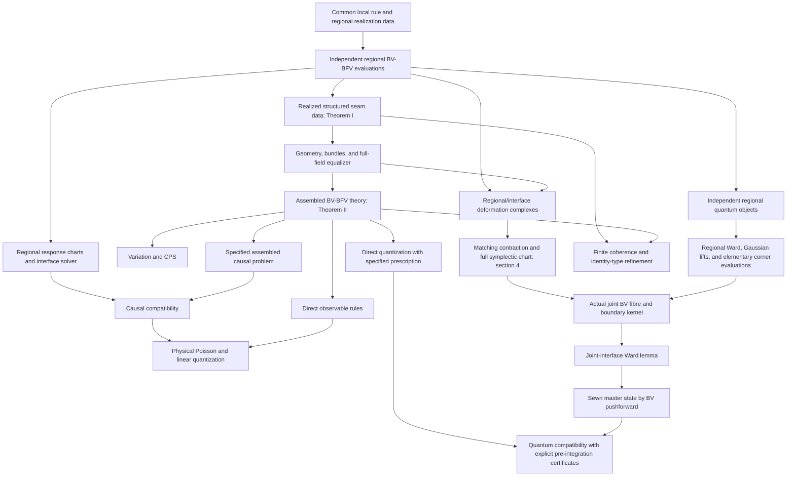

# Theorem dependency graph

## Construction and quantum routes

The principal construction graph is

\[
\begin{array}{c}
\text{common local rule }\mathfrak T
+\text{ actual regional geometry/bundles/domains}\\
\downarrow\ \operatorname{Eval}_{R_a}\\
\{T(R_a)\}+\text{ independently chosen interface candidates}\\
\downarrow\ \text{Theorem I: realized structured sewability}\\
(M_D,P_D,E_D)+\mathcal F_D^{\rm sm}\\
\downarrow\ \text{Theorem II: local compatibility and regular exact closure}\\
T_D\\
\swarrow\qquad\downarrow\qquad\downarrow\qquad\searrow\\
\text{solutions/CPS}\quad\text{causal response}\quad
\text{observables}\quad\text{quantization}.
\end{array}
\]

The arrows out of \(T_D\) carry their own realization inputs. The residual branch starts from its deformation data and the matching complex, not from the causal branch. Theorem III describes the allowed equivalences of construction data; Theorem IV compares finite orders; Theorem V compares the two paths for each derived construction; Corollary IV-R compares identity-type finite refinement with direct regional evaluation.

The more precise quantum dependency graph is useful for avoiding an apparent circular reference among the chapters:

The generic pushforward theorem in §9.4 and the generic effective-state construction in §9.6 precede their application to the joint fibre. The joint-interface lemma uses the **elementary** bar/balanced evaluation and mixed-incidence identities, not the later sewn-state conclusion of Theorem 11.2 as a premise. Its proof does not use the sewn specialization of Theorem 9.3 to manufacture its own Ward identity. These distinctions remove a possible apparent cycle in the chapter-level dependency graph.
